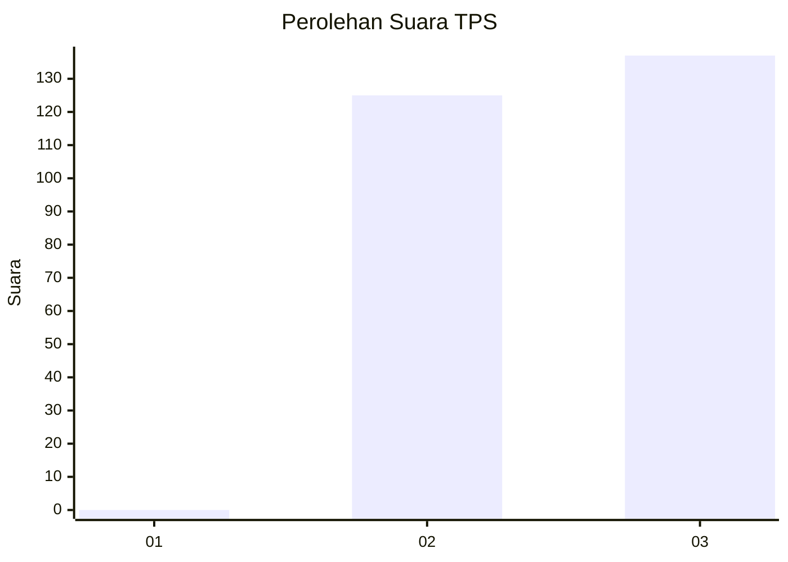
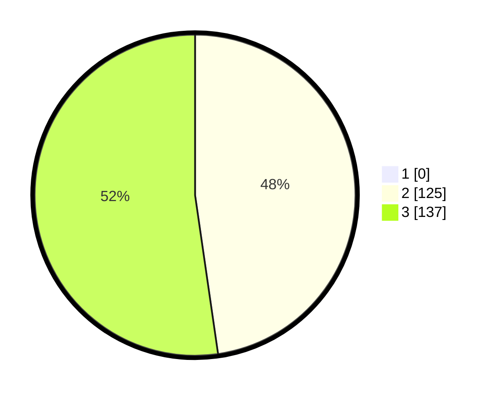

# Hasil

## Grafik

## Tabel

| No. | Nama Paslon    | Suara | Suara (raw) | Persentase |
|:--- |:-------------- | -----:| -----------:| ----------:|
| 1   | ANIES MUHAIMIN | 0     | [0][p-1]    | 0,00       |
| 2   | PRABOWO GIBRAN | 125   | [125][p-2]  | 47,71      |
| 3   | GANJAR MAHFUD  | 137   | [137][p-3]  | 52,29      |

[p-1]: https://github.com/gigit-pemilu/pemilu-2024-51-bali/blob/main/pilpres/hitung-suara/sub/51-bali/sub/04-gianyar/sub/05-ubud/sub/2003-singakerta/sub/005-tps/sub/paslon-1.txt
[p-2]: https://github.com/gigit-pemilu/pemilu-2024-51-bali/blob/main/pilpres/hitung-suara/sub/51-bali/sub/04-gianyar/sub/05-ubud/sub/2003-singakerta/sub/005-tps/sub/paslon-2.txt
[p-3]: https://github.com/gigit-pemilu/pemilu-2024-51-bali/blob/main/pilpres/hitung-suara/sub/51-bali/sub/04-gianyar/sub/05-ubud/sub/2003-singakerta/sub/005-tps/sub/paslon-3.txt

## Foto C Plano

https://sirekap-obj-formc.kpu.go.id/8a24/pemilu/ppwp/51/04/05/20/03/5104052003005-20240214-155310--6fc4ec14-7b4a-42a5-96d6-eab0146c2fd4.jpg

https://sirekap-obj-formc.kpu.go.id/8a24/pemilu/ppwp/51/04/05/20/03/5104052003005-20240214-155135--9508ffab-2a95-42c7-b318-7c88f9a35610.jpg

https://sirekap-obj-formc.kpu.go.id/8a24/pemilu/ppwp/51/04/05/20/03/5104052003005-20240214-155359--aa0a787e-fcec-4f5b-b6dc-6a9eb847250d.jpg

## Metadata

| Key        | Value               |
| ---------- | ------------------- |
| Time Stamp | 2024-02-15 15:00:29 |

