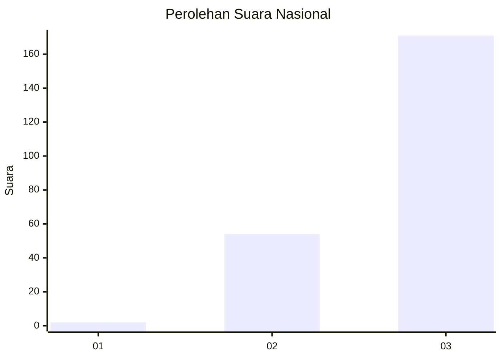
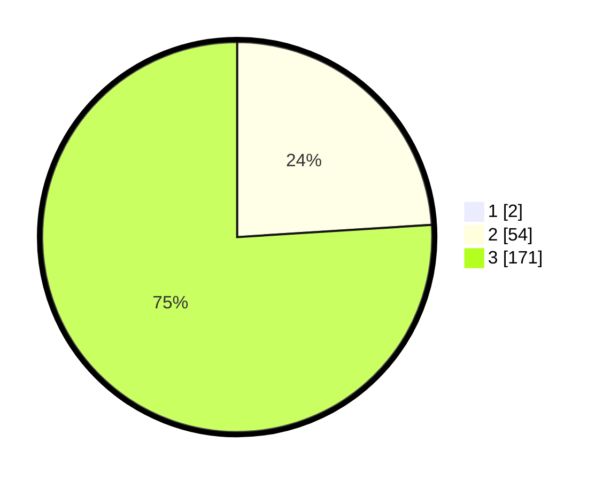

# Hasil

## Grafik

## Tabel

| No. | Nama Paslon    | Suara | Suara (raw) | Persentase |
|:--- |:-------------- | -----:| -----------:| ----------:|
| 1   | ANIES MUHAIMIN | 2     | [2][p-1]    | 0,88       |
| 2   | PRABOWO GIBRAN | 54    | [54][p-2]   | 23,79      |
| 3   | GANJAR MAHFUD  | 171   | [171][p-3]  | 75,33      |

[p-1]: https://github.com/gigit-pemilu/pemilu-2024/blob/main/pilpres/hitung-suara/sub/51-bali/sub/04-gianyar/sub/05-ubud/sub/2003-singakerta/sub/010-tps/sub/paslon-1.txt
[p-2]: https://github.com/gigit-pemilu/pemilu-2024/blob/main/pilpres/hitung-suara/sub/51-bali/sub/04-gianyar/sub/05-ubud/sub/2003-singakerta/sub/010-tps/sub/paslon-2.txt
[p-3]: https://github.com/gigit-pemilu/pemilu-2024/blob/main/pilpres/hitung-suara/sub/51-bali/sub/04-gianyar/sub/05-ubud/sub/2003-singakerta/sub/010-tps/sub/paslon-3.txt

## Foto C Plano

https://sirekap-obj-formc.kpu.go.id/283f/pemilu/ppwp/51/04/05/20/03/5104052003010-20240217-003420--ade043cf-6dc5-4ae5-8533-4f61ac6ac540.jpg

https://sirekap-obj-formc.kpu.go.id/283f/pemilu/ppwp/51/04/05/20/03/5104052003010-20240214-201342--db030c55-5418-41a1-8ce0-c502d48c0c18.jpg

https://sirekap-obj-formc.kpu.go.id/283f/pemilu/ppwp/51/04/05/20/03/5104052003010-20240214-201409--a6285e9a-4ca3-48ee-b482-017b3b41242e.jpg

## Metadata

| Key        | Value               |
| ---------- | ------------------- |
| Time Stamp | 2024-02-17 01:00:00 |

