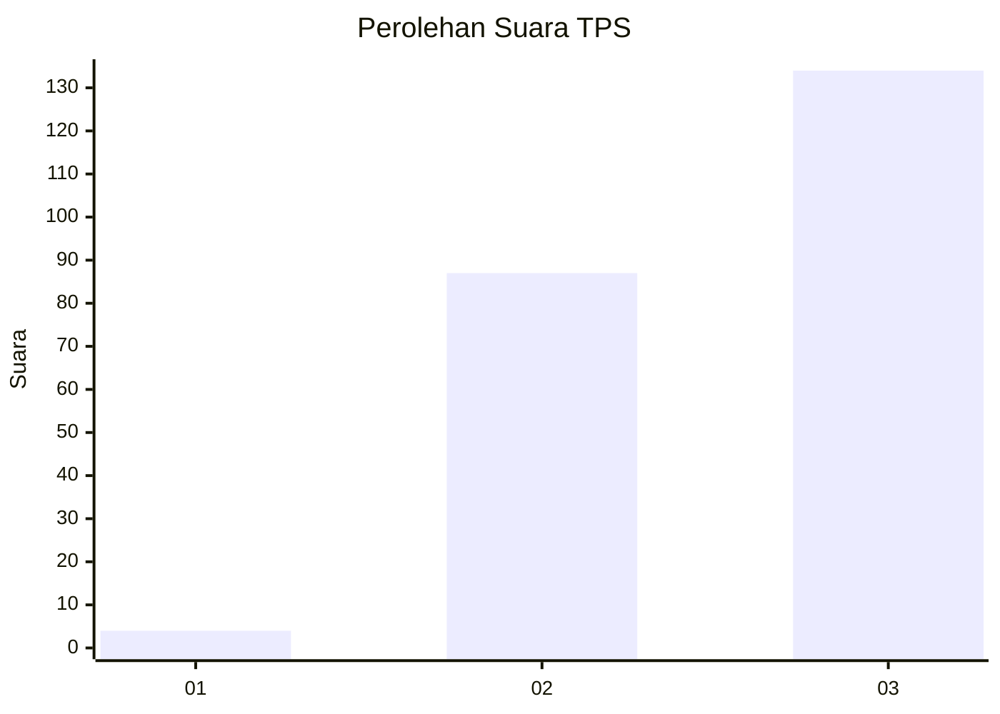
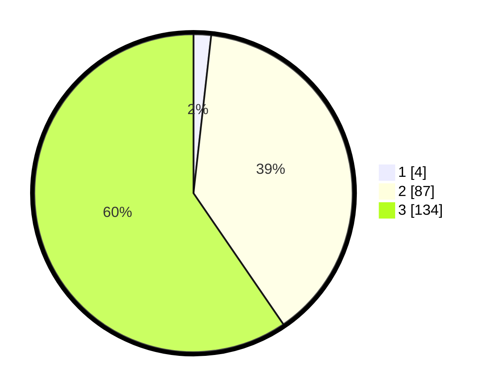

# Hasil

## Grafik

## Tabel

| No. | Nama Paslon    | Suara | Suara (raw) | Persentase |
|:--- |:-------------- | -----:| -----------:| ----------:|
| 1   | ANIES MUHAIMIN | 4     | [4][p-1]    | 1,78       |
| 2   | PRABOWO GIBRAN | 87    | [87][p-2]   | 38,67      |
| 3   | GANJAR MAHFUD  | 134   | [134][p-3]  | 59,56      |

[p-1]: https://github.com/gigit-pemilu/pemilu-2024-51-bali/blob/main/pilpres/hitung-suara/sub/51-bali/sub/04-gianyar/sub/05-ubud/sub/2003-singakerta/sub/017-tps/sub/paslon-1.txt
[p-2]: https://github.com/gigit-pemilu/pemilu-2024-51-bali/blob/main/pilpres/hitung-suara/sub/51-bali/sub/04-gianyar/sub/05-ubud/sub/2003-singakerta/sub/017-tps/sub/paslon-2.txt
[p-3]: https://github.com/gigit-pemilu/pemilu-2024-51-bali/blob/main/pilpres/hitung-suara/sub/51-bali/sub/04-gianyar/sub/05-ubud/sub/2003-singakerta/sub/017-tps/sub/paslon-3.txt

## Foto C Plano

https://sirekap-obj-formc.kpu.go.id/e657/pemilu/ppwp/51/04/05/20/03/5104052003017-20240214-124214--e82259b4-54cc-4a78-9042-d276e9899028.jpg

https://sirekap-obj-formc.kpu.go.id/e657/pemilu/ppwp/51/04/05/20/03/5104052003017-20240214-124336--e1439649-7ce8-4dad-a1a3-6f367a82f39d.jpg

https://sirekap-obj-formc.kpu.go.id/e657/pemilu/ppwp/51/04/05/20/03/5104052003017-20240214-124418--e4777bd0-702b-433f-8aee-aceb979f866f.jpg

## Metadata

| Key        | Value               |
| ---------- | ------------------- |
| Time Stamp | 2024-02-15 15:00:29 |

