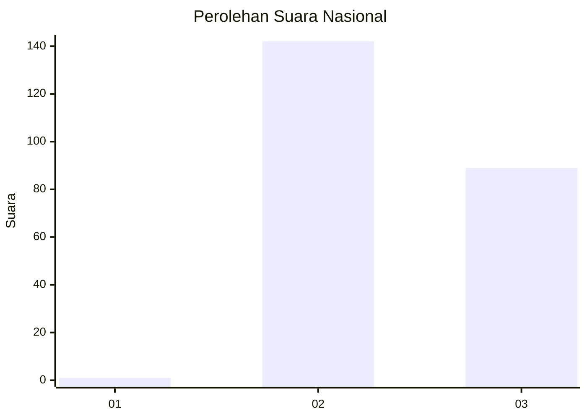
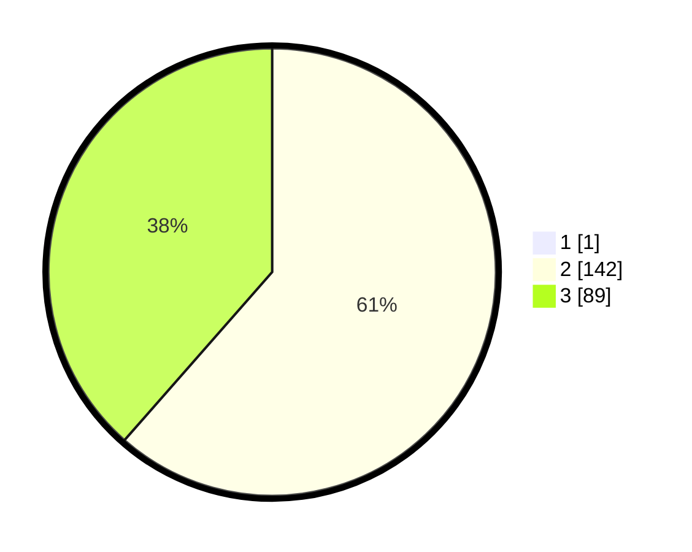

# Hasil

## Grafik

## Tabel

| No. | Nama Paslon    | Suara | Suara (raw) | Persentase |
|:--- |:-------------- | -----:| -----------:| ----------:|
| 1   | ANIES MUHAIMIN | 1     | [1][p-1]    | 0,43       |
| 2   | PRABOWO GIBRAN | 142   | [142][p-2]  | 61,21      |
| 3   | GANJAR MAHFUD  | 89    | [89][p-3]   | 38,36      |

[p-1]: https://github.com/gigit-pemilu/pemilu-2024/blob/main/pilpres/hitung-suara/sub/51-bali/sub/04-gianyar/sub/05-ubud/sub/2003-singakerta/sub/031-tps/sub/paslon-1.txt
[p-2]: https://github.com/gigit-pemilu/pemilu-2024/blob/main/pilpres/hitung-suara/sub/51-bali/sub/04-gianyar/sub/05-ubud/sub/2003-singakerta/sub/031-tps/sub/paslon-2.txt
[p-3]: https://github.com/gigit-pemilu/pemilu-2024/blob/main/pilpres/hitung-suara/sub/51-bali/sub/04-gianyar/sub/05-ubud/sub/2003-singakerta/sub/031-tps/sub/paslon-3.txt

## Foto C Plano

https://sirekap-obj-formc.kpu.go.id/32d7/pemilu/ppwp/51/04/05/20/03/5104052003031-20240214-200630--d046ae9f-beba-43bd-a0f6-0ea3a863e99e.jpg

https://sirekap-obj-formc.kpu.go.id/32d7/pemilu/ppwp/51/04/05/20/03/5104052003031-20240214-200741--17229f77-7cf8-4bae-9508-80404ba39156.jpg

https://sirekap-obj-formc.kpu.go.id/32d7/pemilu/ppwp/51/04/05/20/03/5104052003031-20240214-200922--9edd2c56-f485-4c83-8447-1b5f18902f4e.jpg

## Metadata

| Key        | Value               |
| ---------- | ------------------- |
| Time Stamp | 2024-02-15 15:00:29 |

