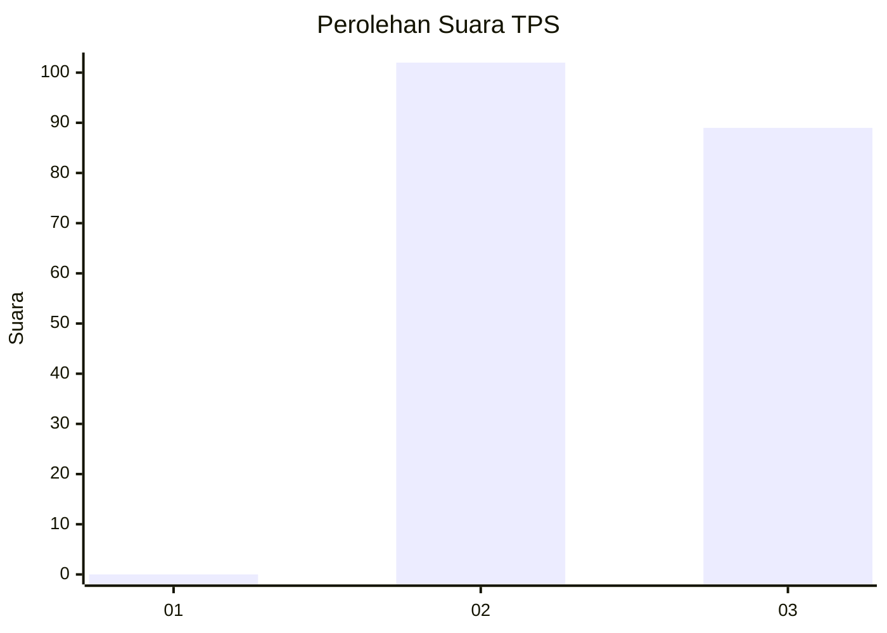
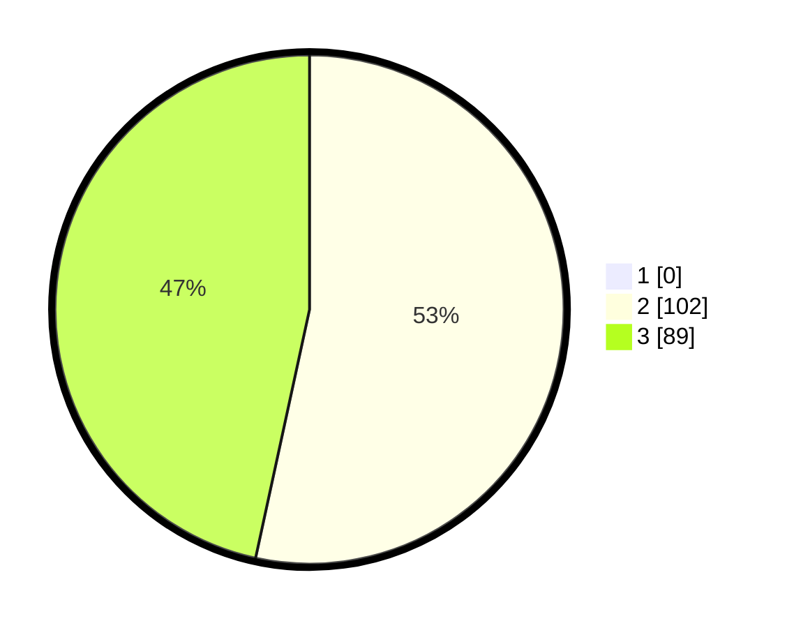

# Hasil

## Grafik

## Tabel

| No. | Nama Paslon    | Suara | Suara (raw) | Persentase |
|:--- |:-------------- | -----:| -----------:| ----------:|
| 1   | ANIES MUHAIMIN | 0     | [0][p-1]    | 0,00       |
| 2   | PRABOWO GIBRAN | 102   | [102][p-2]  | 53,40      |
| 3   | GANJAR MAHFUD  | 89    | [89][p-3]   | 46,60      |

[p-1]: https://github.com/gigit-pemilu/pemilu-2024-51-bali/blob/main/pilpres/hitung-suara/sub/51-bali/sub/04-gianyar/sub/05-ubud/sub/2004-kedewatan/sub/001-tps/sub/paslon-1.txt
[p-2]: https://github.com/gigit-pemilu/pemilu-2024-51-bali/blob/main/pilpres/hitung-suara/sub/51-bali/sub/04-gianyar/sub/05-ubud/sub/2004-kedewatan/sub/001-tps/sub/paslon-2.txt
[p-3]: https://github.com/gigit-pemilu/pemilu-2024-51-bali/blob/main/pilpres/hitung-suara/sub/51-bali/sub/04-gianyar/sub/05-ubud/sub/2004-kedewatan/sub/001-tps/sub/paslon-3.txt

## Foto C Plano

https://sirekap-obj-formc.kpu.go.id/9e2b/pemilu/ppwp/51/04/05/20/04/5104052004001-20240215-204224--fb754e47-4b43-4320-9c50-e34abb8d98a1.jpg

https://sirekap-obj-formc.kpu.go.id/9e2b/pemilu/ppwp/51/04/05/20/04/5104052004001-20240215-204228--e221f755-a679-411e-b943-f208dd196684.jpg

https://sirekap-obj-formc.kpu.go.id/9e2b/pemilu/ppwp/51/04/05/20/04/5104052004001-20240215-204232--e97ead34-314a-4ab1-9b28-abfbb7982dff.jpg

## Metadata

| Key        | Value               |
| ---------- | ------------------- |
| Time Stamp | 2024-02-15 22:30:27 |

