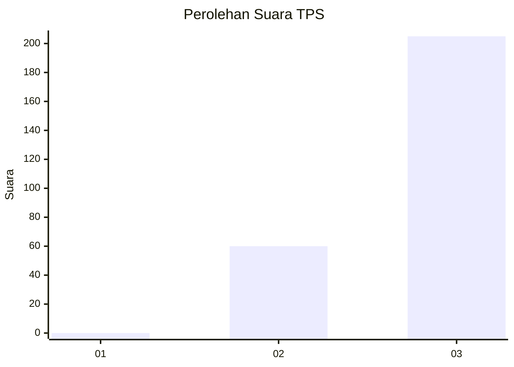
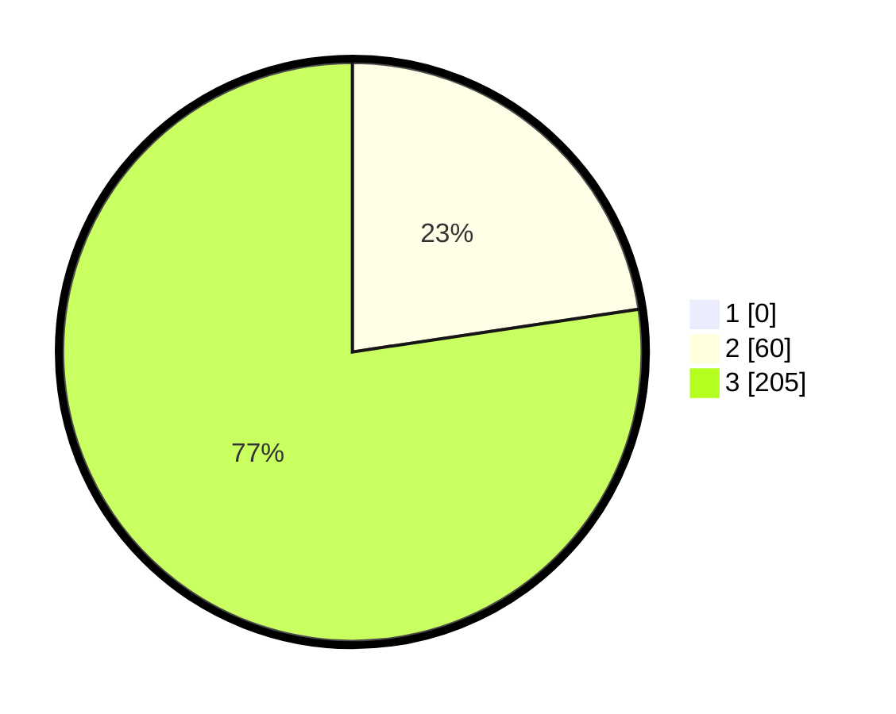

# Hasil

## Grafik

## Tabel

| No. | Nama Paslon    | Suara | Suara (raw) | Persentase |
|:--- |:-------------- | -----:| -----------:| ----------:|
| 1   | ANIES MUHAIMIN | 0     | [0][p-1]    | 0,00       |
| 2   | PRABOWO GIBRAN | 60    | [60][p-2]   | 22,64      |
| 3   | GANJAR MAHFUD  | 205   | [205][p-3]  | 77,36      |

[p-1]: https://github.com/gigit-pemilu/pemilu-2024-51-bali/blob/main/pilpres/hitung-suara/sub/51-bali/sub/04-gianyar/sub/05-ubud/sub/2004-kedewatan/sub/004-tps/sub/paslon-1.txt
[p-2]: https://github.com/gigit-pemilu/pemilu-2024-51-bali/blob/main/pilpres/hitung-suara/sub/51-bali/sub/04-gianyar/sub/05-ubud/sub/2004-kedewatan/sub/004-tps/sub/paslon-2.txt
[p-3]: https://github.com/gigit-pemilu/pemilu-2024-51-bali/blob/main/pilpres/hitung-suara/sub/51-bali/sub/04-gianyar/sub/05-ubud/sub/2004-kedewatan/sub/004-tps/sub/paslon-3.txt

## Foto C Plano

https://sirekap-obj-formc.kpu.go.id/3cdd/pemilu/ppwp/51/04/05/20/04/5104052004004-20240214-205326--0b5a2eaf-ec4f-45e1-bba7-187dc01a46df.jpg

https://sirekap-obj-formc.kpu.go.id/3cdd/pemilu/ppwp/51/04/05/20/04/5104052004004-20240214-205407--0cf32562-3824-4869-8124-bfd57147bd3a.jpg

https://sirekap-obj-formc.kpu.go.id/3cdd/pemilu/ppwp/51/04/05/20/04/5104052004004-20240214-205439--c14da652-1c24-4c9f-8577-eef5399352d1.jpg

## Metadata

| Key        | Value               |
| ---------- | ------------------- |
| Time Stamp | 2024-02-15 15:00:29 |

