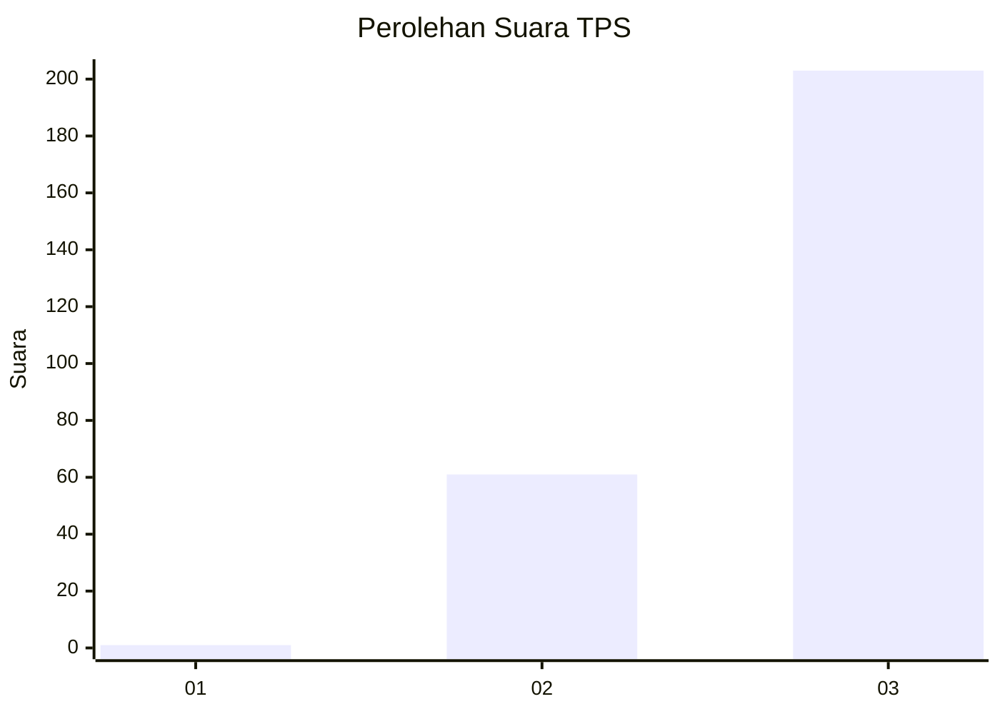
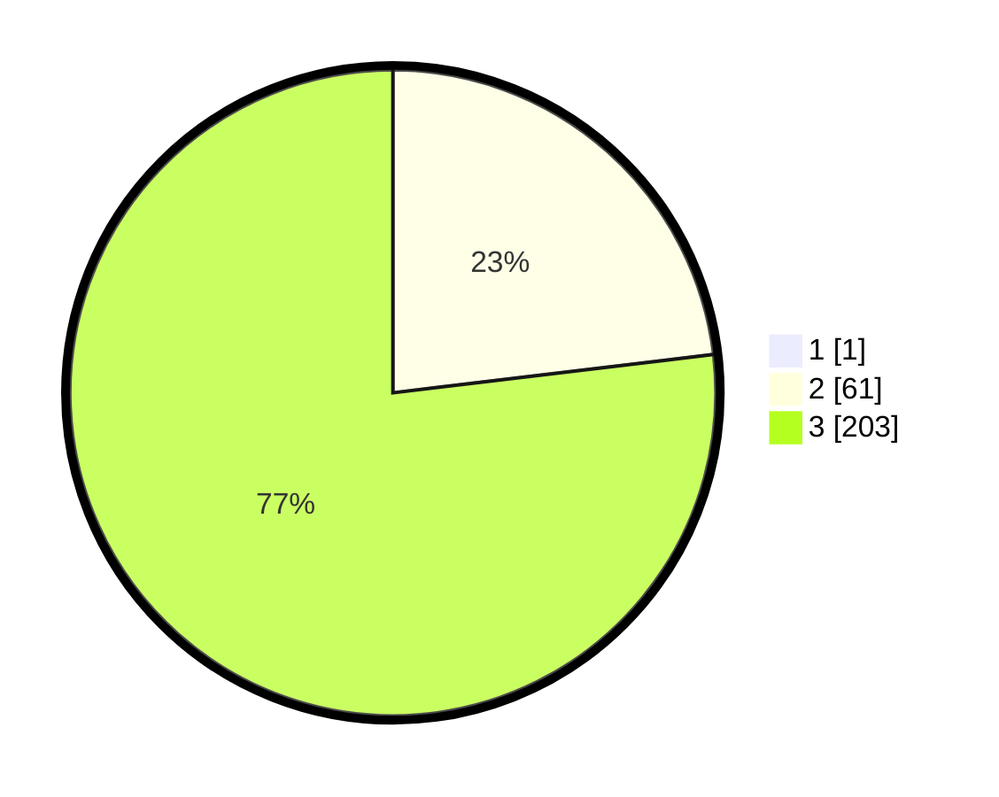

# Hasil

## Grafik

## Tabel

| No. | Nama Paslon    | Suara | Suara (raw) | Persentase |
|:--- |:-------------- | -----:| -----------:| ----------:|
| 1   | ANIES MUHAIMIN | 1     | [1][p-1]    | 0,38       |
| 2   | PRABOWO GIBRAN | 61    | [61][p-2]   | 23,02      |
| 3   | GANJAR MAHFUD  | 203   | [203][p-3]  | 76,60      |

[p-1]: https://github.com/gigit-pemilu/pemilu-2024-51-bali/blob/main/pilpres/hitung-suara/sub/51-bali/sub/04-gianyar/sub/05-ubud/sub/2004-kedewatan/sub/005-tps/sub/paslon-1.txt
[p-2]: https://github.com/gigit-pemilu/pemilu-2024-51-bali/blob/main/pilpres/hitung-suara/sub/51-bali/sub/04-gianyar/sub/05-ubud/sub/2004-kedewatan/sub/005-tps/sub/paslon-2.txt
[p-3]: https://github.com/gigit-pemilu/pemilu-2024-51-bali/blob/main/pilpres/hitung-suara/sub/51-bali/sub/04-gianyar/sub/05-ubud/sub/2004-kedewatan/sub/005-tps/sub/paslon-3.txt

## Foto C Plano

https://sirekap-obj-formc.kpu.go.id/c592/pemilu/ppwp/51/04/05/20/04/5104052004005-20240217-054517--54f28c53-e929-46fe-8c86-98686a62f7e5.jpg

https://sirekap-obj-formc.kpu.go.id/c592/pemilu/ppwp/51/04/05/20/04/5104052004005-20240217-054518--00caba1e-9059-4c72-b2d0-d839384ce9c3.jpg

https://sirekap-obj-formc.kpu.go.id/c592/pemilu/ppwp/51/04/05/20/04/5104052004005-20240217-054517--b5d46881-80e6-4daf-9783-9c09bd2b6170.jpg

## Metadata

| Key        | Value               |
| ---------- | ------------------- |
| Time Stamp | 2024-02-17 13:37:34 |

## DATA PEMILIH TETAP

Jumlah pemilih dalam DPT: **283**.
 * L: **147**.
 * P: **136**.

## DATA PENGGUNA HAK PILIH

Jumlah pengguna hak pilih dalam DPT: **263**.
 * L: **139**.
 * P: **124**.

Jumlah pengguna hak pilih dalam DPTb: **0**.
 * L: **0**.
 * P: **0**.

Jumlah pengguna hak pilih dalam DPK: **3**.
 * L: **2**.
 * P: **1**.

Jumlah pengguna hak pilih: **266**.
 * L: **141**.
 * P: **125**.

## JUMLAH SUARA SAH DAN TIDAK SAH

JUMLAH SELURUH SUARA SAH: **265**.

JUMLAH SUARA TIDAK SAH: **1**.

JUMLAH SELURUH SUARA SAH DAN SUARA TIDAK SAH: **266**.

