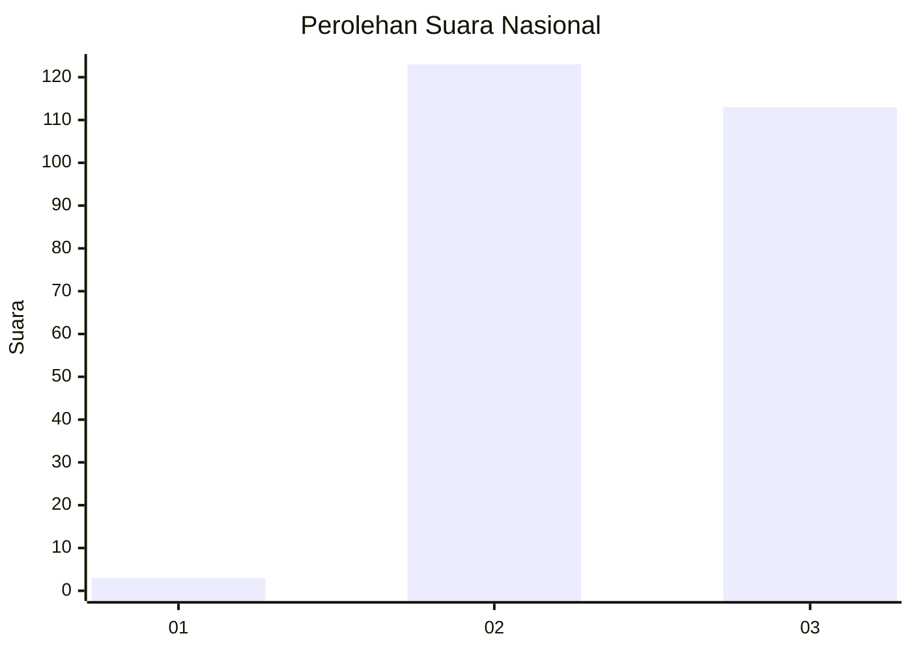
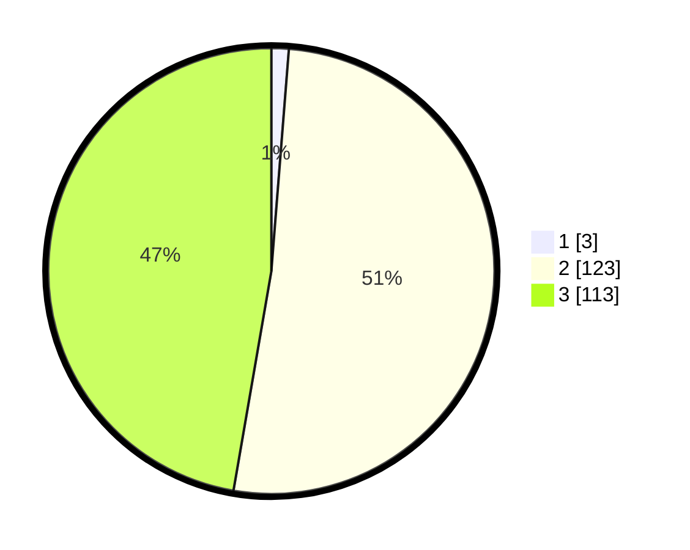

# Hasil

## Grafik

## Tabel

| No. | Nama Paslon    | Suara | Suara (raw) | Persentase |
|:--- |:-------------- | -----:| -----------:| ----------:|
| 1   | ANIES MUHAIMIN | 3     | [3][p-1]    | 1,26       |
| 2   | PRABOWO GIBRAN | 123   | [123][p-2]  | 51,46      |
| 3   | GANJAR MAHFUD  | 113   | [113][p-3]  | 47,28      |

[p-1]: https://github.com/gigit-pemilu/pemilu-2024/blob/main/pilpres/hitung-suara/sub/51-bali/sub/04-gianyar/sub/05-ubud/sub/2004-kedewatan/sub/008-tps/sub/paslon-1.txt
[p-2]: https://github.com/gigit-pemilu/pemilu-2024/blob/main/pilpres/hitung-suara/sub/51-bali/sub/04-gianyar/sub/05-ubud/sub/2004-kedewatan/sub/008-tps/sub/paslon-2.txt
[p-3]: https://github.com/gigit-pemilu/pemilu-2024/blob/main/pilpres/hitung-suara/sub/51-bali/sub/04-gianyar/sub/05-ubud/sub/2004-kedewatan/sub/008-tps/sub/paslon-3.txt

## Foto C Plano

https://sirekap-obj-formc.kpu.go.id/6102/pemilu/ppwp/51/04/05/20/04/5104052004008-20240215-064002--0dab9ec2-d03a-46a4-b56f-b9d646e427ca.jpg

https://sirekap-obj-formc.kpu.go.id/6102/pemilu/ppwp/51/04/05/20/04/5104052004008-20240215-064056--00f64b2b-d92b-447f-bb26-4f65dadb9c94.jpg

https://sirekap-obj-formc.kpu.go.id/6102/pemilu/ppwp/51/04/05/20/04/5104052004008-20240215-064146--e86047c0-8259-4732-b3e1-02a23ec7f432.jpg

## Metadata

| Key        | Value               |
| ---------- | ------------------- |
| Time Stamp | 2024-02-15 22:00:27 |

