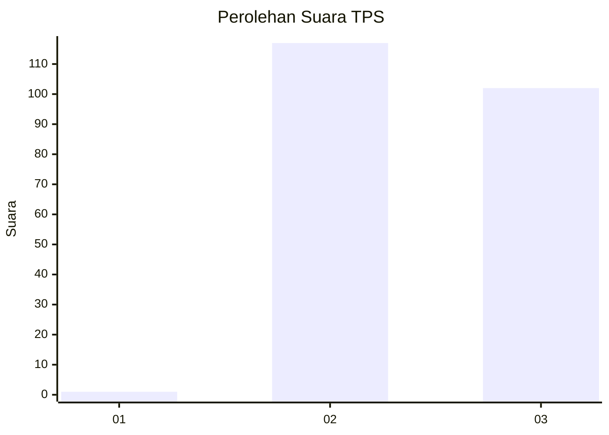
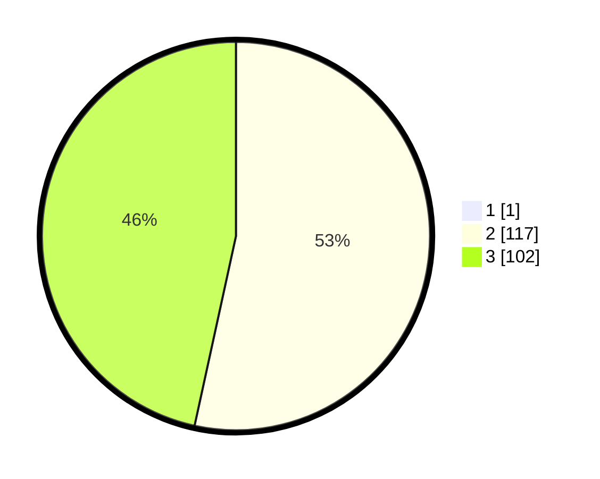

# Hasil

## Grafik

## Tabel

| No. | Nama Paslon    | Suara | Suara (raw) | Persentase |
|:--- |:-------------- | -----:| -----------:| ----------:|
| 1   | ANIES MUHAIMIN | 1     | [1][p-1]    | 0,45       |
| 2   | PRABOWO GIBRAN | 117   | [117][p-2]  | 53,18      |
| 3   | GANJAR MAHFUD  | 102   | [102][p-3]  | 46,36      |

[p-1]: https://github.com/gigit-pemilu/pemilu-2024-51-bali/blob/main/pilpres/hitung-suara/sub/51-bali/sub/04-gianyar/sub/05-ubud/sub/2004-kedewatan/sub/011-tps/sub/paslon-1.txt
[p-2]: https://github.com/gigit-pemilu/pemilu-2024-51-bali/blob/main/pilpres/hitung-suara/sub/51-bali/sub/04-gianyar/sub/05-ubud/sub/2004-kedewatan/sub/011-tps/sub/paslon-2.txt
[p-3]: https://github.com/gigit-pemilu/pemilu-2024-51-bali/blob/main/pilpres/hitung-suara/sub/51-bali/sub/04-gianyar/sub/05-ubud/sub/2004-kedewatan/sub/011-tps/sub/paslon-3.txt

## Foto C Plano

https://sirekap-obj-formc.kpu.go.id/c766/pemilu/ppwp/51/04/05/20/04/5104052004011-20240214-213828--cbe3de2c-abc8-46f2-8cb4-c7bcb573292f.jpg

https://sirekap-obj-formc.kpu.go.id/c766/pemilu/ppwp/51/04/05/20/04/5104052004011-20240214-193336--f68c6690-0947-4320-863b-4837d98a8bb9.jpg

https://sirekap-obj-formc.kpu.go.id/c766/pemilu/ppwp/51/04/05/20/04/5104052004011-20240214-193342--3eb0566b-7c67-4031-a15d-29d91a47a468.jpg

## Metadata

| Key        | Value               |
| ---------- | ------------------- |
| Time Stamp | 2024-02-15 15:00:29 |

