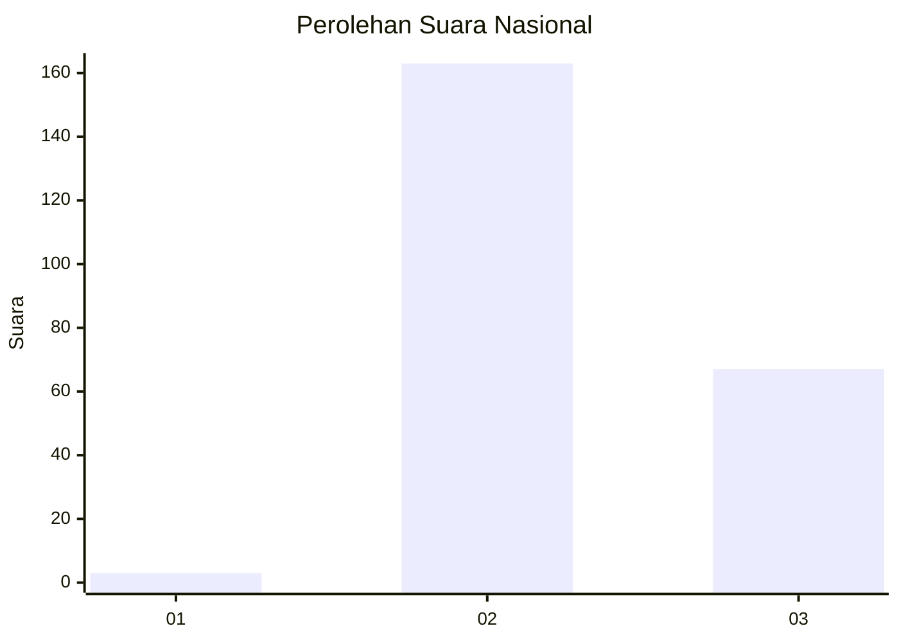

# Hasil

## Grafik

## Tabel

| No. | Nama Paslon    | Suara | Suara (raw) | Persentase |
|:--- |:-------------- | -----:| -----------:| ----------:|
| 1   | ANIES MUHAIMIN | 3     | [3][p-1]    | 1,29       |
| 2   | PRABOWO GIBRAN | 163   | [163][p-2]  | 69,96      |
| 3   | GANJAR MAHFUD  | 67    | [67][p-3]   | 28,76      |

[p-1]: https://github.com/gigit-pemilu/pemilu-2024/blob/main/pilpres/hitung-suara/sub/51-bali/sub/04-gianyar/sub/05-ubud/sub/2004-kedewatan/sub/012-tps/sub/paslon-1.txt
[p-2]: https://github.com/gigit-pemilu/pemilu-2024/blob/main/pilpres/hitung-suara/sub/51-bali/sub/04-gianyar/sub/05-ubud/sub/2004-kedewatan/sub/012-tps/sub/paslon-2.txt
[p-3]: https://github.com/gigit-pemilu/pemilu-2024/blob/main/pilpres/hitung-suara/sub/51-bali/sub/04-gianyar/sub/05-ubud/sub/2004-kedewatan/sub/012-tps/sub/paslon-3.txt

## Foto C Plano

https://sirekap-obj-formc.kpu.go.id/4d32/pemilu/ppwp/51/04/05/20/04/5104052004012-20240214-141818--f8fef210-4413-4538-8a02-7446726295c5.jpg

https://sirekap-obj-formc.kpu.go.id/4d32/pemilu/ppwp/51/04/05/20/04/5104052004012-20240214-185216--eae2cf85-461f-4a65-9477-7311fcd367e2.jpg

https://sirekap-obj-formc.kpu.go.id/4d32/pemilu/ppwp/51/04/05/20/04/5104052004012-20240215-160801--88979cc8-0b58-4780-8034-ac7a13bc3b99.jpg

## Metadata

| Key        | Value               |
| ---------- | ------------------- |
| Time Stamp | 2024-02-15 16:30:25 |

