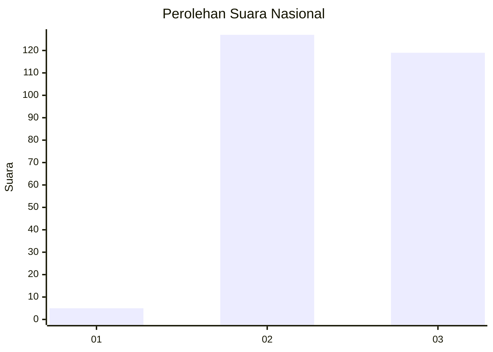
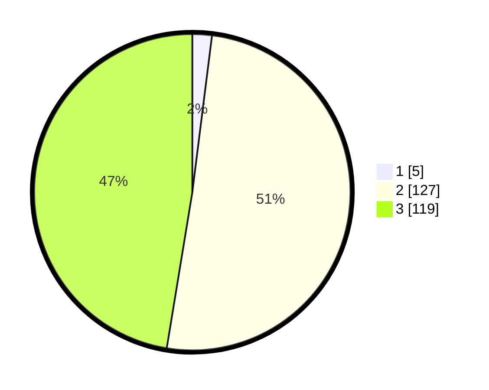

# Hasil

## Grafik

## Tabel

| No. | Nama Paslon    | Suara | Suara (raw) | Persentase |
|:--- |:-------------- | -----:| -----------:| ----------:|
| 1   | ANIES MUHAIMIN | 5     | [5][p-1]    | 1,99       |
| 2   | PRABOWO GIBRAN | 127   | [127][p-2]  | 50,60      |
| 3   | GANJAR MAHFUD  | 119   | [119][p-3]  | 47,41      |

[p-1]: https://github.com/gigit-pemilu/pemilu-2024/blob/main/pilpres/hitung-suara/sub/51-bali/sub/04-gianyar/sub/05-ubud/sub/2004-kedewatan/sub/016-tps/sub/paslon-1.txt
[p-2]: https://github.com/gigit-pemilu/pemilu-2024/blob/main/pilpres/hitung-suara/sub/51-bali/sub/04-gianyar/sub/05-ubud/sub/2004-kedewatan/sub/016-tps/sub/paslon-2.txt
[p-3]: https://github.com/gigit-pemilu/pemilu-2024/blob/main/pilpres/hitung-suara/sub/51-bali/sub/04-gianyar/sub/05-ubud/sub/2004-kedewatan/sub/016-tps/sub/paslon-3.txt

## Foto C Plano

https://sirekap-obj-formc.kpu.go.id/dc20/pemilu/ppwp/51/04/05/20/04/5104052004016-20240214-200315--210e7166-ac8b-41c3-9425-47e22c44f837.jpg

https://sirekap-obj-formc.kpu.go.id/dc20/pemilu/ppwp/51/04/05/20/04/5104052004016-20240214-200404--e880f968-f5d4-4710-bb50-e682401b7b5b.jpg

https://sirekap-obj-formc.kpu.go.id/dc20/pemilu/ppwp/51/04/05/20/04/5104052004016-20240214-194904--e6d5f281-7382-4c35-af3f-2132d1454ea4.jpg

## Metadata

| Key        | Value               |
| ---------- | ------------------- |
| Time Stamp | 2024-02-15 15:00:29 |

