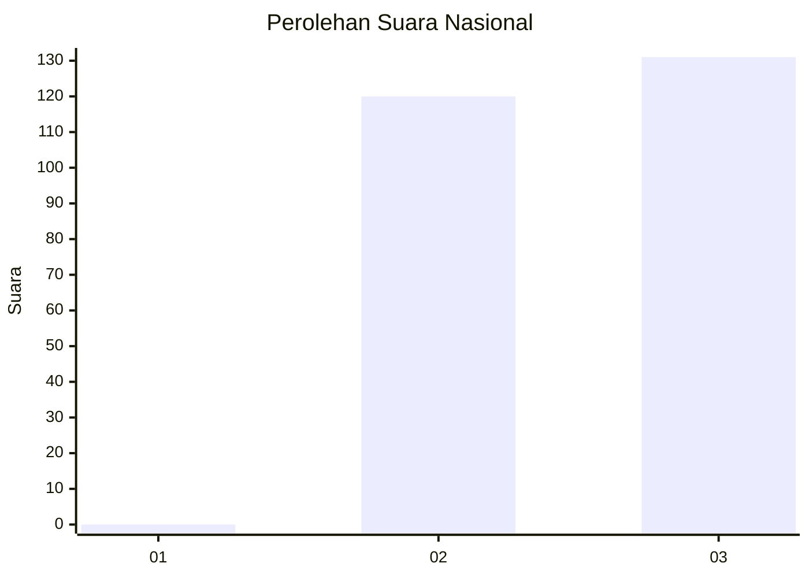
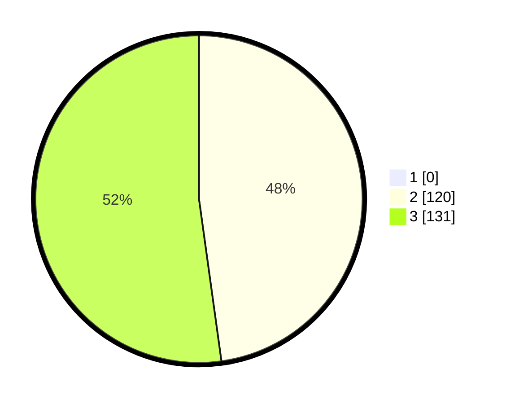

# Hasil

## Grafik

## Tabel

| No. | Nama Paslon    | Suara | Suara (raw) | Persentase |
|:--- |:-------------- | -----:| -----------:| ----------:|
| 1   | ANIES MUHAIMIN | 0     | [0][p-1]    | 0,00       |
| 2   | PRABOWO GIBRAN | 120   | [120][p-2]  | 47,81      |
| 3   | GANJAR MAHFUD  | 131   | [131][p-3]  | 52,19      |

[p-1]: https://github.com/gigit-pemilu/pemilu-2024/blob/main/pilpres/hitung-suara/sub/51-bali/sub/04-gianyar/sub/05-ubud/sub/2004-kedewatan/sub/019-tps/sub/paslon-1.txt
[p-2]: https://github.com/gigit-pemilu/pemilu-2024/blob/main/pilpres/hitung-suara/sub/51-bali/sub/04-gianyar/sub/05-ubud/sub/2004-kedewatan/sub/019-tps/sub/paslon-2.txt
[p-3]: https://github.com/gigit-pemilu/pemilu-2024/blob/main/pilpres/hitung-suara/sub/51-bali/sub/04-gianyar/sub/05-ubud/sub/2004-kedewatan/sub/019-tps/sub/paslon-3.txt

## Foto C Plano

https://sirekap-obj-formc.kpu.go.id/59ce/pemilu/ppwp/51/04/05/20/04/5104052004019-20240215-084431--2068c4de-b6f0-4c27-b33a-49aa33b02ae5.jpg

https://sirekap-obj-formc.kpu.go.id/59ce/pemilu/ppwp/51/04/05/20/04/5104052004019-20240215-084445--0431cedd-78e5-4c85-8865-dcf492b52a91.jpg

https://sirekap-obj-formc.kpu.go.id/59ce/pemilu/ppwp/51/04/05/20/04/5104052004019-20240215-084501--7d8dd786-cef3-4b94-8d65-c5d076ccd378.jpg

## Metadata

| Key        | Value               |
| ---------- | ------------------- |
| Time Stamp | 2024-02-15 15:00:29 |

