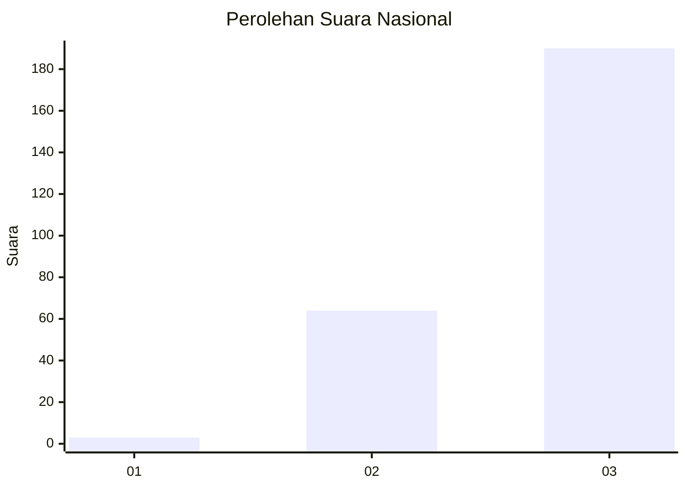
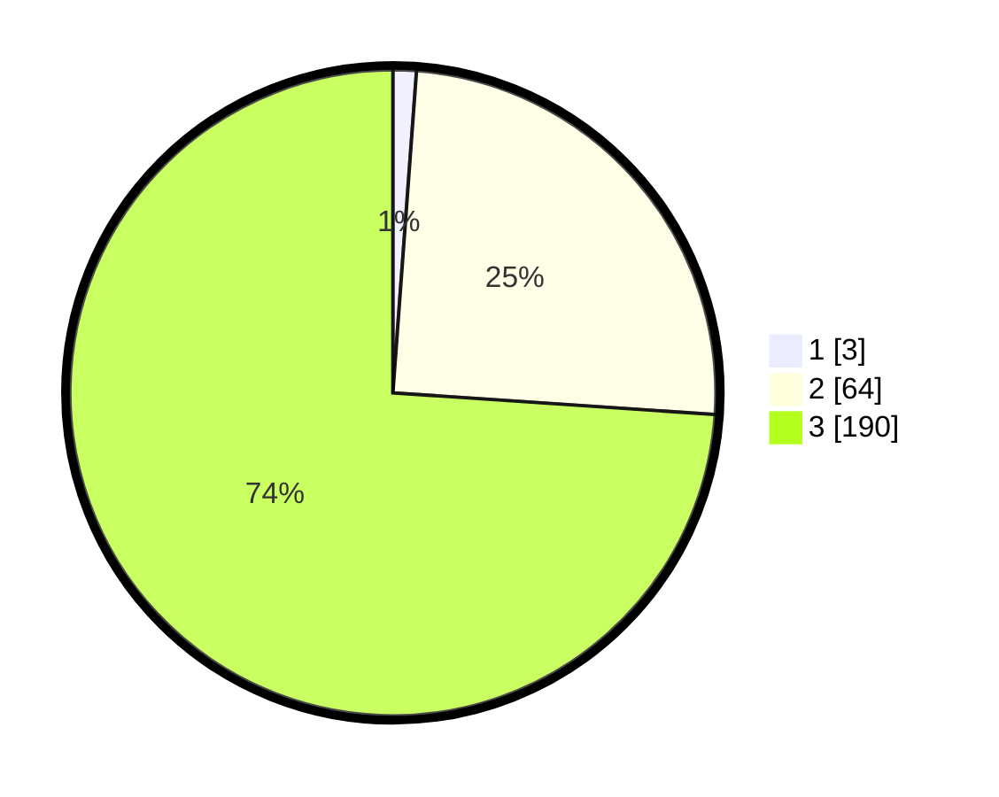

# Hasil

## Grafik

## Tabel

| No. | Nama Paslon    | Suara | Suara (raw) | Persentase |
|:--- |:-------------- | -----:| -----------:| ----------:|
| 1   | ANIES MUHAIMIN | 3     | [3][p-1]    | 1,17       |
| 2   | PRABOWO GIBRAN | 64    | [64][p-2]   | 24,90      |
| 3   | GANJAR MAHFUD  | 190   | [190][p-3]  | 73,93      |

[p-1]: https://github.com/gigit-pemilu/pemilu-2024/blob/main/pilpres/hitung-suara/sub/51-bali/sub/04-gianyar/sub/05-ubud/sub/2004-kedewatan/sub/020-tps/sub/paslon-1.txt
[p-2]: https://github.com/gigit-pemilu/pemilu-2024/blob/main/pilpres/hitung-suara/sub/51-bali/sub/04-gianyar/sub/05-ubud/sub/2004-kedewatan/sub/020-tps/sub/paslon-2.txt
[p-3]: https://github.com/gigit-pemilu/pemilu-2024/blob/main/pilpres/hitung-suara/sub/51-bali/sub/04-gianyar/sub/05-ubud/sub/2004-kedewatan/sub/020-tps/sub/paslon-3.txt

## Foto C Plano

https://sirekap-obj-formc.kpu.go.id/a477/pemilu/ppwp/51/04/05/20/04/5104052004020-20240214-184749--10cd809b-cf21-4a38-adf5-14f1dd0af1cf.jpg

https://sirekap-obj-formc.kpu.go.id/a477/pemilu/ppwp/51/04/05/20/04/5104052004020-20240214-184844--05b6697e-baf0-4f99-9867-511fce7f438c.jpg

https://sirekap-obj-formc.kpu.go.id/a477/pemilu/ppwp/51/04/05/20/04/5104052004020-20240214-184944--b1c9b278-d621-420b-a26e-eaa4d9d88617.jpg

## Metadata

| Key        | Value               |
| ---------- | ------------------- |
| Time Stamp | 2024-02-15 15:00:29 |

