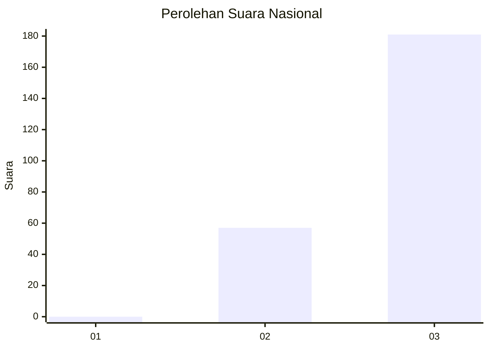
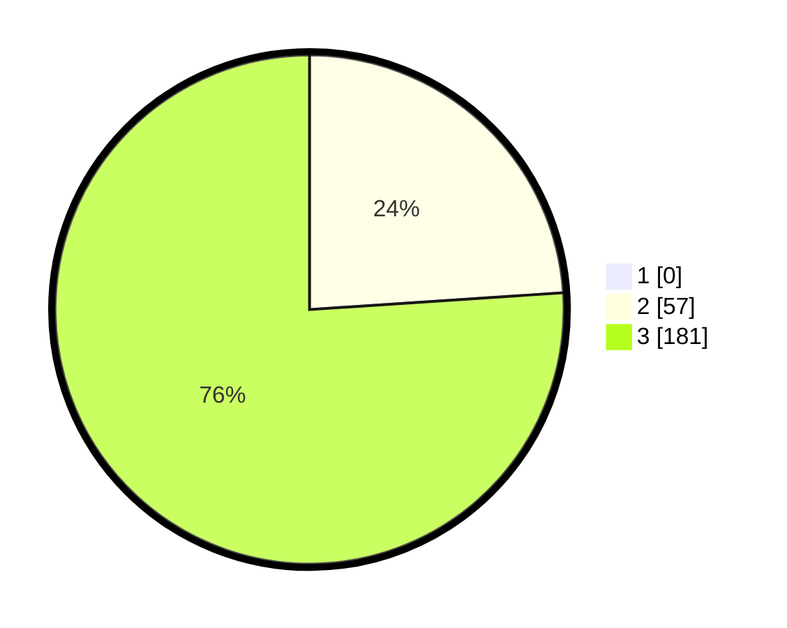

# Hasil

## Grafik

## Tabel

| No. | Nama Paslon    | Suara | Suara (raw) | Persentase |
|:--- |:-------------- | -----:| -----------:| ----------:|
| 1   | ANIES MUHAIMIN | 0     | [0][p-1]    | 0,00       |
| 2   | PRABOWO GIBRAN | 57    | [57][p-2]   | 23,95      |
| 3   | GANJAR MAHFUD  | 181   | [181][p-3]  | 76,05      |

[p-1]: https://github.com/gigit-pemilu/pemilu-2024/blob/main/pilpres/hitung-suara/sub/51-bali/sub/04-gianyar/sub/05-ubud/sub/2004-kedewatan/sub/021-tps/sub/paslon-1.txt
[p-2]: https://github.com/gigit-pemilu/pemilu-2024/blob/main/pilpres/hitung-suara/sub/51-bali/sub/04-gianyar/sub/05-ubud/sub/2004-kedewatan/sub/021-tps/sub/paslon-2.txt
[p-3]: https://github.com/gigit-pemilu/pemilu-2024/blob/main/pilpres/hitung-suara/sub/51-bali/sub/04-gianyar/sub/05-ubud/sub/2004-kedewatan/sub/021-tps/sub/paslon-3.txt

## Foto C Plano

https://sirekap-obj-formc.kpu.go.id/3c6d/pemilu/ppwp/51/04/05/20/04/5104052004021-20240214-194533--628a9588-1684-4276-bbac-a7b12b31514c.jpg

https://sirekap-obj-formc.kpu.go.id/3c6d/pemilu/ppwp/51/04/05/20/04/5104052004021-20240214-192628--b5eb9c50-1d2a-4db1-9fab-d4159abfcbe2.jpg

https://sirekap-obj-formc.kpu.go.id/3c6d/pemilu/ppwp/51/04/05/20/04/5104052004021-20240214-192536--6128bc11-9f78-42fa-bbda-466f1a6196e1.jpg

## Metadata

| Key        | Value               |
| ---------- | ------------------- |
| Time Stamp | 2024-02-15 15:00:29 |

