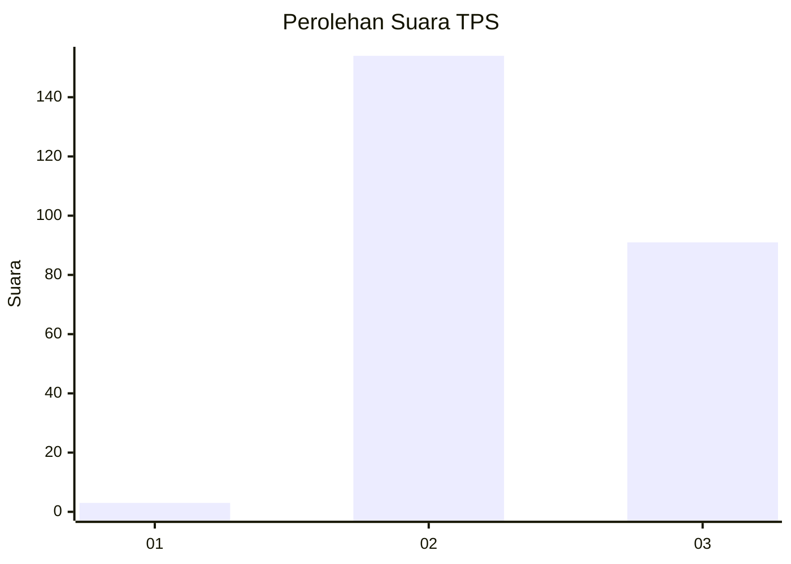
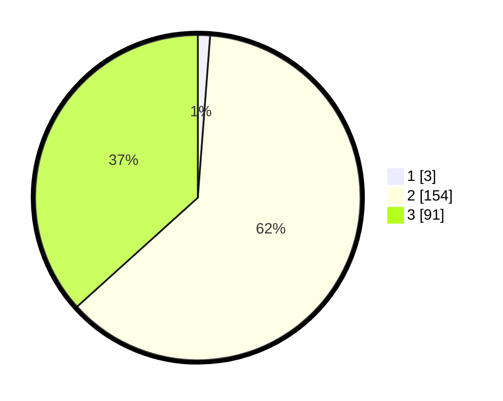

# Hasil

## Grafik

## Tabel

| No. | Nama Paslon    | Suara | Suara (raw) | Persentase |
|:--- |:-------------- | -----:| -----------:| ----------:|
| 1   | ANIES MUHAIMIN | 3     | [3][p-1]    | 1,21       |
| 2   | PRABOWO GIBRAN | 154   | [154][p-2]  | 62,10      |
| 3   | GANJAR MAHFUD  | 91    | [91][p-3]   | 36,69      |

[p-1]: https://github.com/gigit-pemilu/pemilu-2024-51-bali/blob/main/pilpres/hitung-suara/sub/51-bali/sub/04-gianyar/sub/05-ubud/sub/2006-peliatan/sub/001-tps/sub/paslon-1.txt
[p-2]: https://github.com/gigit-pemilu/pemilu-2024-51-bali/blob/main/pilpres/hitung-suara/sub/51-bali/sub/04-gianyar/sub/05-ubud/sub/2006-peliatan/sub/001-tps/sub/paslon-2.txt
[p-3]: https://github.com/gigit-pemilu/pemilu-2024-51-bali/blob/main/pilpres/hitung-suara/sub/51-bali/sub/04-gianyar/sub/05-ubud/sub/2006-peliatan/sub/001-tps/sub/paslon-3.txt

## Foto C Plano

https://sirekap-obj-formc.kpu.go.id/acdc/pemilu/ppwp/51/04/05/20/06/5104052006001-20240215-000345--04cb628d-4629-404a-9e5e-3e418831533d.jpg

https://sirekap-obj-formc.kpu.go.id/acdc/pemilu/ppwp/51/04/05/20/06/5104052006001-20240215-000522--bd559028-99af-47dd-8d29-1537b26b4211.jpg

https://sirekap-obj-formc.kpu.go.id/acdc/pemilu/ppwp/51/04/05/20/06/5104052006001-20240215-000742--ee510c47-17bb-414f-8892-d41e8c2f6d01.jpg

## Metadata

| Key        | Value               |
| ---------- | ------------------- |
| Time Stamp | 2024-02-15 15:00:29 |

