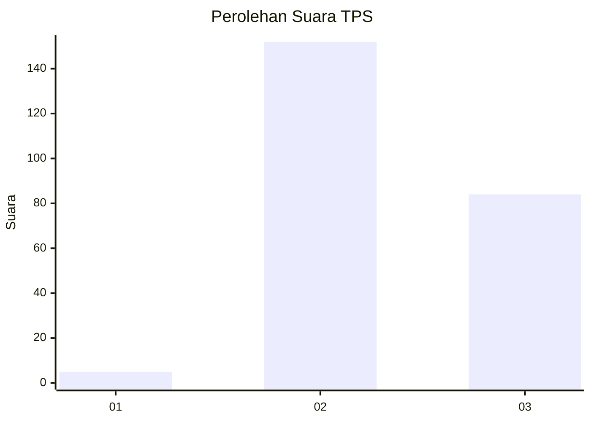
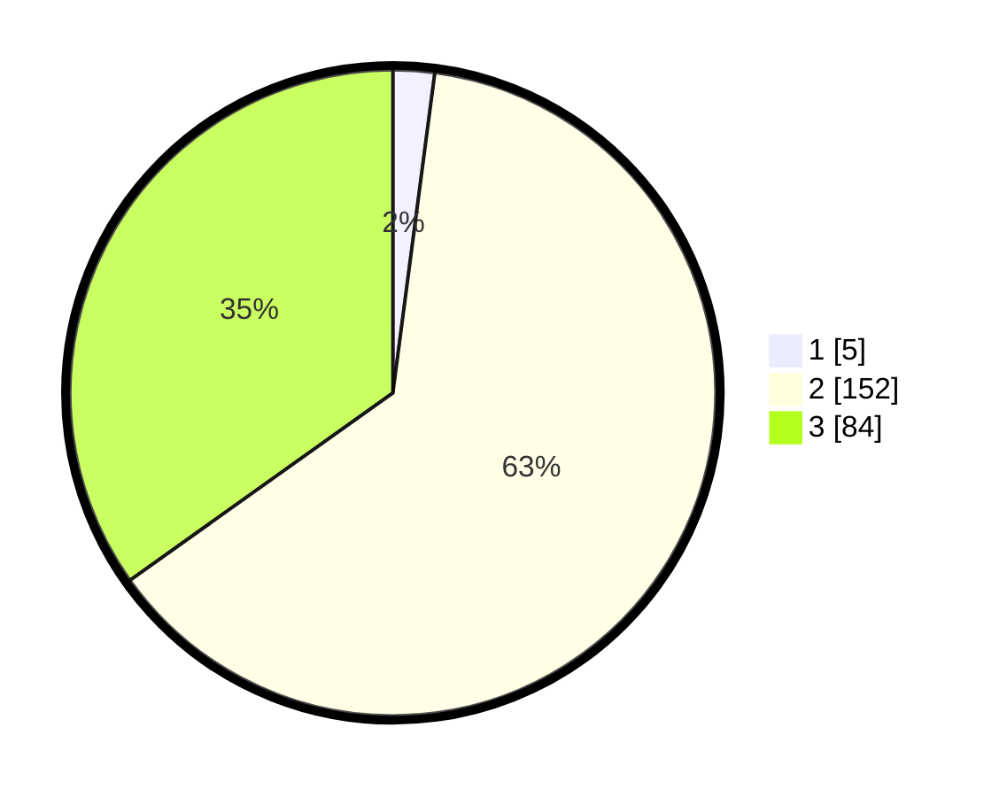

# Hasil

## Grafik

## Tabel

| No. | Nama Paslon    | Suara | Suara (raw) | Persentase |
|:--- |:-------------- | -----:| -----------:| ----------:|
| 1   | ANIES MUHAIMIN | 5     | [5][p-1]    | 2,07       |
| 2   | PRABOWO GIBRAN | 152   | [152][p-2]  | 63,07      |
| 3   | GANJAR MAHFUD  | 84    | [84][p-3]   | 34,85      |

[p-1]: https://github.com/gigit-pemilu/pemilu-2024-51-bali/blob/main/pilpres/hitung-suara/sub/51-bali/sub/04-gianyar/sub/05-ubud/sub/2006-peliatan/sub/002-tps/sub/paslon-1.txt
[p-2]: https://github.com/gigit-pemilu/pemilu-2024-51-bali/blob/main/pilpres/hitung-suara/sub/51-bali/sub/04-gianyar/sub/05-ubud/sub/2006-peliatan/sub/002-tps/sub/paslon-2.txt
[p-3]: https://github.com/gigit-pemilu/pemilu-2024-51-bali/blob/main/pilpres/hitung-suara/sub/51-bali/sub/04-gianyar/sub/05-ubud/sub/2006-peliatan/sub/002-tps/sub/paslon-3.txt

## Foto C Plano

https://sirekap-obj-formc.kpu.go.id/415f/pemilu/ppwp/51/04/05/20/06/5104052006002-20240214-215354--19e48890-c6ec-4246-8012-ea02f0a2b1c3.jpg

https://sirekap-obj-formc.kpu.go.id/415f/pemilu/ppwp/51/04/05/20/06/5104052006002-20240214-215423--2092cc4e-407b-4fd0-87b6-7d13fc11ff2a.jpg

https://sirekap-obj-formc.kpu.go.id/415f/pemilu/ppwp/51/04/05/20/06/5104052006002-20240214-215453--eb4a3d5b-a165-4366-ade2-0eb33eeff4c4.jpg

## Metadata

| Key        | Value               |
| ---------- | ------------------- |
| Time Stamp | 2024-02-15 15:00:29 |

