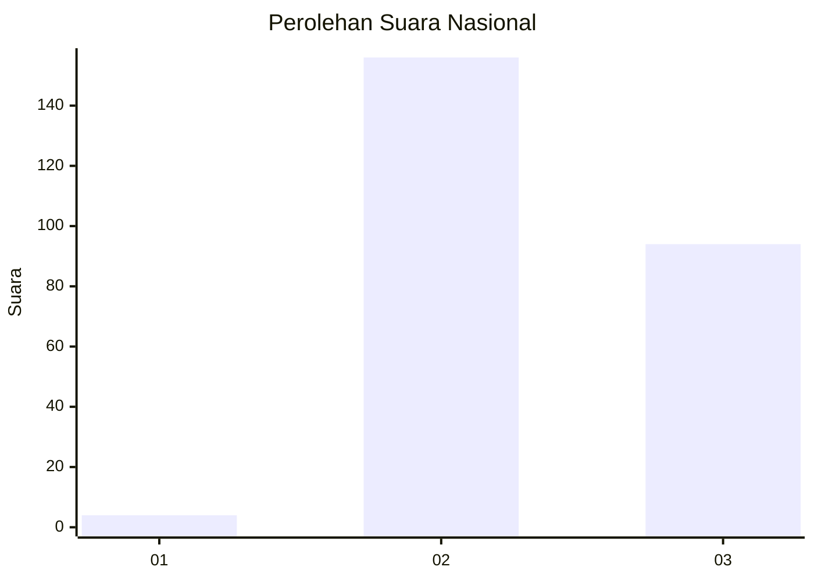
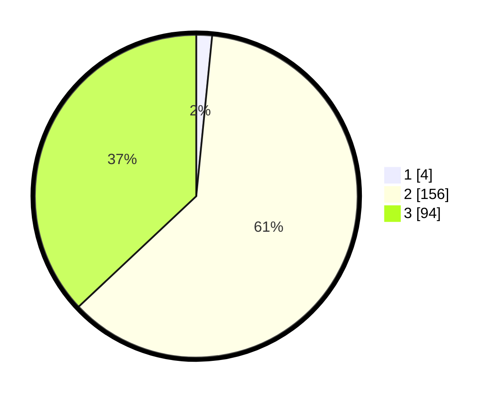

# Hasil

## Grafik

## Tabel

| No. | Nama Paslon    | Suara | Suara (raw) | Persentase |
|:--- |:-------------- | -----:| -----------:| ----------:|
| 1   | ANIES MUHAIMIN | 4     | [4][p-1]    | 1,57       |
| 2   | PRABOWO GIBRAN | 156   | [156][p-2]  | 61,42      |
| 3   | GANJAR MAHFUD  | 94    | [94][p-3]   | 37,01      |

[p-1]: https://github.com/gigit-pemilu/pemilu-2024/blob/main/pilpres/hitung-suara/sub/51-bali/sub/04-gianyar/sub/05-ubud/sub/2006-peliatan/sub/003-tps/sub/paslon-1.txt
[p-2]: https://github.com/gigit-pemilu/pemilu-2024/blob/main/pilpres/hitung-suara/sub/51-bali/sub/04-gianyar/sub/05-ubud/sub/2006-peliatan/sub/003-tps/sub/paslon-2.txt
[p-3]: https://github.com/gigit-pemilu/pemilu-2024/blob/main/pilpres/hitung-suara/sub/51-bali/sub/04-gianyar/sub/05-ubud/sub/2006-peliatan/sub/003-tps/sub/paslon-3.txt

## Foto C Plano

https://sirekap-obj-formc.kpu.go.id/e7ff/pemilu/ppwp/51/04/05/20/06/5104052006003-20240214-215006--05315f15-45fd-4b86-995d-0cf9eca2b7b4.jpg

https://sirekap-obj-formc.kpu.go.id/e7ff/pemilu/ppwp/51/04/05/20/06/5104052006003-20240214-215140--e8fbbbda-600c-475b-9695-4059e8e49055.jpg

https://sirekap-obj-formc.kpu.go.id/e7ff/pemilu/ppwp/51/04/05/20/06/5104052006003-20240214-215251--7983b203-d253-4be8-bf1f-951502d4b7b7.jpg

## Metadata

| Key        | Value               |
| ---------- | ------------------- |
| Time Stamp | 2024-02-15 19:30:26 |

