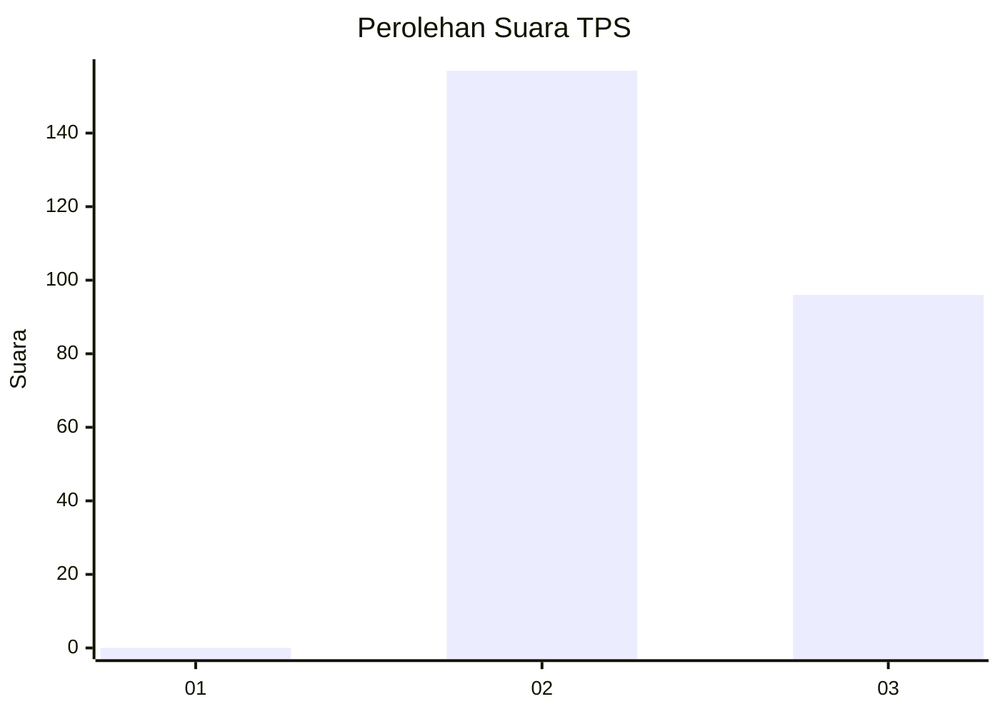
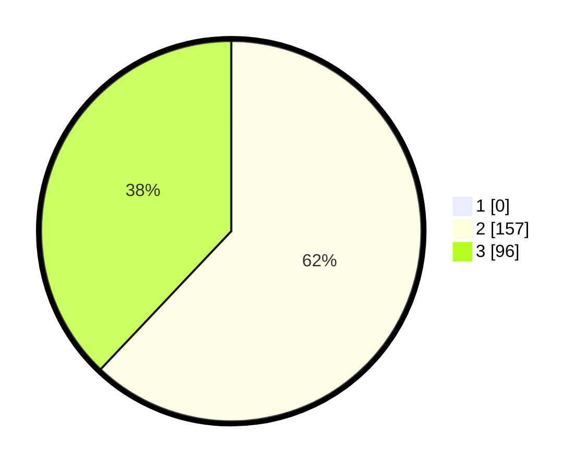

# Hasil

## Grafik

## Tabel

| No. | Nama Paslon    | Suara | Suara (raw) | Persentase |
|:--- |:-------------- | -----:| -----------:| ----------:|
| 1   | ANIES MUHAIMIN | 0     | [0][p-1]    | 0,00       |
| 2   | PRABOWO GIBRAN | 157   | [157][p-2]  | 62,06      |
| 3   | GANJAR MAHFUD  | 96    | [96][p-3]   | 37,94      |

[p-1]: https://github.com/gigit-pemilu/pemilu-2024-51-bali/blob/main/pilpres/hitung-suara/sub/51-bali/sub/04-gianyar/sub/05-ubud/sub/2006-peliatan/sub/004-tps/sub/paslon-1.txt
[p-2]: https://github.com/gigit-pemilu/pemilu-2024-51-bali/blob/main/pilpres/hitung-suara/sub/51-bali/sub/04-gianyar/sub/05-ubud/sub/2006-peliatan/sub/004-tps/sub/paslon-2.txt
[p-3]: https://github.com/gigit-pemilu/pemilu-2024-51-bali/blob/main/pilpres/hitung-suara/sub/51-bali/sub/04-gianyar/sub/05-ubud/sub/2006-peliatan/sub/004-tps/sub/paslon-3.txt

## Foto C Plano

https://sirekap-obj-formc.kpu.go.id/59cd/pemilu/ppwp/51/04/05/20/06/5104052006004-20240214-155300--84d01c40-60c4-44e8-a098-d797623762c9.jpg

https://sirekap-obj-formc.kpu.go.id/59cd/pemilu/ppwp/51/04/05/20/06/5104052006004-20240214-204505--355b59d3-3b5a-4840-a46a-2c4f7081e6e5.jpg

https://sirekap-obj-formc.kpu.go.id/59cd/pemilu/ppwp/51/04/05/20/06/5104052006004-20240214-155254--507394c6-cd95-4d47-9289-81ce62cf8fc2.jpg

## Metadata

| Key        | Value               |
| ---------- | ------------------- |
| Time Stamp | 2024-02-15 15:00:29 |

