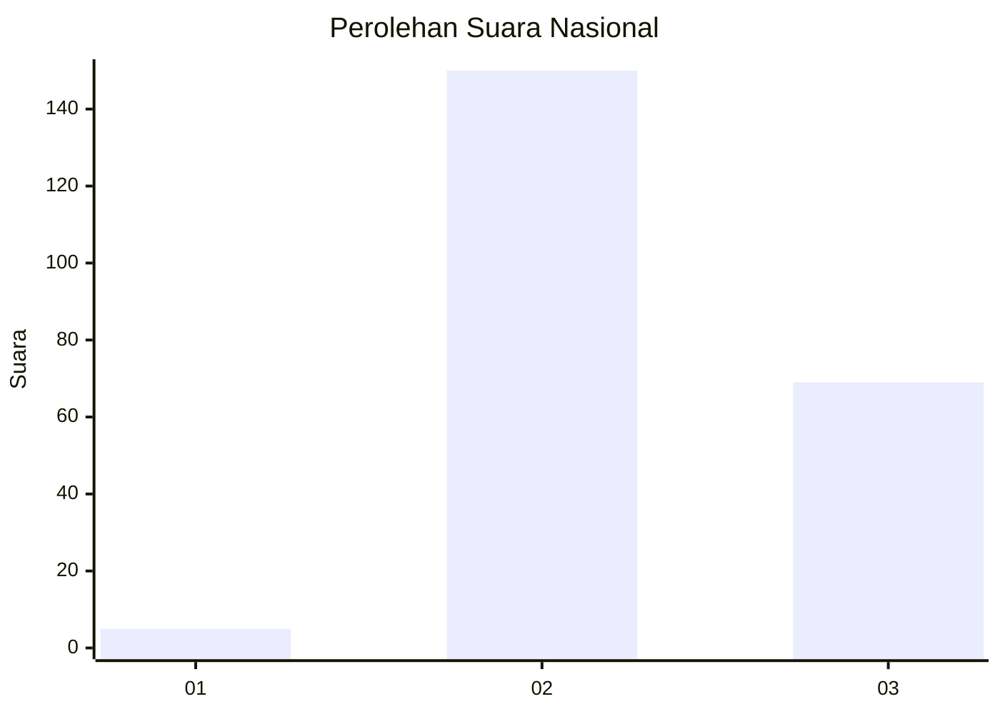
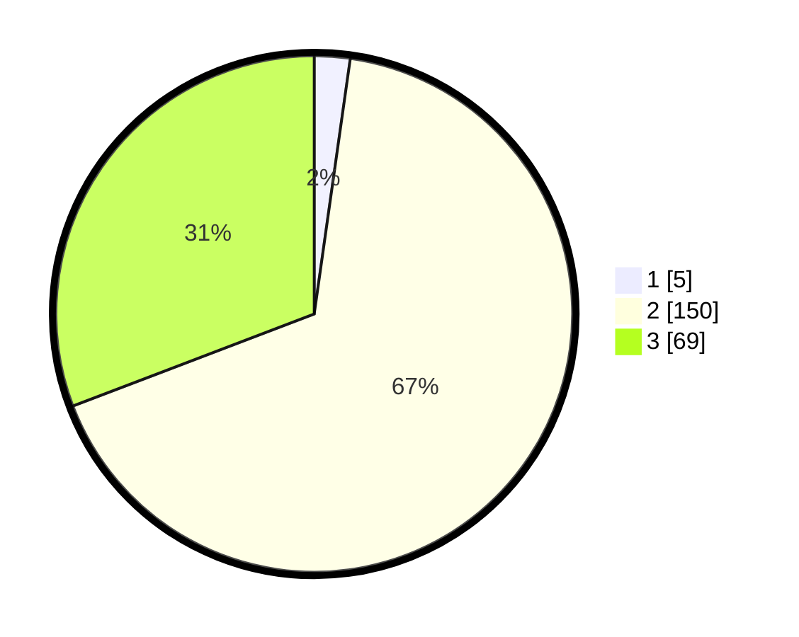

# Hasil

## Grafik

## Tabel

| No. | Nama Paslon    | Suara | Suara (raw) | Persentase |
|:--- |:-------------- | -----:| -----------:| ----------:|
| 1   | ANIES MUHAIMIN | 5     | [5][p-1]    | 2,23       |
| 2   | PRABOWO GIBRAN | 150   | [150][p-2]  | 66,96      |
| 3   | GANJAR MAHFUD  | 69    | [69][p-3]   | 30,80      |

[p-1]: https://github.com/gigit-pemilu/pemilu-2024/blob/main/pilpres/hitung-suara/sub/51-bali/sub/04-gianyar/sub/05-ubud/sub/2006-peliatan/sub/005-tps/sub/paslon-1.txt
[p-2]: https://github.com/gigit-pemilu/pemilu-2024/blob/main/pilpres/hitung-suara/sub/51-bali/sub/04-gianyar/sub/05-ubud/sub/2006-peliatan/sub/005-tps/sub/paslon-2.txt
[p-3]: https://github.com/gigit-pemilu/pemilu-2024/blob/main/pilpres/hitung-suara/sub/51-bali/sub/04-gianyar/sub/05-ubud/sub/2006-peliatan/sub/005-tps/sub/paslon-3.txt

## Foto C Plano

https://sirekap-obj-formc.kpu.go.id/951e/pemilu/ppwp/51/04/05/20/06/5104052006005-20240214-233649--e262a917-f3ff-4975-bfb6-f73110fe0440.jpg

https://sirekap-obj-formc.kpu.go.id/951e/pemilu/ppwp/51/04/05/20/06/5104052006005-20240214-233715--ba6e7c3d-ba3a-47ef-8f09-50cd76f75618.jpg

https://sirekap-obj-formc.kpu.go.id/951e/pemilu/ppwp/51/04/05/20/06/5104052006005-20240214-233730--121aea33-8156-42fd-897b-d920c8f41cbf.jpg

## Metadata

| Key        | Value               |
| ---------- | ------------------- |
| Time Stamp | 2024-02-15 15:00:29 |

