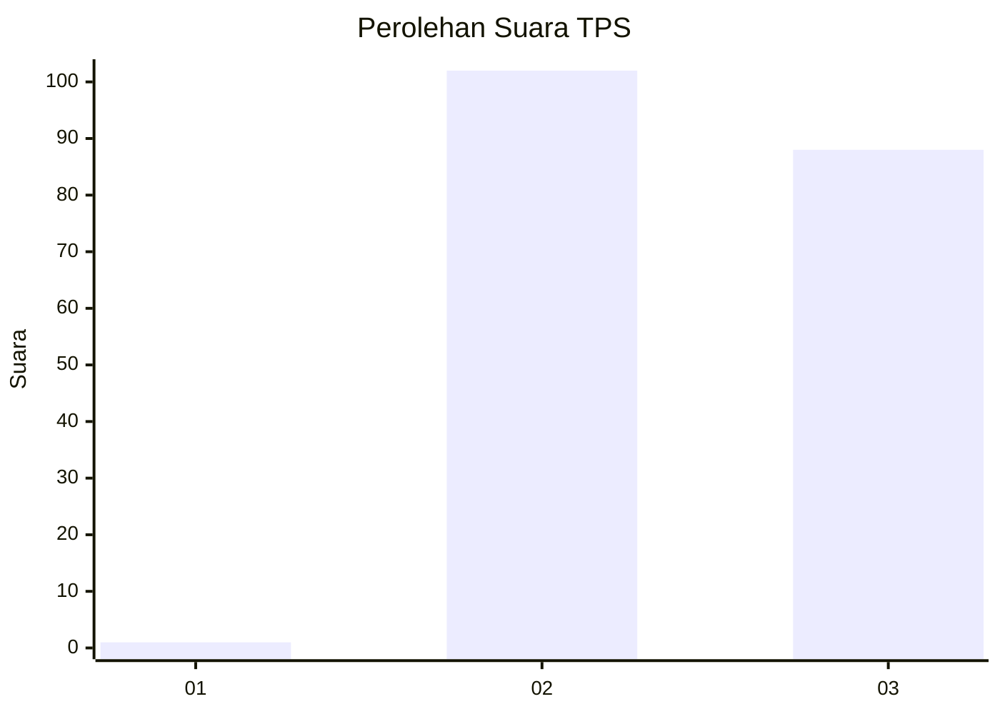
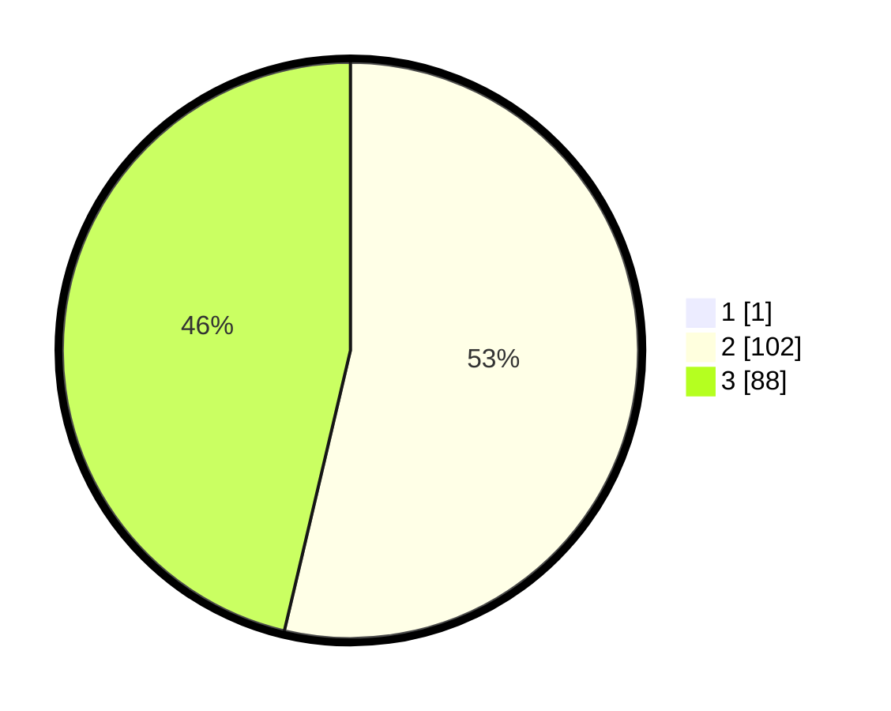

# Hasil

## Grafik

## Tabel

| No. | Nama Paslon    | Suara | Suara (raw) | Persentase |
|:--- |:-------------- | -----:| -----------:| ----------:|
| 1   | ANIES MUHAIMIN | 1     | [1][p-1]    | 0,52       |
| 2   | PRABOWO GIBRAN | 102   | [102][p-2]  | 53,40      |
| 3   | GANJAR MAHFUD  | 88    | [88][p-3]   | 46,07      |

[p-1]: https://github.com/gigit-pemilu/pemilu-2024-51-bali/blob/main/pilpres/hitung-suara/sub/51-bali/sub/04-gianyar/sub/05-ubud/sub/2006-peliatan/sub/007-tps/sub/paslon-1.txt
[p-2]: https://github.com/gigit-pemilu/pemilu-2024-51-bali/blob/main/pilpres/hitung-suara/sub/51-bali/sub/04-gianyar/sub/05-ubud/sub/2006-peliatan/sub/007-tps/sub/paslon-2.txt
[p-3]: https://github.com/gigit-pemilu/pemilu-2024-51-bali/blob/main/pilpres/hitung-suara/sub/51-bali/sub/04-gianyar/sub/05-ubud/sub/2006-peliatan/sub/007-tps/sub/paslon-3.txt

## Foto C Plano

https://sirekap-obj-formc.kpu.go.id/46ef/pemilu/ppwp/51/04/05/20/06/5104052006007-20240214-124415--c067b3bc-aa93-405e-bdff-d079922d5a12.jpg

https://sirekap-obj-formc.kpu.go.id/46ef/pemilu/ppwp/51/04/05/20/06/5104052006007-20240214-124533--cef59aeb-e56b-455b-9a79-06df62886c8f.jpg

https://sirekap-obj-formc.kpu.go.id/46ef/pemilu/ppwp/51/04/05/20/06/5104052006007-20240214-124647--3309c017-cfa2-4001-ae86-e2f3ace0dbdf.jpg

## Metadata

| Key        | Value               |
| ---------- | ------------------- |
| Time Stamp | 2024-02-15 15:30:25 |

