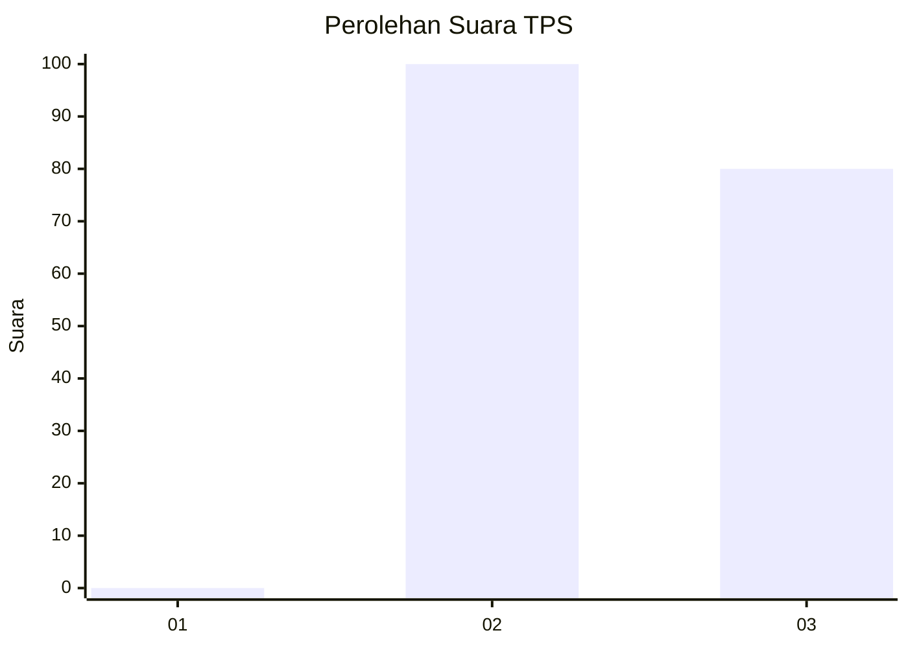
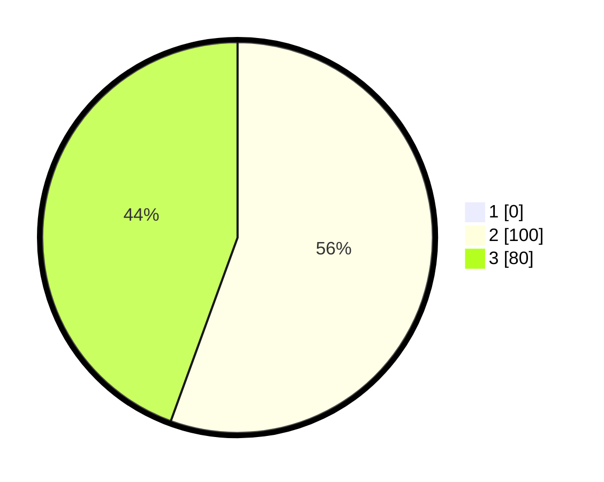

# Hasil

## Grafik

## Tabel

| No. | Nama Paslon    | Suara | Suara (raw) | Persentase |
|:--- |:-------------- | -----:| -----------:| ----------:|
| 1   | ANIES MUHAIMIN | 0     | [0][p-1]    | 0,00       |
| 2   | PRABOWO GIBRAN | 100   | [100][p-2]  | 55,56      |
| 3   | GANJAR MAHFUD  | 80    | [80][p-3]   | 44,44      |

[p-1]: https://github.com/gigit-pemilu/pemilu-2024-51-bali/blob/main/pilpres/hitung-suara/sub/51-bali/sub/04-gianyar/sub/05-ubud/sub/2006-peliatan/sub/008-tps/sub/paslon-1.txt
[p-2]: https://github.com/gigit-pemilu/pemilu-2024-51-bali/blob/main/pilpres/hitung-suara/sub/51-bali/sub/04-gianyar/sub/05-ubud/sub/2006-peliatan/sub/008-tps/sub/paslon-2.txt
[p-3]: https://github.com/gigit-pemilu/pemilu-2024-51-bali/blob/main/pilpres/hitung-suara/sub/51-bali/sub/04-gianyar/sub/05-ubud/sub/2006-peliatan/sub/008-tps/sub/paslon-3.txt

## Foto C Plano

https://sirekap-obj-formc.kpu.go.id/4461/pemilu/ppwp/51/04/05/20/06/5104052006008-20240214-192126--dab6cee3-9d9e-48e9-9a1a-30594b1b762a.jpg

https://sirekap-obj-formc.kpu.go.id/4461/pemilu/ppwp/51/04/05/20/06/5104052006008-20240214-192318--b006669d-e5ba-4152-b1c7-a83d81404840.jpg

https://sirekap-obj-formc.kpu.go.id/4461/pemilu/ppwp/51/04/05/20/06/5104052006008-20240214-192420--8bdcddad-2340-47cb-ab14-4511082e3eb8.jpg

## Metadata

| Key        | Value               |
| ---------- | ------------------- |
| Time Stamp | 2024-02-15 15:00:29 |

