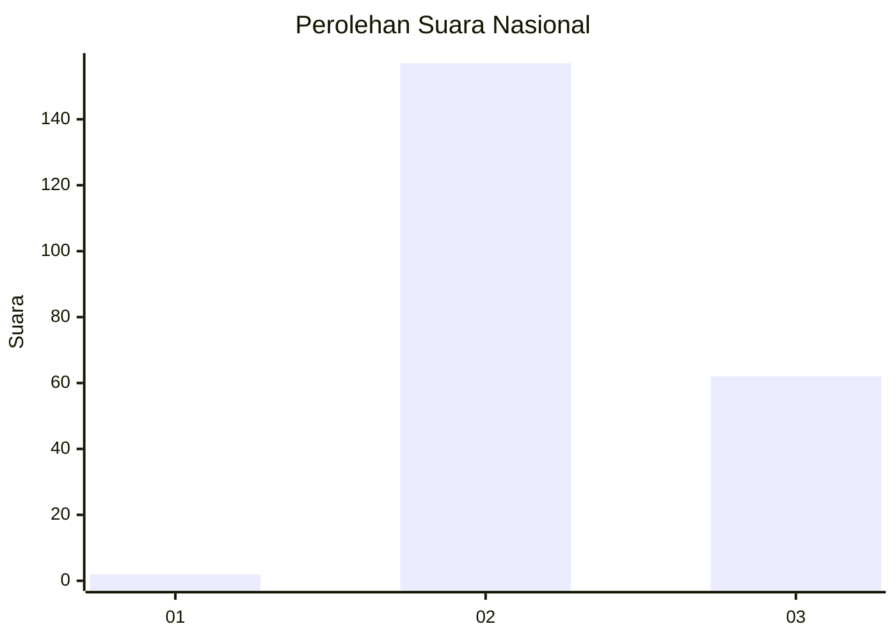
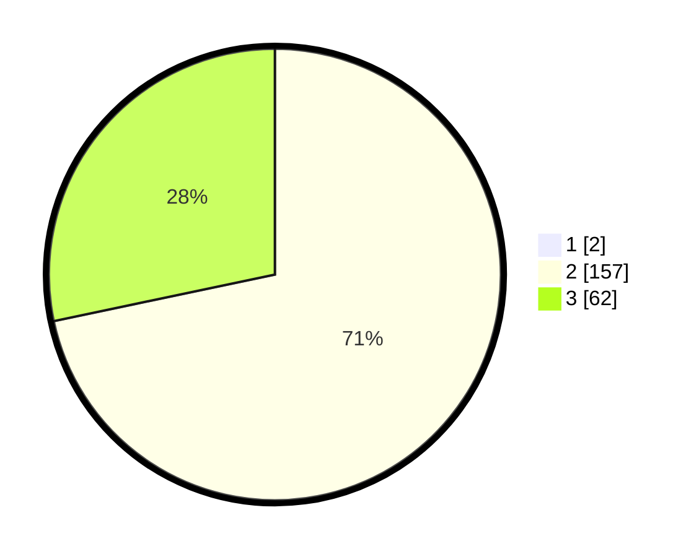

# Hasil

## Grafik

## Tabel

| No. | Nama Paslon    | Suara | Suara (raw) | Persentase |
|:--- |:-------------- | -----:| -----------:| ----------:|
| 1   | ANIES MUHAIMIN | 2     | [2][p-1]    | 0,90       |
| 2   | PRABOWO GIBRAN | 157   | [157][p-2]  | 71,04      |
| 3   | GANJAR MAHFUD  | 62    | [62][p-3]   | 28,05      |

[p-1]: https://github.com/gigit-pemilu/pemilu-2024/blob/main/pilpres/hitung-suara/sub/51-bali/sub/04-gianyar/sub/05-ubud/sub/2006-peliatan/sub/009-tps/sub/paslon-1.txt
[p-2]: https://github.com/gigit-pemilu/pemilu-2024/blob/main/pilpres/hitung-suara/sub/51-bali/sub/04-gianyar/sub/05-ubud/sub/2006-peliatan/sub/009-tps/sub/paslon-2.txt
[p-3]: https://github.com/gigit-pemilu/pemilu-2024/blob/main/pilpres/hitung-suara/sub/51-bali/sub/04-gianyar/sub/05-ubud/sub/2006-peliatan/sub/009-tps/sub/paslon-3.txt

## Foto C Plano

https://sirekap-obj-formc.kpu.go.id/7443/pemilu/ppwp/51/04/05/20/06/5104052006009-20240214-212847--1983746d-5302-4a4e-bfdf-e4ba0f8658d9.jpg

https://sirekap-obj-formc.kpu.go.id/7443/pemilu/ppwp/51/04/05/20/06/5104052006009-20240215-000001--3797c8bc-726f-46f6-927c-28930831a772.jpg

https://sirekap-obj-formc.kpu.go.id/7443/pemilu/ppwp/51/04/05/20/06/5104052006009-20240214-213340--0c7711e4-fb91-4987-a015-b684b06637e0.jpg

## Metadata

| Key        | Value               |
| ---------- | ------------------- |
| Time Stamp | 2024-02-15 15:00:29 |

