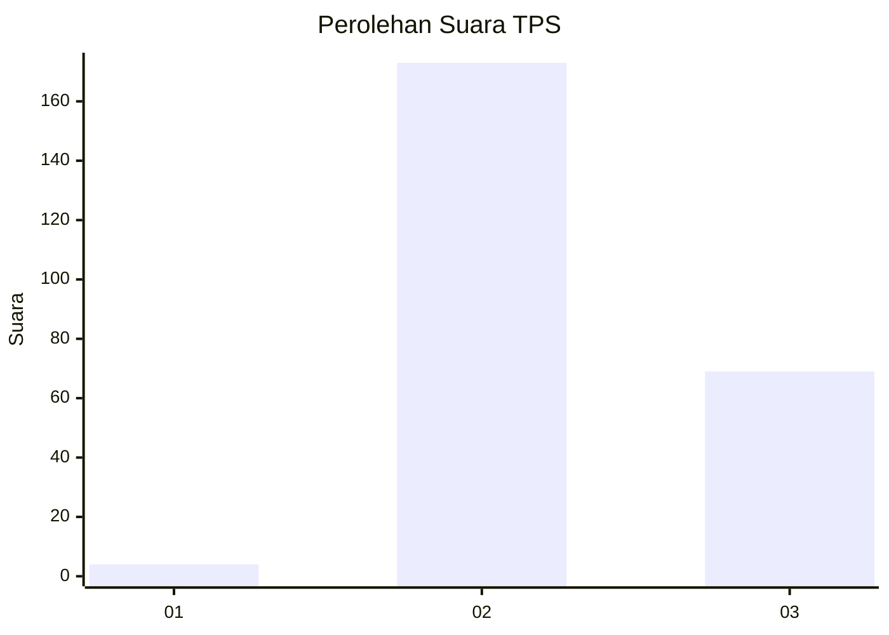
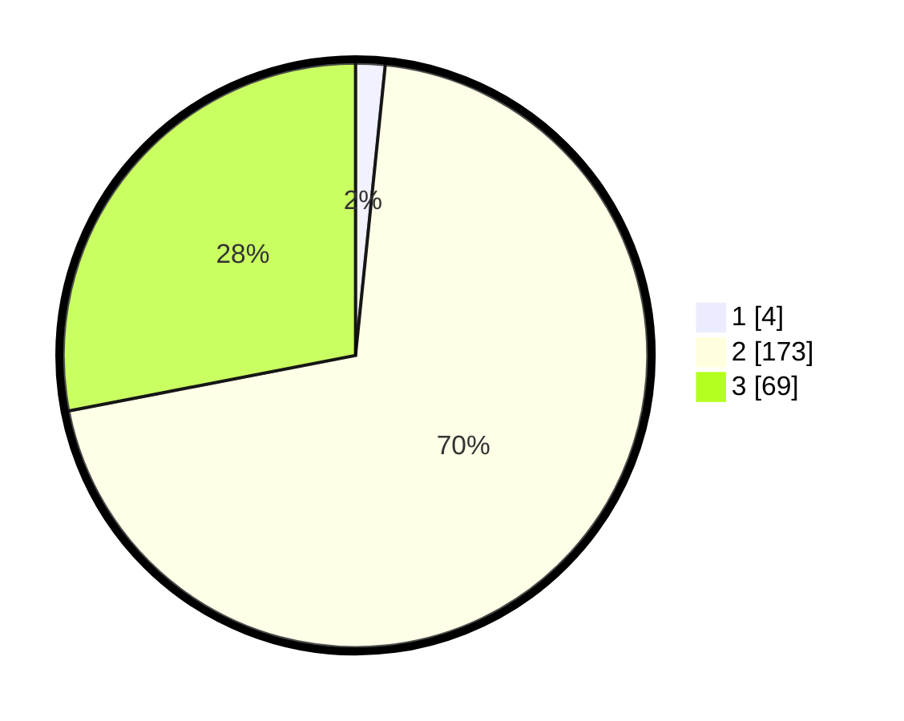

# Hasil

## Grafik

## Tabel

| No. | Nama Paslon    | Suara | Suara (raw) | Persentase |
|:--- |:-------------- | -----:| -----------:| ----------:|
| 1   | ANIES MUHAIMIN | 4     | [4][p-1]    | 1,63       |
| 2   | PRABOWO GIBRAN | 173   | [173][p-2]  | 70,33      |
| 3   | GANJAR MAHFUD  | 69    | [69][p-3]   | 28,05      |

[p-1]: https://github.com/gigit-pemilu/pemilu-2024-51-bali/blob/main/pilpres/hitung-suara/sub/51-bali/sub/04-gianyar/sub/05-ubud/sub/2006-peliatan/sub/012-tps/sub/paslon-1.txt
[p-2]: https://github.com/gigit-pemilu/pemilu-2024-51-bali/blob/main/pilpres/hitung-suara/sub/51-bali/sub/04-gianyar/sub/05-ubud/sub/2006-peliatan/sub/012-tps/sub/paslon-2.txt
[p-3]: https://github.com/gigit-pemilu/pemilu-2024-51-bali/blob/main/pilpres/hitung-suara/sub/51-bali/sub/04-gianyar/sub/05-ubud/sub/2006-peliatan/sub/012-tps/sub/paslon-3.txt

## Foto C Plano

https://sirekap-obj-formc.kpu.go.id/e5fb/pemilu/ppwp/51/04/05/20/06/5104052006012-20240214-220703--a3d55850-eb65-47b5-b052-89330b9ada95.jpg

https://sirekap-obj-formc.kpu.go.id/e5fb/pemilu/ppwp/51/04/05/20/06/5104052006012-20240214-220728--90c0b146-ef3d-4119-995f-a0419e2a5f89.jpg

https://sirekap-obj-formc.kpu.go.id/e5fb/pemilu/ppwp/51/04/05/20/06/5104052006012-20240214-220750--2c010962-67d6-4ab3-b7ad-5d530e8ed58f.jpg

## Metadata

| Key        | Value               |
| ---------- | ------------------- |
| Time Stamp | 2024-02-15 15:00:29 |

