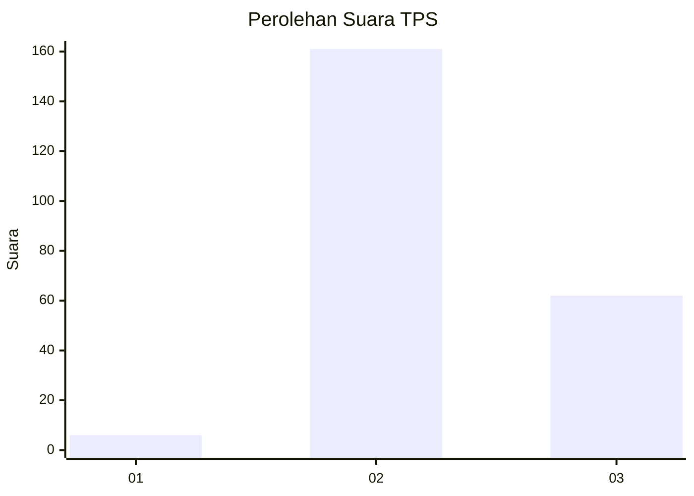
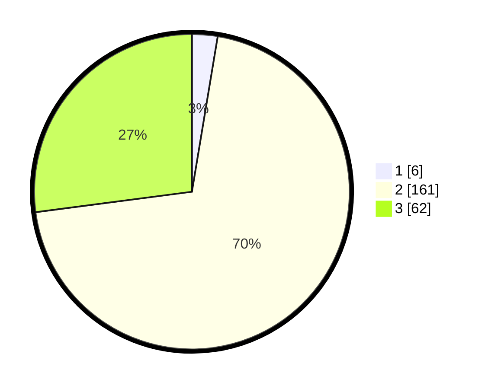

# Hasil

## Grafik

## Tabel

| No. | Nama Paslon    | Suara | Suara (raw) | Persentase |
|:--- |:-------------- | -----:| -----------:| ----------:|
| 1   | ANIES MUHAIMIN | 6     | [6][p-1]    | 2,62       |
| 2   | PRABOWO GIBRAN | 161   | [161][p-2]  | 70,31      |
| 3   | GANJAR MAHFUD  | 62    | [62][p-3]   | 27,07      |

[p-1]: https://github.com/gigit-pemilu/pemilu-2024-51-bali/blob/main/pilpres/hitung-suara/sub/51-bali/sub/04-gianyar/sub/05-ubud/sub/2006-peliatan/sub/013-tps/sub/paslon-1.txt
[p-2]: https://github.com/gigit-pemilu/pemilu-2024-51-bali/blob/main/pilpres/hitung-suara/sub/51-bali/sub/04-gianyar/sub/05-ubud/sub/2006-peliatan/sub/013-tps/sub/paslon-2.txt
[p-3]: https://github.com/gigit-pemilu/pemilu-2024-51-bali/blob/main/pilpres/hitung-suara/sub/51-bali/sub/04-gianyar/sub/05-ubud/sub/2006-peliatan/sub/013-tps/sub/paslon-3.txt

## Foto C Plano

https://sirekap-obj-formc.kpu.go.id/f07f/pemilu/ppwp/51/04/05/20/06/5104052006013-20240214-205946--6bee0e7d-aea7-449f-b60e-9b02b274524c.jpg

https://sirekap-obj-formc.kpu.go.id/f07f/pemilu/ppwp/51/04/05/20/06/5104052006013-20240214-210157--62f41d4c-0edb-4cea-b080-2d80b4b310fd.jpg

https://sirekap-obj-formc.kpu.go.id/f07f/pemilu/ppwp/51/04/05/20/06/5104052006013-20240214-210039--4fc1282d-689e-4efb-ae4a-dd0bd38ac376.jpg

## Metadata

| Key        | Value               |
| ---------- | ------------------- |
| Time Stamp | 2024-02-15 15:00:29 |

