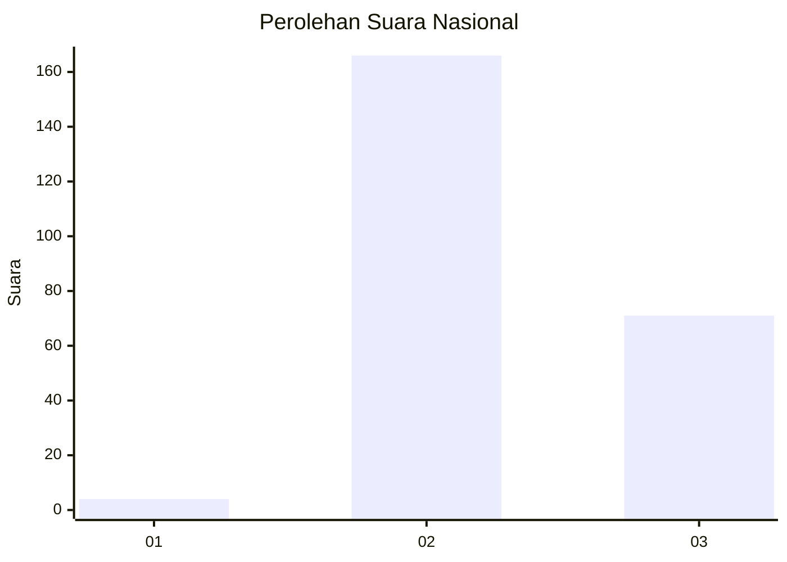

# Hasil

## Grafik

## Tabel

| No. | Nama Paslon    | Suara | Suara (raw) | Persentase |
|:--- |:-------------- | -----:| -----------:| ----------:|
| 1   | ANIES MUHAIMIN | 4     | [4][p-1]    | 1,66       |
| 2   | PRABOWO GIBRAN | 166   | [166][p-2]  | 68,88      |
| 3   | GANJAR MAHFUD  | 71    | [71][p-3]   | 29,46      |

[p-1]: https://github.com/gigit-pemilu/pemilu-2024/blob/main/pilpres/hitung-suara/sub/51-bali/sub/04-gianyar/sub/05-ubud/sub/2006-peliatan/sub/015-tps/sub/paslon-1.txt
[p-2]: https://github.com/gigit-pemilu/pemilu-2024/blob/main/pilpres/hitung-suara/sub/51-bali/sub/04-gianyar/sub/05-ubud/sub/2006-peliatan/sub/015-tps/sub/paslon-2.txt
[p-3]: https://github.com/gigit-pemilu/pemilu-2024/blob/main/pilpres/hitung-suara/sub/51-bali/sub/04-gianyar/sub/05-ubud/sub/2006-peliatan/sub/015-tps/sub/paslon-3.txt

## Foto C Plano

https://sirekap-obj-formc.kpu.go.id/42b0/pemilu/ppwp/51/04/05/20/06/5104052006015-20240214-224254--fa7aa6be-8945-490b-8389-9377414fb950.jpg

https://sirekap-obj-formc.kpu.go.id/42b0/pemilu/ppwp/51/04/05/20/06/5104052006015-20240214-224346--d373d43c-afeb-4783-a432-efbecc8a4176.jpg

https://sirekap-obj-formc.kpu.go.id/42b0/pemilu/ppwp/51/04/05/20/06/5104052006015-20240214-224431--c2f49a0b-5001-4c83-bc1f-a925ab123570.jpg

## Metadata

| Key        | Value               |
| ---------- | ------------------- |
| Time Stamp | 2024-02-15 15:30:25 |

