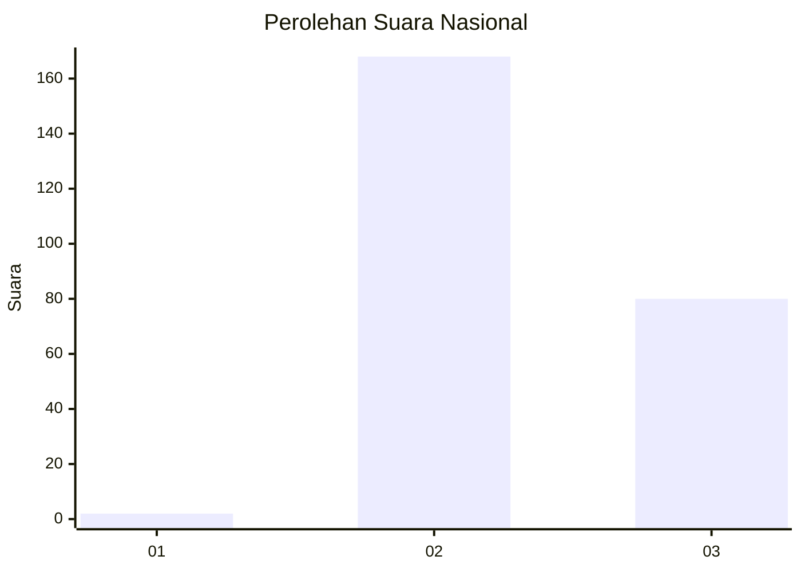
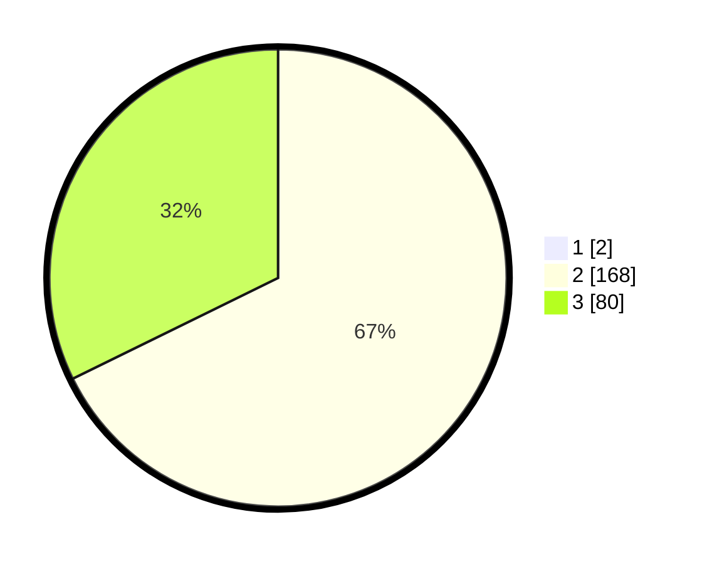

# Hasil

## Grafik

## Tabel

| No. | Nama Paslon    | Suara | Suara (raw) | Persentase |
|:--- |:-------------- | -----:| -----------:| ----------:|
| 1   | ANIES MUHAIMIN | 2     | [2][p-1]    | 0,80       |
| 2   | PRABOWO GIBRAN | 168   | [168][p-2]  | 67,20      |
| 3   | GANJAR MAHFUD  | 80    | [80][p-3]   | 32,00      |

[p-1]: https://github.com/gigit-pemilu/pemilu-2024/blob/main/pilpres/hitung-suara/sub/51-bali/sub/04-gianyar/sub/05-ubud/sub/2006-peliatan/sub/017-tps/sub/paslon-1.txt
[p-2]: https://github.com/gigit-pemilu/pemilu-2024/blob/main/pilpres/hitung-suara/sub/51-bali/sub/04-gianyar/sub/05-ubud/sub/2006-peliatan/sub/017-tps/sub/paslon-2.txt
[p-3]: https://github.com/gigit-pemilu/pemilu-2024/blob/main/pilpres/hitung-suara/sub/51-bali/sub/04-gianyar/sub/05-ubud/sub/2006-peliatan/sub/017-tps/sub/paslon-3.txt

## Foto C Plano

https://sirekap-obj-formc.kpu.go.id/6e59/pemilu/ppwp/51/04/05/20/06/5104052006017-20240214-223512--404ce4c9-0bda-44b5-9f7f-969840d1b9ff.jpg

https://sirekap-obj-formc.kpu.go.id/6e59/pemilu/ppwp/51/04/05/20/06/5104052006017-20240214-223714--e5476b72-9c3a-4471-95b3-13ddbd689a81.jpg

https://sirekap-obj-formc.kpu.go.id/6e59/pemilu/ppwp/51/04/05/20/06/5104052006017-20240214-224001--cec460ef-0df0-43c2-8a8a-7163eaed5dee.jpg

## Metadata

| Key        | Value               |
| ---------- | ------------------- |
| Time Stamp | 2024-02-15 15:00:29 |

