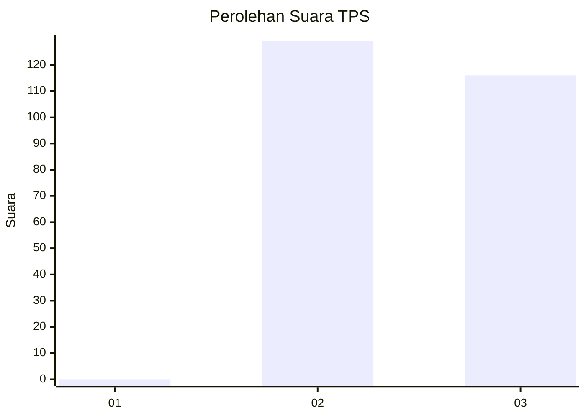
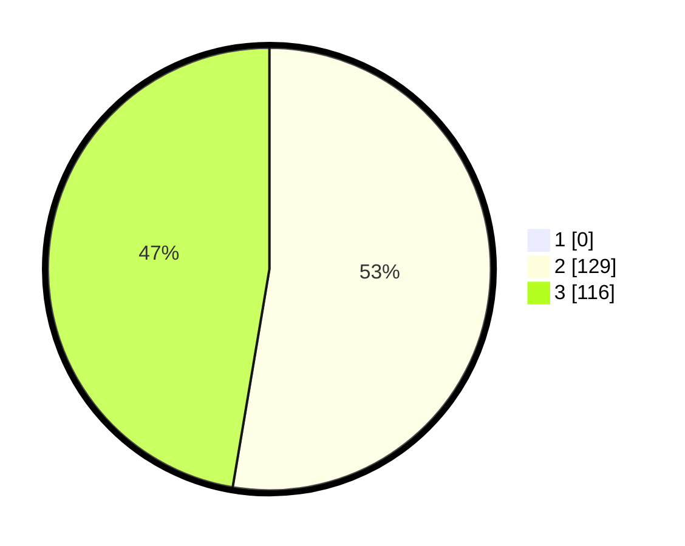

# Hasil

## Grafik

## Tabel

| No. | Nama Paslon    | Suara | Suara (raw) | Persentase |
|:--- |:-------------- | -----:| -----------:| ----------:|
| 1   | ANIES MUHAIMIN | 0     | [0][p-1]    | 0,00       |
| 2   | PRABOWO GIBRAN | 129   | [129][p-2]  | 52,65      |
| 3   | GANJAR MAHFUD  | 116   | [116][p-3]  | 47,35      |

[p-1]: https://github.com/gigit-pemilu/pemilu-2024-51-bali/blob/main/pilpres/hitung-suara/sub/51-bali/sub/04-gianyar/sub/05-ubud/sub/2006-peliatan/sub/021-tps/sub/paslon-1.txt
[p-2]: https://github.com/gigit-pemilu/pemilu-2024-51-bali/blob/main/pilpres/hitung-suara/sub/51-bali/sub/04-gianyar/sub/05-ubud/sub/2006-peliatan/sub/021-tps/sub/paslon-2.txt
[p-3]: https://github.com/gigit-pemilu/pemilu-2024-51-bali/blob/main/pilpres/hitung-suara/sub/51-bali/sub/04-gianyar/sub/05-ubud/sub/2006-peliatan/sub/021-tps/sub/paslon-3.txt

## Foto C Plano

https://sirekap-obj-formc.kpu.go.id/cb67/pemilu/ppwp/51/04/05/20/06/5104052006021-20240215-014554--ca05f70c-d5ca-4f28-b53d-2f651f21278c.jpg

https://sirekap-obj-formc.kpu.go.id/cb67/pemilu/ppwp/51/04/05/20/06/5104052006021-20240215-014616--41d67f3a-c994-4913-a8f0-70a80b379c18.jpg

https://sirekap-obj-formc.kpu.go.id/cb67/pemilu/ppwp/51/04/05/20/06/5104052006021-20240214-215712--06c7c524-e019-4094-9e77-94833eb27523.jpg

## Metadata

| Key        | Value               |
| ---------- | ------------------- |
| Time Stamp | 2024-02-15 15:30:25 |

