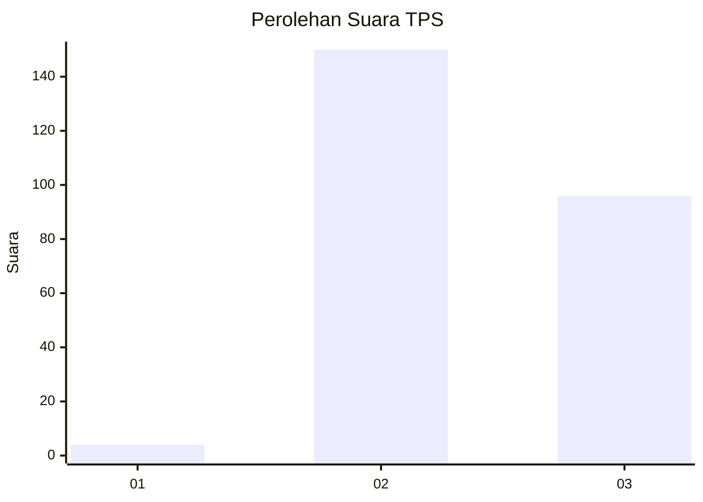
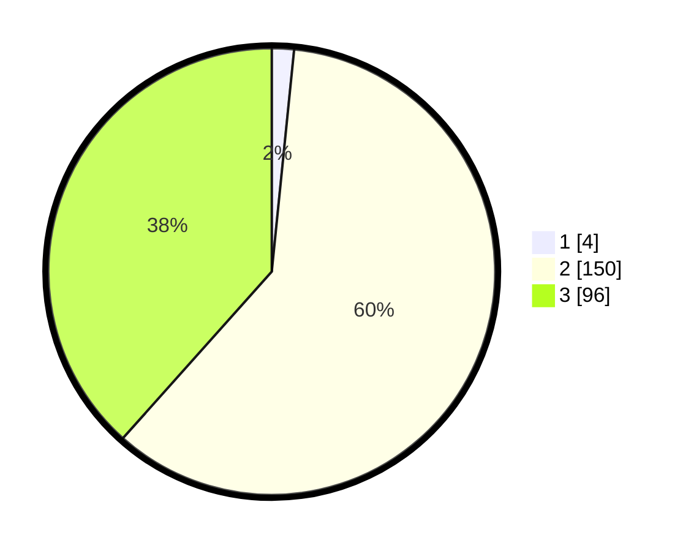

# Hasil

## Grafik

## Tabel

| No. | Nama Paslon    | Suara | Suara (raw) | Persentase |
|:--- |:-------------- | -----:| -----------:| ----------:|
| 1   | ANIES MUHAIMIN | 4     | [4][p-1]    | 1,60       |
| 2   | PRABOWO GIBRAN | 150   | [150][p-2]  | 60,00      |
| 3   | GANJAR MAHFUD  | 96    | [96][p-3]   | 38,40      |

[p-1]: https://github.com/gigit-pemilu/pemilu-2024-51-bali/blob/main/pilpres/hitung-suara/sub/51-bali/sub/04-gianyar/sub/05-ubud/sub/2007-petulu/sub/004-tps/sub/paslon-1.txt
[p-2]: https://github.com/gigit-pemilu/pemilu-2024-51-bali/blob/main/pilpres/hitung-suara/sub/51-bali/sub/04-gianyar/sub/05-ubud/sub/2007-petulu/sub/004-tps/sub/paslon-2.txt
[p-3]: https://github.com/gigit-pemilu/pemilu-2024-51-bali/blob/main/pilpres/hitung-suara/sub/51-bali/sub/04-gianyar/sub/05-ubud/sub/2007-petulu/sub/004-tps/sub/paslon-3.txt

## Foto C Plano

https://sirekap-obj-formc.kpu.go.id/8f8e/pemilu/ppwp/51/04/05/20/07/5104052007004-20240214-195206--454077a3-c3f3-4006-9204-a0fbbf205c16.jpg

https://sirekap-obj-formc.kpu.go.id/8f8e/pemilu/ppwp/51/04/05/20/07/5104052007004-20240214-195319--ff802dee-ceca-44b2-8678-4b503b5184ab.jpg

https://sirekap-obj-formc.kpu.go.id/8f8e/pemilu/ppwp/51/04/05/20/07/5104052007004-20240214-195446--c7f7c3eb-0164-4122-9cda-7779861c8d88.jpg

## Metadata

| Key        | Value               |
| ---------- | ------------------- |
| Time Stamp | 2024-02-15 15:30:25 |

