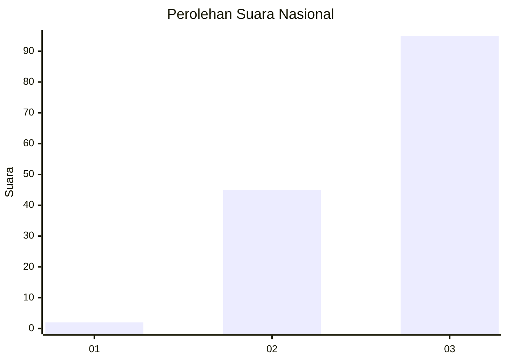
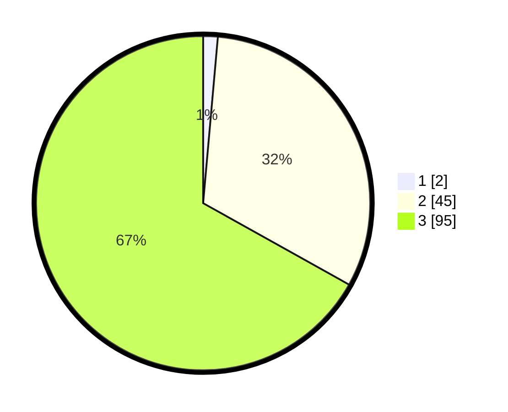

# Hasil

## Grafik

## Tabel

| No. | Nama Paslon    | Suara | Suara (raw) | Persentase |
|:--- |:-------------- | -----:| -----------:| ----------:|
| 1   | ANIES MUHAIMIN | 2     | [2][p-1]    | 1,41       |
| 2   | PRABOWO GIBRAN | 45    | [45][p-2]   | 31,69      |
| 3   | GANJAR MAHFUD  | 95    | [95][p-3]   | 66,90      |

[p-1]: https://github.com/gigit-pemilu/pemilu-2024/blob/main/pilpres/hitung-suara/sub/51-bali/sub/04-gianyar/sub/05-ubud/sub/2008-sayan/sub/001-tps/sub/paslon-1.txt
[p-2]: https://github.com/gigit-pemilu/pemilu-2024/blob/main/pilpres/hitung-suara/sub/51-bali/sub/04-gianyar/sub/05-ubud/sub/2008-sayan/sub/001-tps/sub/paslon-2.txt
[p-3]: https://github.com/gigit-pemilu/pemilu-2024/blob/main/pilpres/hitung-suara/sub/51-bali/sub/04-gianyar/sub/05-ubud/sub/2008-sayan/sub/001-tps/sub/paslon-3.txt

## Foto C Plano

https://sirekap-obj-formc.kpu.go.id/d3ae/pemilu/ppwp/51/04/05/20/08/5104052008001-20240214-130548--8a22201f-3575-4e76-bc75-2d09a5eddeb0.jpg

https://sirekap-obj-formc.kpu.go.id/d3ae/pemilu/ppwp/51/04/05/20/08/5104052008001-20240214-132036--3da02672-4582-415c-90a6-f7142aa696aa.jpg

https://sirekap-obj-formc.kpu.go.id/d3ae/pemilu/ppwp/51/04/05/20/08/5104052008001-20240214-131002--047c9c06-2cfb-482f-b6e3-6a6f3d074b20.jpg

## Metadata

| Key        | Value               |
| ---------- | ------------------- |
| Time Stamp | 2024-02-14 21:46:01 |

## DATA PEMILIH TETAP

Jumlah pemilih dalam DPT: **148**.
 * L: **72**.
 * P: **73**.

## DATA PENGGUNA HAK PILIH

Jumlah pengguna hak pilih dalam DPT: **143**.
 * L: **70**.
 * P: **73**.

Jumlah pengguna hak pilih dalam DPTb: **0**.
 * L: **0**.
 * P: **0**.

Jumlah pengguna hak pilih dalam DPK: **0**.
 * L: **0**.
 * P: **0**.

Jumlah pengguna hak pilih: **143**.
 * L: **70**.
 * P: **73**.

## JUMLAH SUARA SAH DAN TIDAK SAH

JUMLAH SELURUH SUARA SAH: **142**.

JUMLAH SUARA TIDAK SAH: **1**.

JUMLAH SELURUH SUARA SAH DAN SUARA TIDAK SAH: **143**.

