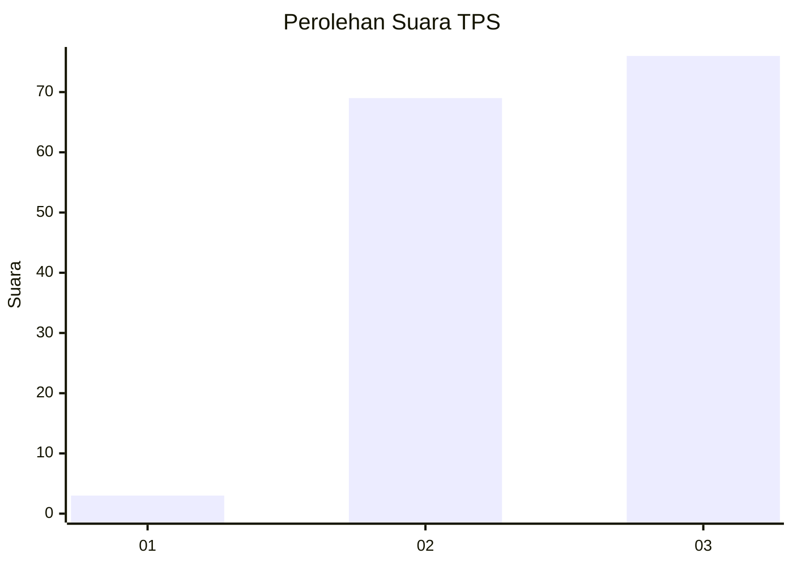
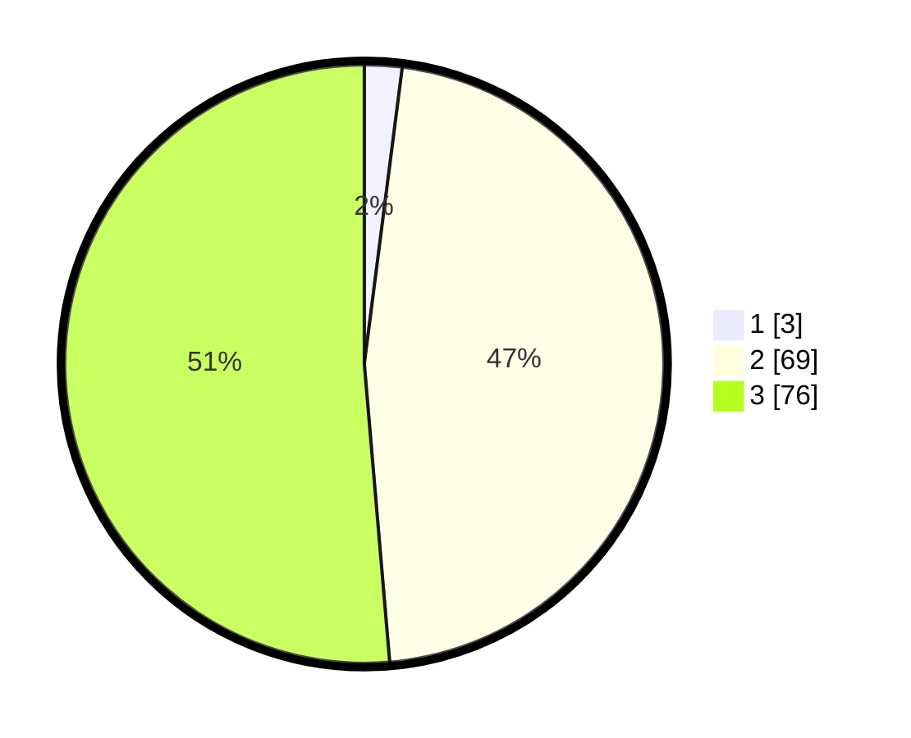

# Hasil

## Grafik

## Tabel

| No. | Nama Paslon    | Suara | Suara (raw) | Persentase |
|:--- |:-------------- | -----:| -----------:| ----------:|
| 1   | ANIES MUHAIMIN | 3     | [3][p-1]    | 2,03       |
| 2   | PRABOWO GIBRAN | 69    | [69][p-2]   | 46,62      |
| 3   | GANJAR MAHFUD  | 76    | [76][p-3]   | 51,35      |

[p-1]: https://github.com/gigit-pemilu/pemilu-2024-51-bali/blob/main/pilpres/hitung-suara/sub/51-bali/sub/04-gianyar/sub/05-ubud/sub/2008-sayan/sub/002-tps/sub/paslon-1.txt
[p-2]: https://github.com/gigit-pemilu/pemilu-2024-51-bali/blob/main/pilpres/hitung-suara/sub/51-bali/sub/04-gianyar/sub/05-ubud/sub/2008-sayan/sub/002-tps/sub/paslon-2.txt
[p-3]: https://github.com/gigit-pemilu/pemilu-2024-51-bali/blob/main/pilpres/hitung-suara/sub/51-bali/sub/04-gianyar/sub/05-ubud/sub/2008-sayan/sub/002-tps/sub/paslon-3.txt

## Foto C Plano

https://sirekap-obj-formc.kpu.go.id/675c/pemilu/ppwp/51/04/05/20/08/5104052008002-20240214-131837--924fb82b-5e95-4b1e-83dc-8841394345da.jpg

https://sirekap-obj-formc.kpu.go.id/675c/pemilu/ppwp/51/04/05/20/08/5104052008002-20240214-131817--b260108d-246f-4c12-a5d6-8280b677bc81.jpg

https://sirekap-obj-formc.kpu.go.id/675c/pemilu/ppwp/51/04/05/20/08/5104052008002-20240214-131854--5c361f2d-56d7-4f88-842a-1223e610fc4a.jpg

## Metadata

| Key        | Value               |
| ---------- | ------------------- |
| Time Stamp | 2024-02-14 21:46:01 |

## DATA PEMILIH TETAP

Jumlah pemilih dalam DPT: **151**.
 * L: **74**.
 * P: **77**.

## DATA PENGGUNA HAK PILIH

Jumlah pengguna hak pilih dalam DPT: **149**.
 * L: **74**.
 * P: **75**.

Jumlah pengguna hak pilih dalam DPTb: **0**.
 * L: **0**.
 * P: **0**.

Jumlah pengguna hak pilih dalam DPK: **1**.
 * L: **0**.
 * P: **1**.

Jumlah pengguna hak pilih: **150**.
 * L: **74**.
 * P: **76**.

## JUMLAH SUARA SAH DAN TIDAK SAH

JUMLAH SELURUH SUARA SAH: **148**.

JUMLAH SUARA TIDAK SAH: **2**.

JUMLAH SELURUH SUARA SAH DAN SUARA TIDAK SAH: **150**.

