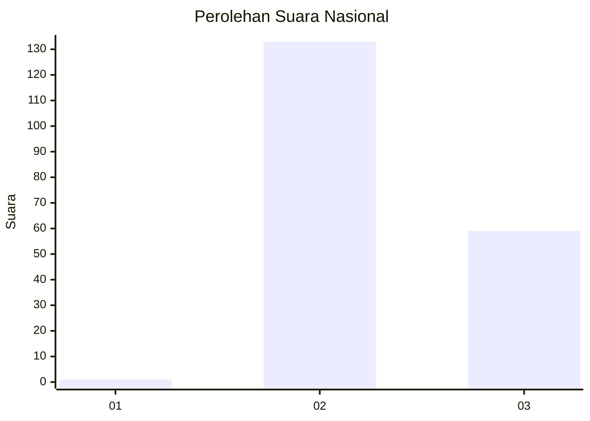
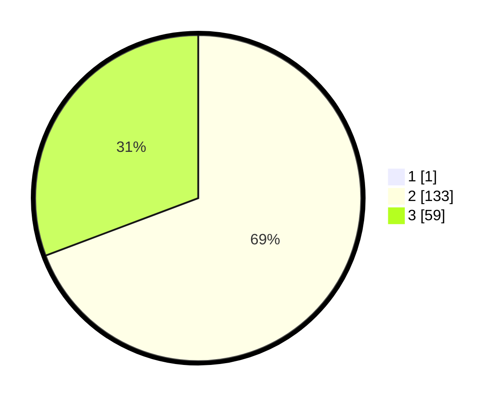

# Hasil

## Grafik

## Tabel

| No. | Nama Paslon    | Suara | Suara (raw) | Persentase |
|:--- |:-------------- | -----:| -----------:| ----------:|
| 1   | ANIES MUHAIMIN | 1     | [1][p-1]    | 0,52       |
| 2   | PRABOWO GIBRAN | 133   | [133][p-2]  | 68,91      |
| 3   | GANJAR MAHFUD  | 59    | [59][p-3]   | 30,57      |

[p-1]: https://github.com/gigit-pemilu/pemilu-2024/blob/main/pilpres/hitung-suara/sub/51-bali/sub/04-gianyar/sub/05-ubud/sub/2008-sayan/sub/008-tps/sub/paslon-1.txt
[p-2]: https://github.com/gigit-pemilu/pemilu-2024/blob/main/pilpres/hitung-suara/sub/51-bali/sub/04-gianyar/sub/05-ubud/sub/2008-sayan/sub/008-tps/sub/paslon-2.txt
[p-3]: https://github.com/gigit-pemilu/pemilu-2024/blob/main/pilpres/hitung-suara/sub/51-bali/sub/04-gianyar/sub/05-ubud/sub/2008-sayan/sub/008-tps/sub/paslon-3.txt

## Foto C Plano

https://sirekap-obj-formc.kpu.go.id/4d46/pemilu/ppwp/51/04/05/20/08/5104052008008-20240215-173524--5216c119-c596-4839-959f-190ac6aa6a5b.jpg

https://sirekap-obj-formc.kpu.go.id/4d46/pemilu/ppwp/51/04/05/20/08/5104052008008-20240215-173537--86a1a452-598e-46d5-a65d-3ffefd1cbaa0.jpg

https://sirekap-obj-formc.kpu.go.id/4d46/pemilu/ppwp/51/04/05/20/08/5104052008008-20240215-173547--b0ff1ec7-f767-4e2a-b7a1-b45001ec76ca.jpg

## Metadata

| Key        | Value               |
| ---------- | ------------------- |
| Time Stamp | 2024-02-19 19:00:00 |

## DATA PEMILIH TETAP

Jumlah pemilih dalam DPT: **211**.
 * L: **109**.
 * P: **102**.

## DATA PENGGUNA HAK PILIH

Jumlah pengguna hak pilih dalam DPT: **195**.
 * L: **104**.
 * P: **91**.

Jumlah pengguna hak pilih dalam DPTb: **0**.
 * L: **0**.
 * P: **0**.

Jumlah pengguna hak pilih dalam DPK: **0**.
 * L: **0**.
 * P: **0**.

Jumlah pengguna hak pilih: **195**.
 * L: **104**.
 * P: **91**.

## JUMLAH SUARA SAH DAN TIDAK SAH

JUMLAH SELURUH SUARA SAH: **193**.

JUMLAH SUARA TIDAK SAH: **2**.

JUMLAH SELURUH SUARA SAH DAN SUARA TIDAK SAH: **195**.

