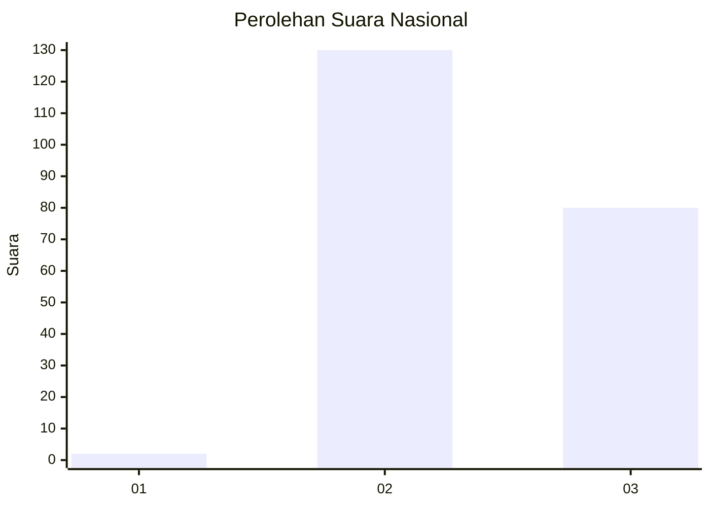
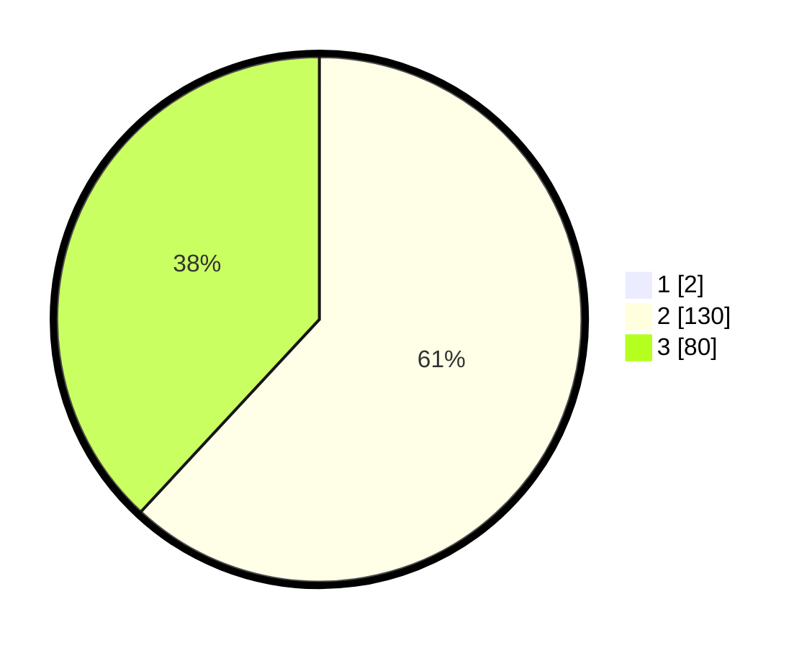

# Hasil

## Grafik

## Tabel

| No. | Nama Paslon    | Suara | Suara (raw) | Persentase |
|:--- |:-------------- | -----:| -----------:| ----------:|
| 1   | ANIES MUHAIMIN | 2     | [2][p-1]    | 0,94       |
| 2   | PRABOWO GIBRAN | 130   | [130][p-2]  | 61,32      |
| 3   | GANJAR MAHFUD  | 80    | [80][p-3]   | 37,74      |

[p-1]: https://github.com/gigit-pemilu/pemilu-2024/blob/main/pilpres/hitung-suara/sub/51-bali/sub/04-gianyar/sub/05-ubud/sub/2008-sayan/sub/012-tps/sub/paslon-1.txt
[p-2]: https://github.com/gigit-pemilu/pemilu-2024/blob/main/pilpres/hitung-suara/sub/51-bali/sub/04-gianyar/sub/05-ubud/sub/2008-sayan/sub/012-tps/sub/paslon-2.txt
[p-3]: https://github.com/gigit-pemilu/pemilu-2024/blob/main/pilpres/hitung-suara/sub/51-bali/sub/04-gianyar/sub/05-ubud/sub/2008-sayan/sub/012-tps/sub/paslon-3.txt

## Foto C Plano

https://sirekap-obj-formc.kpu.go.id/bfdd/pemilu/ppwp/51/04/05/20/08/5104052008012-20240214-192813--4f276b3b-48b0-4099-905c-7ffb6333b30c.jpg

https://sirekap-obj-formc.kpu.go.id/bfdd/pemilu/ppwp/51/04/05/20/08/5104052008012-20240214-192902--dad03c82-dd4d-4f48-a20d-3f05cd964f90.jpg

https://sirekap-obj-formc.kpu.go.id/bfdd/pemilu/ppwp/51/04/05/20/08/5104052008012-20240214-192944--de06a720-1c7f-48ed-b34d-97b4b6ffff35.jpg

## Metadata

| Key        | Value               |
| ---------- | ------------------- |
| Time Stamp | 2024-02-15 15:00:29 |

