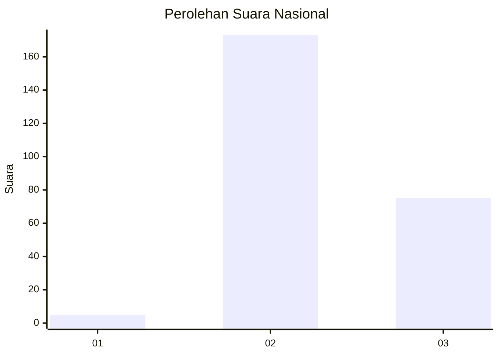

# Hasil

## Grafik

## Tabel

| No. | Nama Paslon    | Suara | Suara (raw) | Persentase |
|:--- |:-------------- | -----:| -----------:| ----------:|
| 1   | ANIES MUHAIMIN | 5     | [5][p-1]    | 1,98       |
| 2   | PRABOWO GIBRAN | 173   | [173][p-2]  | 68,38      |
| 3   | GANJAR MAHFUD  | 75    | [75][p-3]   | 29,64      |

[p-1]: https://github.com/gigit-pemilu/pemilu-2024/blob/main/pilpres/hitung-suara/sub/51-bali/sub/04-gianyar/sub/06-tegallalang/sub/2001-keliki/sub/005-tps/sub/paslon-1.txt
[p-2]: https://github.com/gigit-pemilu/pemilu-2024/blob/main/pilpres/hitung-suara/sub/51-bali/sub/04-gianyar/sub/06-tegallalang/sub/2001-keliki/sub/005-tps/sub/paslon-2.txt
[p-3]: https://github.com/gigit-pemilu/pemilu-2024/blob/main/pilpres/hitung-suara/sub/51-bali/sub/04-gianyar/sub/06-tegallalang/sub/2001-keliki/sub/005-tps/sub/paslon-3.txt

## Foto C Plano

https://sirekap-obj-formc.kpu.go.id/86f4/pemilu/ppwp/51/04/06/20/01/5104062001005-20240214-185138--5781f050-5296-4e37-9242-a838d6174c46.jpg

https://sirekap-obj-formc.kpu.go.id/86f4/pemilu/ppwp/51/04/06/20/01/5104062001005-20240214-185326--44b3b88f-6113-4030-a5ce-44d9e4bd6fe0.jpg

https://sirekap-obj-formc.kpu.go.id/86f4/pemilu/ppwp/51/04/06/20/01/5104062001005-20240214-185451--af2bf4fd-2ce4-4d15-8e05-11f9ef1ec430.jpg

## Metadata

| Key        | Value               |
| ---------- | ------------------- |
| Time Stamp | 2024-02-15 09:00:24 |

## DATA PEMILIH TETAP

Jumlah pemilih dalam DPT: **290**.
 * L: **147**.
 * P: **143**.

## DATA PENGGUNA HAK PILIH

Jumlah pengguna hak pilih dalam DPT: **258**.
 * L: **136**.
 * P: **122**.

Jumlah pengguna hak pilih dalam DPTb: **0**.
 * L: **0**.
 * P: **0**.

Jumlah pengguna hak pilih dalam DPK: **1**.
 * L: **0**.
 * P: **1**.

Jumlah pengguna hak pilih: **259**.
 * L: **136**.
 * P: **123**.

## JUMLAH SUARA SAH DAN TIDAK SAH

JUMLAH SELURUH SUARA SAH: **253**.

JUMLAH SUARA TIDAK SAH: **6**.

JUMLAH SELURUH SUARA SAH DAN SUARA TIDAK SAH: **259**.

