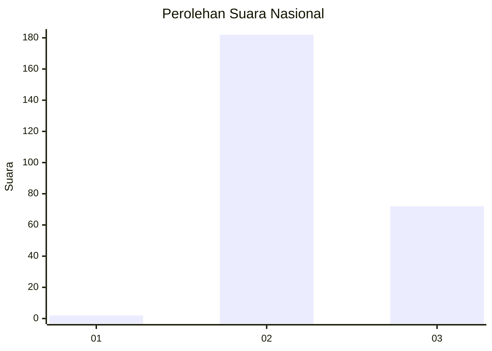
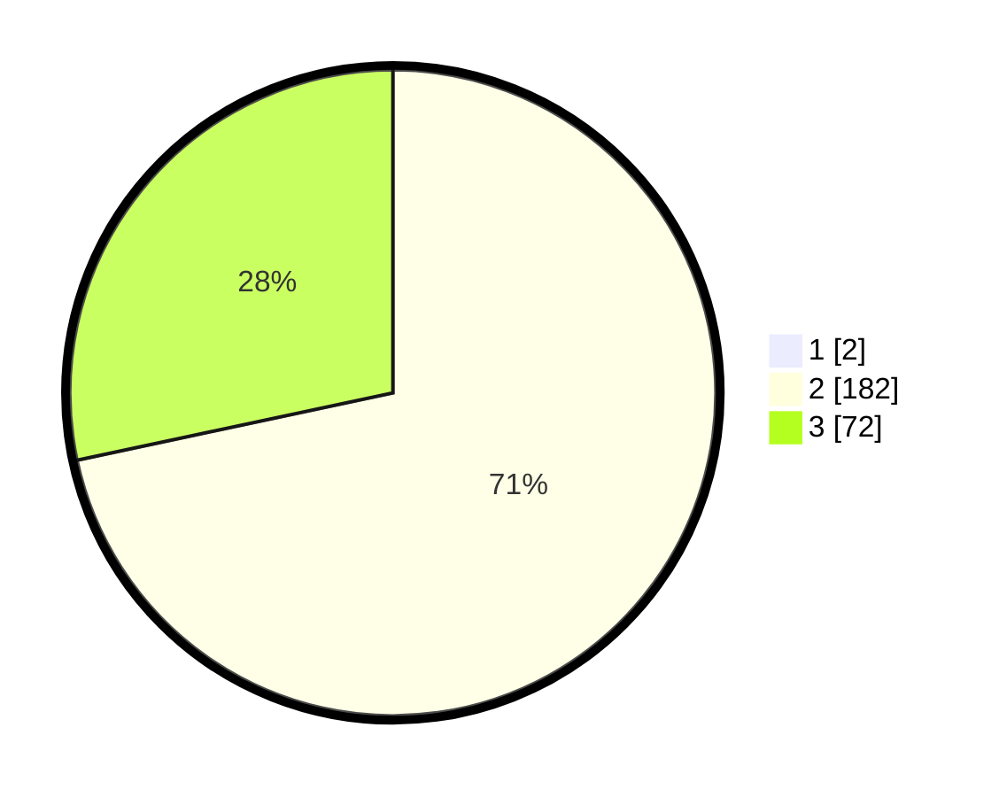

# Hasil

## Grafik

## Tabel

| No. | Nama Paslon    | Suara | Suara (raw) | Persentase |
|:--- |:-------------- | -----:| -----------:| ----------:|
| 1   | ANIES MUHAIMIN | 2     | [2][p-1]    | 0,78       |
| 2   | PRABOWO GIBRAN | 182   | [182][p-2]  | 71,09      |
| 3   | GANJAR MAHFUD  | 72    | [72][p-3]   | 28,13      |

[p-1]: https://github.com/gigit-pemilu/pemilu-2024/blob/main/pilpres/hitung-suara/sub/51-bali/sub/04-gianyar/sub/06-tegallalang/sub/2001-keliki/sub/006-tps/sub/paslon-1.txt
[p-2]: https://github.com/gigit-pemilu/pemilu-2024/blob/main/pilpres/hitung-suara/sub/51-bali/sub/04-gianyar/sub/06-tegallalang/sub/2001-keliki/sub/006-tps/sub/paslon-2.txt
[p-3]: https://github.com/gigit-pemilu/pemilu-2024/blob/main/pilpres/hitung-suara/sub/51-bali/sub/04-gianyar/sub/06-tegallalang/sub/2001-keliki/sub/006-tps/sub/paslon-3.txt

## Foto C Plano

https://sirekap-obj-formc.kpu.go.id/287a/pemilu/ppwp/51/04/06/20/01/5104062001006-20240214-193445--7ac45072-3439-4e02-acb5-f90ee363f6c3.jpg

https://sirekap-obj-formc.kpu.go.id/287a/pemilu/ppwp/51/04/06/20/01/5104062001006-20240214-194347--29071c8c-5413-473c-a436-7161f9767c51.jpg

https://sirekap-obj-formc.kpu.go.id/287a/pemilu/ppwp/51/04/06/20/01/5104062001006-20240214-193804--a795060d-c2b7-4953-815c-b315a53e4643.jpg

## Metadata

| Key        | Value               |
| ---------- | ------------------- |
| Time Stamp | 2024-02-15 15:00:29 |

## DATA PEMILIH TETAP

Jumlah pemilih dalam DPT: **296**.
 * L: **152**.
 * P: **144**.

## DATA PENGGUNA HAK PILIH

Jumlah pengguna hak pilih dalam DPT: **260**.
 * L: **133**.
 * P: **127**.

Jumlah pengguna hak pilih dalam DPTb: **0**.
 * L: **0**.
 * P: **0**.

Jumlah pengguna hak pilih dalam DPK: **1**.
 * L: **0**.
 * P: **1**.

Jumlah pengguna hak pilih: **261**.
 * L: **133**.
 * P: **128**.

## JUMLAH SUARA SAH DAN TIDAK SAH

JUMLAH SELURUH SUARA SAH: **256**.

JUMLAH SUARA TIDAK SAH: **5**.

JUMLAH SELURUH SUARA SAH DAN SUARA TIDAK SAH: **261**.

