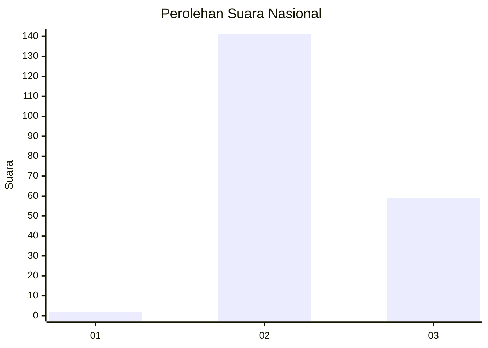
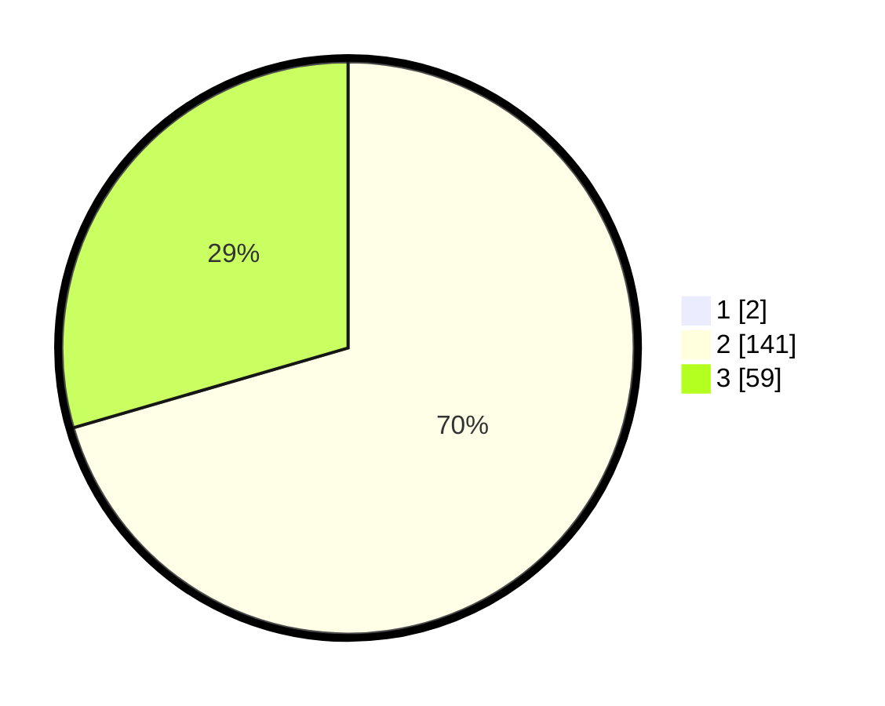

# Hasil

## Grafik

## Tabel

| No. | Nama Paslon    | Suara | Suara (raw) | Persentase |
|:--- |:-------------- | -----:| -----------:| ----------:|
| 1   | ANIES MUHAIMIN | 2     | [2][p-1]    | 0,99       |
| 2   | PRABOWO GIBRAN | 141   | [141][p-2]  | 69,80      |
| 3   | GANJAR MAHFUD  | 59    | [59][p-3]   | 29,21      |

[p-1]: https://github.com/gigit-pemilu/pemilu-2024/blob/main/pilpres/hitung-suara/sub/51-bali/sub/04-gianyar/sub/06-tegallalang/sub/2001-keliki/sub/007-tps/sub/paslon-1.txt
[p-2]: https://github.com/gigit-pemilu/pemilu-2024/blob/main/pilpres/hitung-suara/sub/51-bali/sub/04-gianyar/sub/06-tegallalang/sub/2001-keliki/sub/007-tps/sub/paslon-2.txt
[p-3]: https://github.com/gigit-pemilu/pemilu-2024/blob/main/pilpres/hitung-suara/sub/51-bali/sub/04-gianyar/sub/06-tegallalang/sub/2001-keliki/sub/007-tps/sub/paslon-3.txt

## Foto C Plano

https://sirekap-obj-formc.kpu.go.id/fd1e/pemilu/ppwp/51/04/06/20/01/5104062001007-20240214-132249--ad67442e-22aa-456b-aacf-4a3633170047.jpg

https://sirekap-obj-formc.kpu.go.id/fd1e/pemilu/ppwp/51/04/06/20/01/5104062001007-20240214-132457--8e2bb7c1-523d-4c65-a18d-e5d8a3f3e9a5.jpg

## Metadata

| Key        | Value               |
| ---------- | ------------------- |
| Time Stamp | 2024-02-15 07:00:44 |

