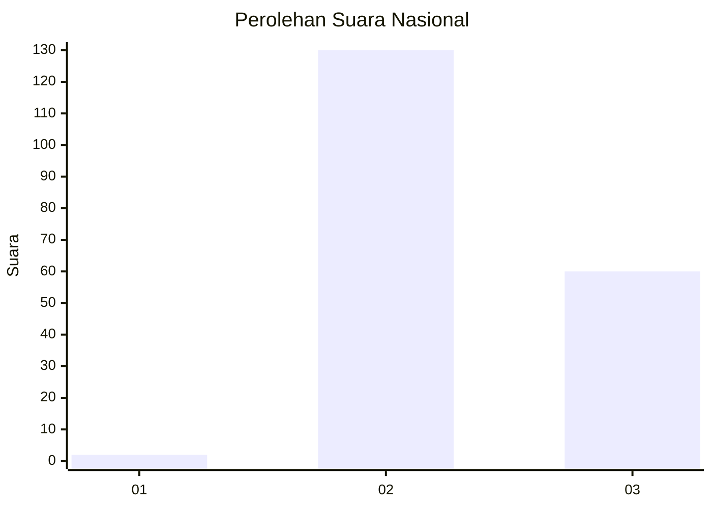
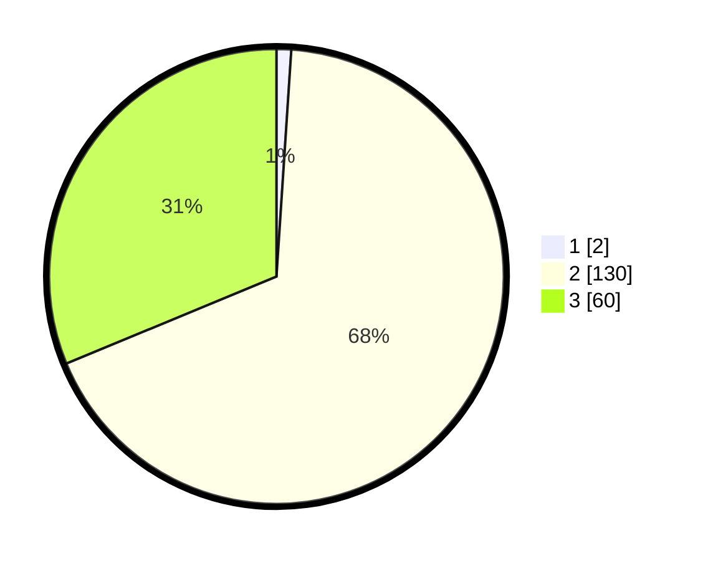

# Hasil

## Grafik

## Tabel

| No. | Nama Paslon    | Suara | Suara (raw) | Persentase |
|:--- |:-------------- | -----:| -----------:| ----------:|
| 1   | ANIES MUHAIMIN | 2     | [2][p-1]    | 1,04       |
| 2   | PRABOWO GIBRAN | 130   | [130][p-2]  | 67,71      |
| 3   | GANJAR MAHFUD  | 60    | [60][p-3]   | 31,25      |

[p-1]: https://github.com/gigit-pemilu/pemilu-2024/blob/main/pilpres/hitung-suara/sub/51-bali/sub/04-gianyar/sub/06-tegallalang/sub/2001-keliki/sub/008-tps/sub/paslon-1.txt
[p-2]: https://github.com/gigit-pemilu/pemilu-2024/blob/main/pilpres/hitung-suara/sub/51-bali/sub/04-gianyar/sub/06-tegallalang/sub/2001-keliki/sub/008-tps/sub/paslon-2.txt
[p-3]: https://github.com/gigit-pemilu/pemilu-2024/blob/main/pilpres/hitung-suara/sub/51-bali/sub/04-gianyar/sub/06-tegallalang/sub/2001-keliki/sub/008-tps/sub/paslon-3.txt

## Foto C Plano

https://sirekap-obj-formc.kpu.go.id/2c1e/pemilu/ppwp/51/04/06/20/01/5104062001008-20240214-213133--d4735ee1-a290-4181-bdd9-a5dab8d17010.jpg

https://sirekap-obj-formc.kpu.go.id/2c1e/pemilu/ppwp/51/04/06/20/01/5104062001008-20240214-213249--f17fe622-d860-49c8-8977-db811c809a28.jpg

https://sirekap-obj-formc.kpu.go.id/2c1e/pemilu/ppwp/51/04/06/20/01/5104062001008-20240214-213337--f5319391-4e3f-482d-bdfb-5326083f7297.jpg

## Metadata

| Key        | Value               |
| ---------- | ------------------- |
| Time Stamp | 2024-02-15 12:00:28 |

