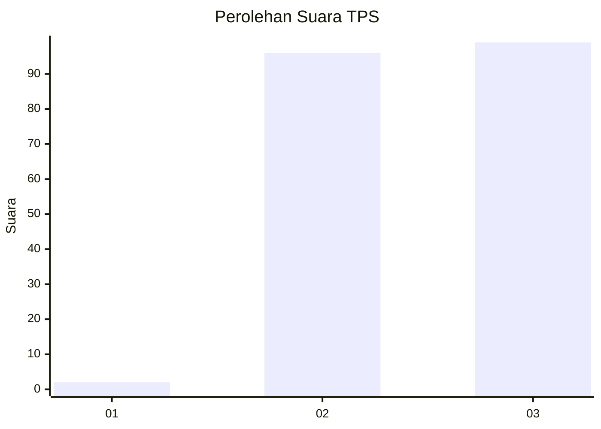
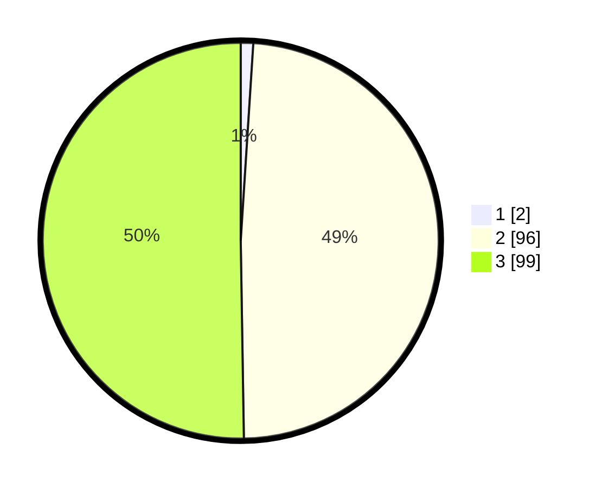

# Hasil

## Grafik

## Tabel

| No. | Nama Paslon    | Suara | Suara (raw) | Persentase |
|:--- |:-------------- | -----:| -----------:| ----------:|
| 1   | ANIES MUHAIMIN | 2     | [2][p-1]    | 1,02       |
| 2   | PRABOWO GIBRAN | 96    | [96][p-2]   | 48,73      |
| 3   | GANJAR MAHFUD  | 99    | [99][p-3]   | 50,25      |

[p-1]: https://github.com/gigit-pemilu/pemilu-2024-51-bali/blob/main/pilpres/hitung-suara/sub/51-bali/sub/04-gianyar/sub/06-tegallalang/sub/2001-keliki/sub/009-tps/sub/paslon-1.txt
[p-2]: https://github.com/gigit-pemilu/pemilu-2024-51-bali/blob/main/pilpres/hitung-suara/sub/51-bali/sub/04-gianyar/sub/06-tegallalang/sub/2001-keliki/sub/009-tps/sub/paslon-2.txt
[p-3]: https://github.com/gigit-pemilu/pemilu-2024-51-bali/blob/main/pilpres/hitung-suara/sub/51-bali/sub/04-gianyar/sub/06-tegallalang/sub/2001-keliki/sub/009-tps/sub/paslon-3.txt

## Foto C Plano

https://sirekap-obj-formc.kpu.go.id/36f5/pemilu/ppwp/51/04/06/20/01/5104062001009-20240214-194938--ad4b22df-f5e6-40c8-b7a3-84407882456a.jpg

https://sirekap-obj-formc.kpu.go.id/36f5/pemilu/ppwp/51/04/06/20/01/5104062001009-20240214-195103--83c9e830-b18b-4f54-b030-7fc4a32bb714.jpg

https://sirekap-obj-formc.kpu.go.id/36f5/pemilu/ppwp/51/04/06/20/01/5104062001009-20240214-195220--7696451b-82b1-442e-ac96-4874701bf72f.jpg

## Metadata

| Key        | Value               |
| ---------- | ------------------- |
| Time Stamp | 2024-02-16 14:30:33 |

