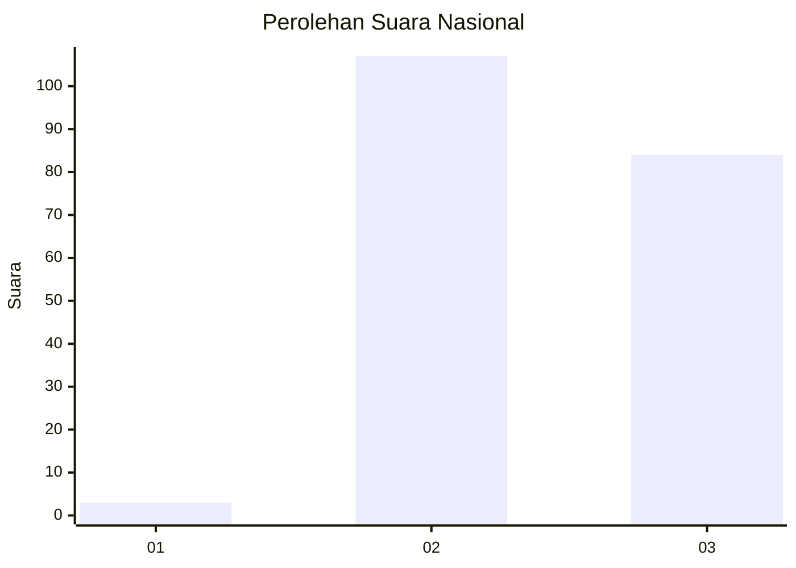
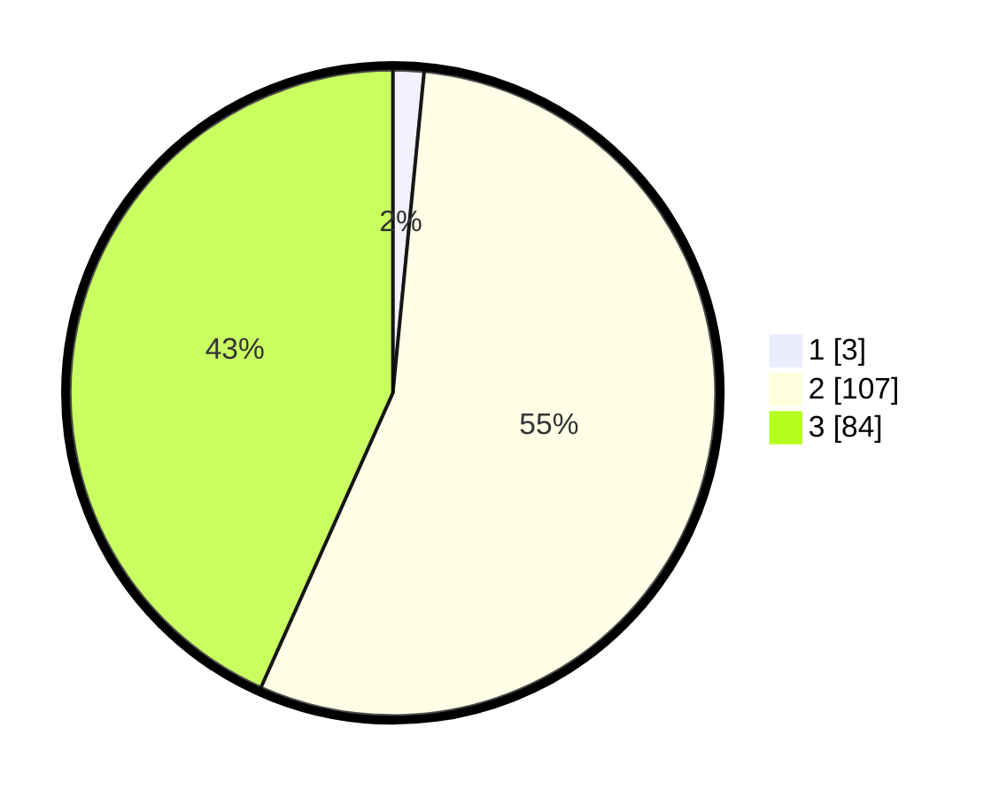

# Hasil

## Grafik

## Tabel

| No. | Nama Paslon    | Suara | Suara (raw) | Persentase |
|:--- |:-------------- | -----:| -----------:| ----------:|
| 1   | ANIES MUHAIMIN | 3     | [3][p-1]    | 1,55       |
| 2   | PRABOWO GIBRAN | 107   | [107][p-2]  | 55,15      |
| 3   | GANJAR MAHFUD  | 84    | [84][p-3]   | 43,30      |

[p-1]: https://github.com/gigit-pemilu/pemilu-2024/blob/main/pilpres/hitung-suara/sub/51-bali/sub/04-gianyar/sub/06-tegallalang/sub/2002-tegallalang/sub/003-tps/sub/paslon-1.txt
[p-2]: https://github.com/gigit-pemilu/pemilu-2024/blob/main/pilpres/hitung-suara/sub/51-bali/sub/04-gianyar/sub/06-tegallalang/sub/2002-tegallalang/sub/003-tps/sub/paslon-2.txt
[p-3]: https://github.com/gigit-pemilu/pemilu-2024/blob/main/pilpres/hitung-suara/sub/51-bali/sub/04-gianyar/sub/06-tegallalang/sub/2002-tegallalang/sub/003-tps/sub/paslon-3.txt

## Foto C Plano

https://sirekap-obj-formc.kpu.go.id/db4e/pemilu/ppwp/51/04/06/20/02/5104062002003-20240214-230355--f60512e2-3783-49a8-8664-4ce8d6c79405.jpg

https://sirekap-obj-formc.kpu.go.id/db4e/pemilu/ppwp/51/04/06/20/02/5104062002003-20240214-230349--4fe87b04-4d41-4de6-bea1-c6a05f18ec1e.jpg

https://sirekap-obj-formc.kpu.go.id/db4e/pemilu/ppwp/51/04/06/20/02/5104062002003-20240214-230401--77c47e56-4393-4fa7-b877-fde8dad1f4d0.jpg

## Metadata

| Key        | Value               |
| ---------- | ------------------- |
| Time Stamp | 2024-02-15 15:00:29 |

