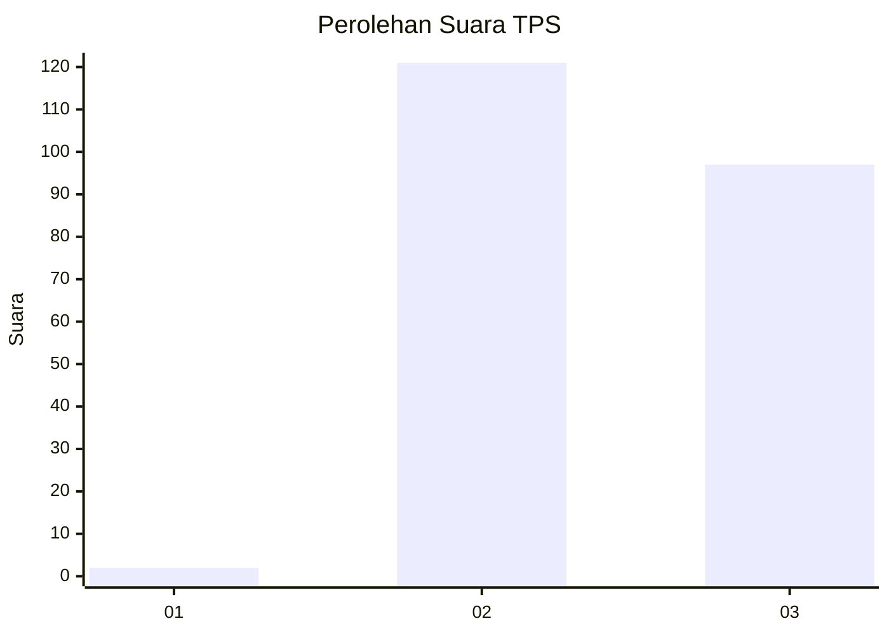
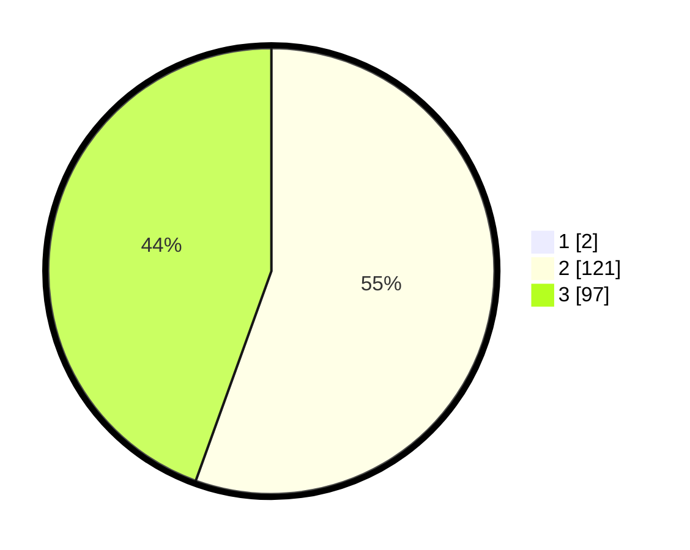

# Hasil

## Grafik

## Tabel

| No. | Nama Paslon    | Suara | Suara (raw) | Persentase |
|:--- |:-------------- | -----:| -----------:| ----------:|
| 1   | ANIES MUHAIMIN | 2     | [2][p-1]    | 0,91       |
| 2   | PRABOWO GIBRAN | 121   | [121][p-2]  | 55,00      |
| 3   | GANJAR MAHFUD  | 97    | [97][p-3]   | 44,09      |

[p-1]: https://github.com/gigit-pemilu/pemilu-2024-51-bali/blob/main/pilpres/hitung-suara/sub/51-bali/sub/04-gianyar/sub/06-tegallalang/sub/2002-tegallalang/sub/011-tps/sub/paslon-1.txt
[p-2]: https://github.com/gigit-pemilu/pemilu-2024-51-bali/blob/main/pilpres/hitung-suara/sub/51-bali/sub/04-gianyar/sub/06-tegallalang/sub/2002-tegallalang/sub/011-tps/sub/paslon-2.txt
[p-3]: https://github.com/gigit-pemilu/pemilu-2024-51-bali/blob/main/pilpres/hitung-suara/sub/51-bali/sub/04-gianyar/sub/06-tegallalang/sub/2002-tegallalang/sub/011-tps/sub/paslon-3.txt

## Foto C Plano

https://sirekap-obj-formc.kpu.go.id/8b5c/pemilu/ppwp/51/04/06/20/02/5104062002011-20240214-205125--c0bc764d-a302-40c5-b4c9-767cf052333c.jpg

https://sirekap-obj-formc.kpu.go.id/8b5c/pemilu/ppwp/51/04/06/20/02/5104062002011-20240214-205237--003c4c6e-cb4e-41b2-b4fc-a394d85ed6ef.jpg

https://sirekap-obj-formc.kpu.go.id/8b5c/pemilu/ppwp/51/04/06/20/02/5104062002011-20240214-205336--00571593-63b1-4f64-a2d8-4cb7f986dbf0.jpg

## Metadata

| Key        | Value               |
| ---------- | ------------------- |
| Time Stamp | 2024-02-15 15:00:29 |

