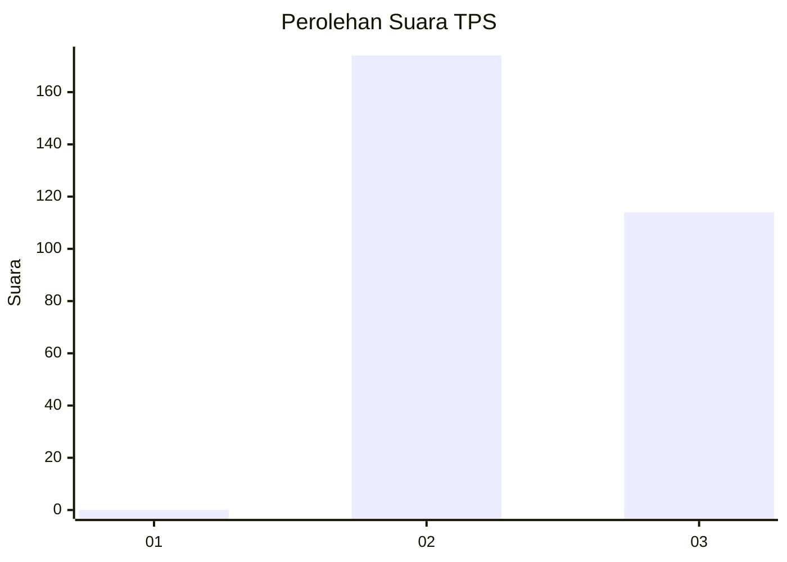
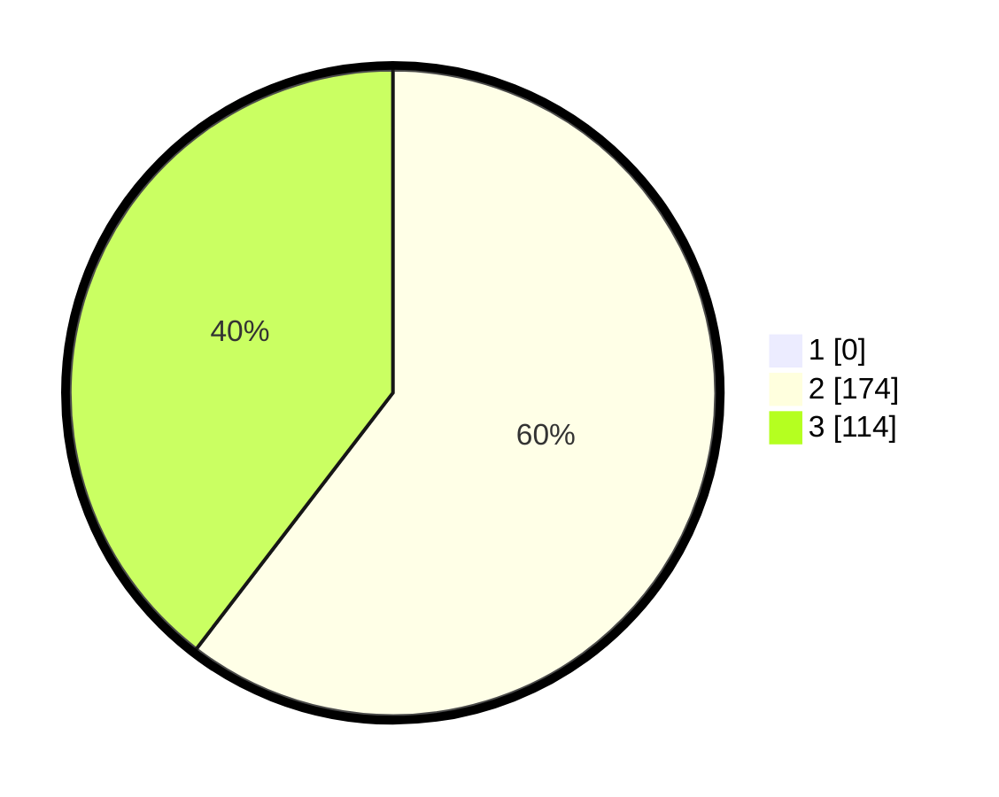

# Hasil

## Grafik

## Tabel

| No. | Nama Paslon    | Suara | Suara (raw) | Persentase |
|:--- |:-------------- | -----:| -----------:| ----------:|
| 1   | ANIES MUHAIMIN | 0     | [0][p-1]    | 0,00       |
| 2   | PRABOWO GIBRAN | 174   | [174][p-2]  | 60,42      |
| 3   | GANJAR MAHFUD  | 114   | [114][p-3]  | 39,58      |

[p-1]: https://github.com/gigit-pemilu/pemilu-2024-51-bali/blob/main/pilpres/hitung-suara/sub/51-bali/sub/04-gianyar/sub/06-tegallalang/sub/2002-tegallalang/sub/013-tps/sub/paslon-1.txt
[p-2]: https://github.com/gigit-pemilu/pemilu-2024-51-bali/blob/main/pilpres/hitung-suara/sub/51-bali/sub/04-gianyar/sub/06-tegallalang/sub/2002-tegallalang/sub/013-tps/sub/paslon-2.txt
[p-3]: https://github.com/gigit-pemilu/pemilu-2024-51-bali/blob/main/pilpres/hitung-suara/sub/51-bali/sub/04-gianyar/sub/06-tegallalang/sub/2002-tegallalang/sub/013-tps/sub/paslon-3.txt

## Foto C Plano

https://sirekap-obj-formc.kpu.go.id/1e5b/pemilu/ppwp/51/04/06/20/02/5104062002013-20240214-201403--b95a6b73-eb52-4196-8261-3a1361f203e1.jpg

https://sirekap-obj-formc.kpu.go.id/1e5b/pemilu/ppwp/51/04/06/20/02/5104062002013-20240214-201543--3188a05f-14b4-4637-b1a4-685522633de9.jpg

https://sirekap-obj-formc.kpu.go.id/1e5b/pemilu/ppwp/51/04/06/20/02/5104062002013-20240214-201242--8ce62300-cac9-4b7e-926a-fb777049e43c.jpg

## Metadata

| Key        | Value               |
| ---------- | ------------------- |
| Time Stamp | 2024-02-15 15:00:29 |

