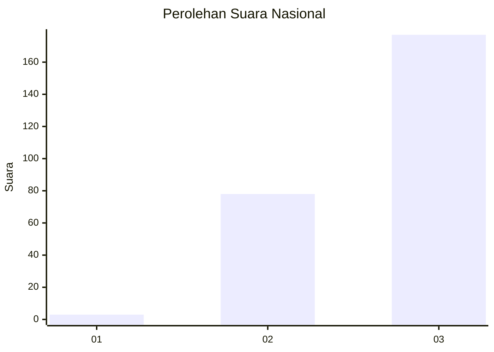
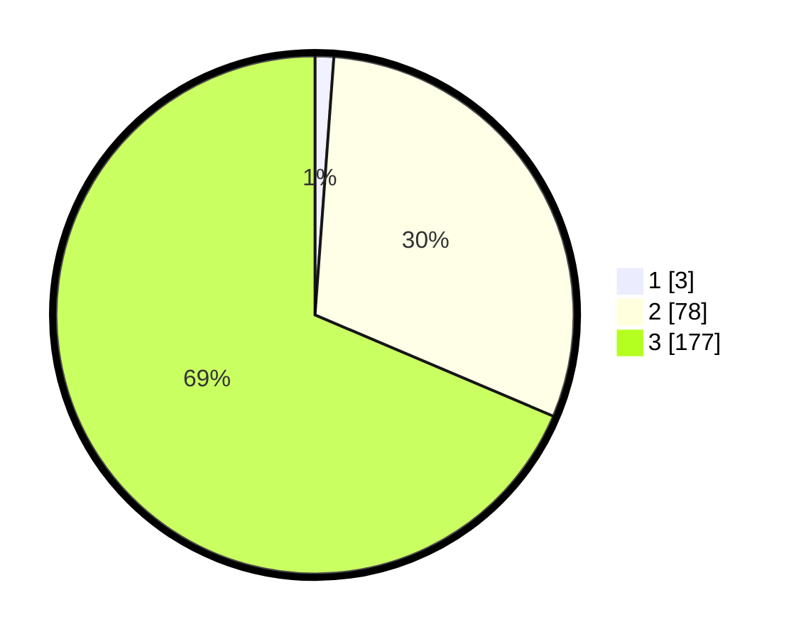

# Hasil

## Grafik

## Tabel

| No. | Nama Paslon    | Suara | Suara (raw) | Persentase |
|:--- |:-------------- | -----:| -----------:| ----------:|
| 1   | ANIES MUHAIMIN | 3     | [3][p-1]    | 1,16       |
| 2   | PRABOWO GIBRAN | 78    | [78][p-2]   | 30,23      |
| 3   | GANJAR MAHFUD  | 177   | [177][p-3]  | 68,60      |

[p-1]: https://github.com/gigit-pemilu/pemilu-2024/blob/main/pilpres/hitung-suara/sub/51-bali/sub/04-gianyar/sub/06-tegallalang/sub/2002-tegallalang/sub/015-tps/sub/paslon-1.txt
[p-2]: https://github.com/gigit-pemilu/pemilu-2024/blob/main/pilpres/hitung-suara/sub/51-bali/sub/04-gianyar/sub/06-tegallalang/sub/2002-tegallalang/sub/015-tps/sub/paslon-2.txt
[p-3]: https://github.com/gigit-pemilu/pemilu-2024/blob/main/pilpres/hitung-suara/sub/51-bali/sub/04-gianyar/sub/06-tegallalang/sub/2002-tegallalang/sub/015-tps/sub/paslon-3.txt

## Foto C Plano

https://sirekap-obj-formc.kpu.go.id/a62d/pemilu/ppwp/51/04/06/20/02/5104062002015-20240214-225450--bf528135-1d2d-45f1-935d-c9f4d45d4d7a.jpg

https://sirekap-obj-formc.kpu.go.id/a62d/pemilu/ppwp/51/04/06/20/02/5104062002015-20240214-225459--95da0ae7-6717-407d-ab43-f49e7d530440.jpg

https://sirekap-obj-formc.kpu.go.id/a62d/pemilu/ppwp/51/04/06/20/02/5104062002015-20240214-225506--a1431f51-b600-4c15-be75-c0bcf5364cc9.jpg

## Metadata

| Key        | Value               |
| ---------- | ------------------- |
| Time Stamp | 2024-02-15 15:00:29 |

