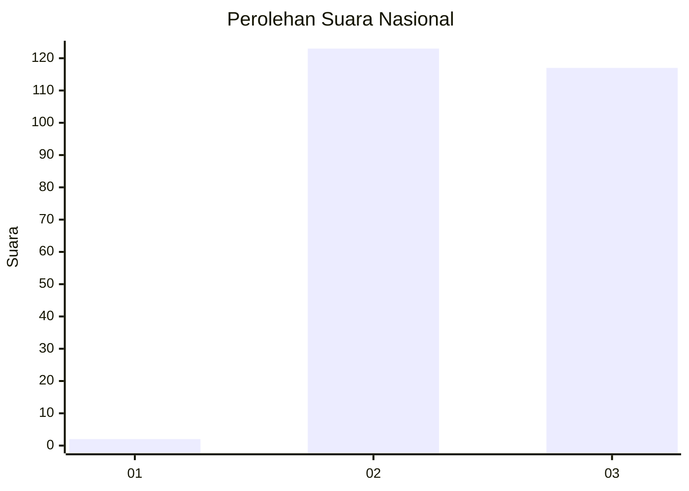
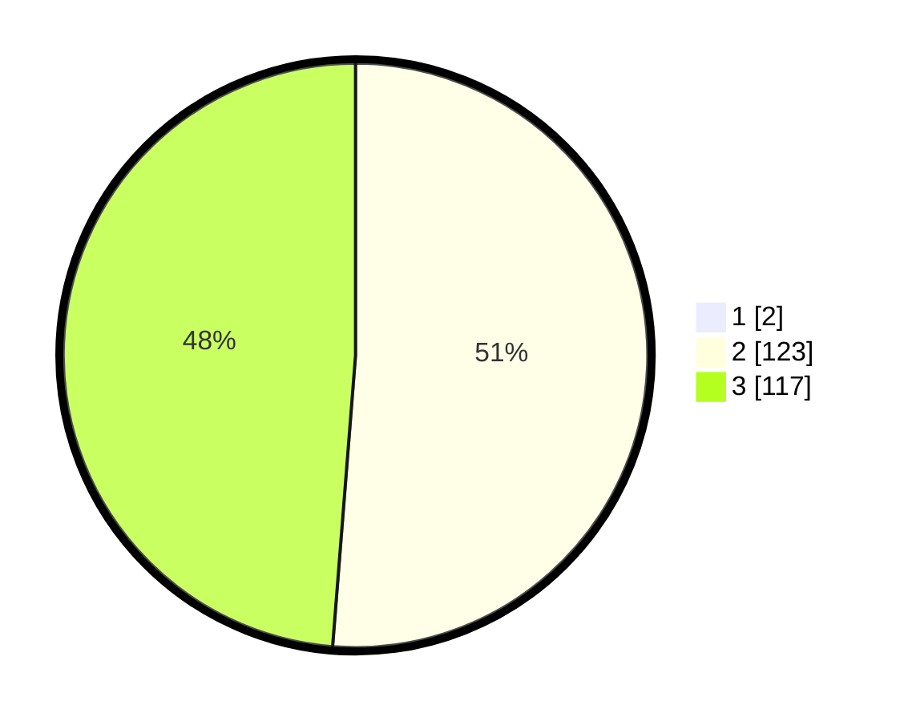

# Hasil

## Grafik

## Tabel

| No. | Nama Paslon    | Suara | Suara (raw) | Persentase |
|:--- |:-------------- | -----:| -----------:| ----------:|
| 1   | ANIES MUHAIMIN | 2     | [2][p-1]    | 0,83       |
| 2   | PRABOWO GIBRAN | 123   | [123][p-2]  | 50,83      |
| 3   | GANJAR MAHFUD  | 117   | [117][p-3]  | 48,35      |

[p-1]: https://github.com/gigit-pemilu/pemilu-2024/blob/main/pilpres/hitung-suara/sub/51-bali/sub/04-gianyar/sub/06-tegallalang/sub/2002-tegallalang/sub/022-tps/sub/paslon-1.txt
[p-2]: https://github.com/gigit-pemilu/pemilu-2024/blob/main/pilpres/hitung-suara/sub/51-bali/sub/04-gianyar/sub/06-tegallalang/sub/2002-tegallalang/sub/022-tps/sub/paslon-2.txt
[p-3]: https://github.com/gigit-pemilu/pemilu-2024/blob/main/pilpres/hitung-suara/sub/51-bali/sub/04-gianyar/sub/06-tegallalang/sub/2002-tegallalang/sub/022-tps/sub/paslon-3.txt

## Foto C Plano

https://sirekap-obj-formc.kpu.go.id/7cd1/pemilu/ppwp/51/04/06/20/02/5104062002022-20240215-185314--8d7a0f6d-eb15-4a0f-a884-b050a71a3d25.jpg

https://sirekap-obj-formc.kpu.go.id/7cd1/pemilu/ppwp/51/04/06/20/02/5104062002022-20240215-185934--79645768-4c62-4e41-af75-044578eceaf4.jpg

https://sirekap-obj-formc.kpu.go.id/7cd1/pemilu/ppwp/51/04/06/20/02/5104062002022-20240215-185222--83609088-2ce6-410e-97b9-86d74b56ad1c.jpg

## Metadata

| Key        | Value               |
| ---------- | ------------------- |
| Time Stamp | 2024-02-25 18:00:00 |

