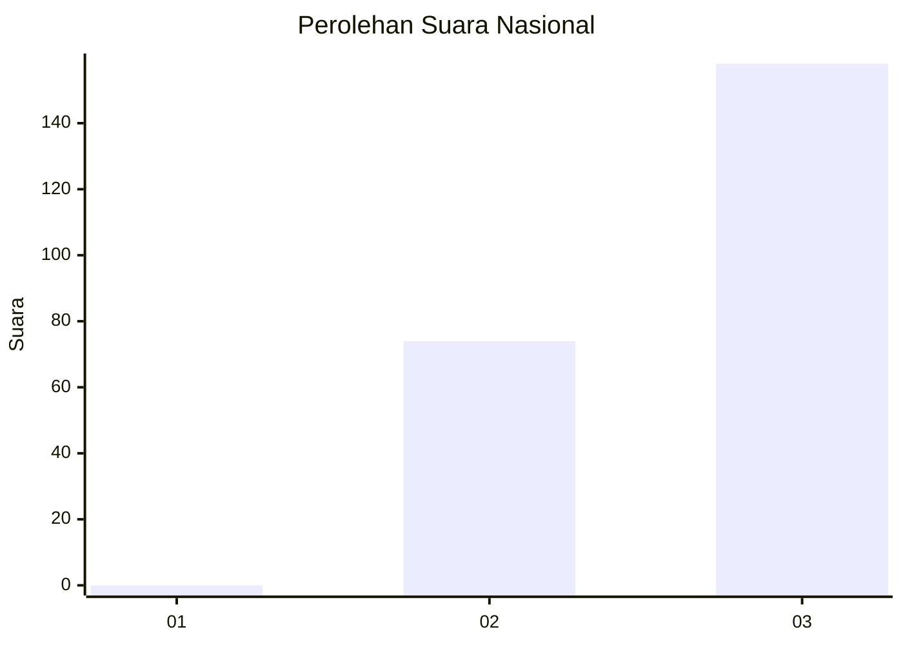
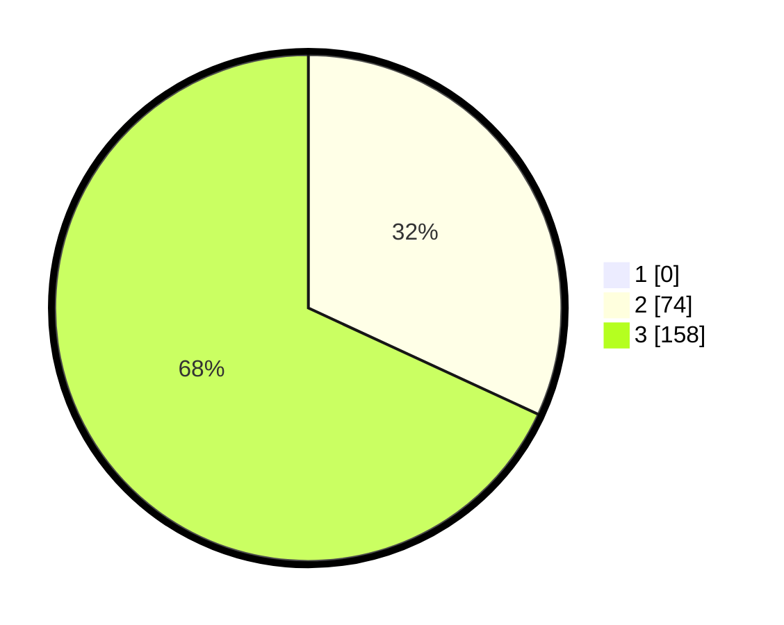

# Hasil

## Grafik

## Tabel

| No. | Nama Paslon    | Suara | Suara (raw) | Persentase |
|:--- |:-------------- | -----:| -----------:| ----------:|
| 1   | ANIES MUHAIMIN | 0     | [0][p-1]    | 0,00       |
| 2   | PRABOWO GIBRAN | 74    | [74][p-2]   | 31,90      |
| 3   | GANJAR MAHFUD  | 158   | [158][p-3]  | 68,10      |

[p-1]: https://github.com/gigit-pemilu/pemilu-2024/blob/main/pilpres/hitung-suara/sub/51-bali/sub/04-gianyar/sub/06-tegallalang/sub/2003-kenderan/sub/001-tps/sub/paslon-1.txt
[p-2]: https://github.com/gigit-pemilu/pemilu-2024/blob/main/pilpres/hitung-suara/sub/51-bali/sub/04-gianyar/sub/06-tegallalang/sub/2003-kenderan/sub/001-tps/sub/paslon-2.txt
[p-3]: https://github.com/gigit-pemilu/pemilu-2024/blob/main/pilpres/hitung-suara/sub/51-bali/sub/04-gianyar/sub/06-tegallalang/sub/2003-kenderan/sub/001-tps/sub/paslon-3.txt

## Foto C Plano

https://sirekap-obj-formc.kpu.go.id/c9e9/pemilu/ppwp/51/04/06/20/03/5104062003001-20240214-233114--2c8d9bc0-fa5d-4f64-8db8-dc59d9b90315.jpg

https://sirekap-obj-formc.kpu.go.id/c9e9/pemilu/ppwp/51/04/06/20/03/5104062003001-20240214-233140--8bde47ac-44ac-41a8-bdee-822dc66a6de0.jpg

https://sirekap-obj-formc.kpu.go.id/c9e9/pemilu/ppwp/51/04/06/20/03/5104062003001-20240214-233147--20c11d59-92d2-4486-8f23-8c496b305c12.jpg

## Metadata

| Key        | Value               |
| ---------- | ------------------- |
| Time Stamp | 2024-02-15 12:00:28 |

