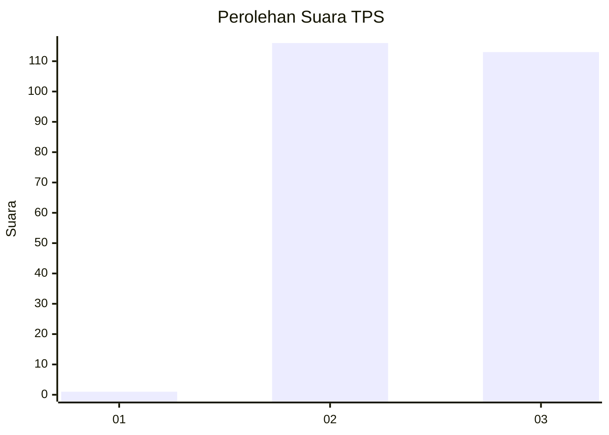
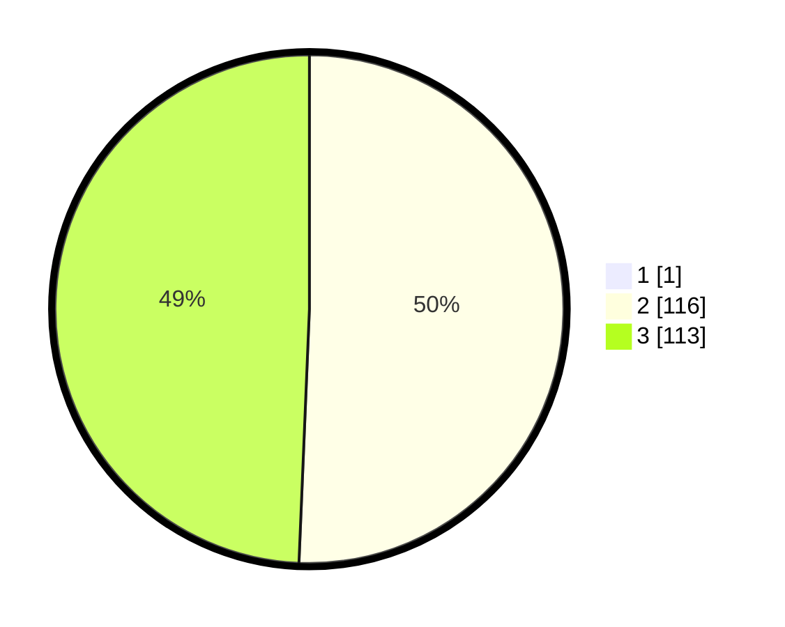

# Hasil

## Grafik

## Tabel

| No. | Nama Paslon    | Suara | Suara (raw) | Persentase |
|:--- |:-------------- | -----:| -----------:| ----------:|
| 1   | ANIES MUHAIMIN | 1     | [1][p-1]    | 0,43       |
| 2   | PRABOWO GIBRAN | 116   | [116][p-2]  | 50,43      |
| 3   | GANJAR MAHFUD  | 113   | [113][p-3]  | 49,13      |

[p-1]: https://github.com/gigit-pemilu/pemilu-2024-51-bali/blob/main/pilpres/hitung-suara/sub/51-bali/sub/04-gianyar/sub/06-tegallalang/sub/2003-kenderan/sub/002-tps/sub/paslon-1.txt
[p-2]: https://github.com/gigit-pemilu/pemilu-2024-51-bali/blob/main/pilpres/hitung-suara/sub/51-bali/sub/04-gianyar/sub/06-tegallalang/sub/2003-kenderan/sub/002-tps/sub/paslon-2.txt
[p-3]: https://github.com/gigit-pemilu/pemilu-2024-51-bali/blob/main/pilpres/hitung-suara/sub/51-bali/sub/04-gianyar/sub/06-tegallalang/sub/2003-kenderan/sub/002-tps/sub/paslon-3.txt

## Foto C Plano

https://sirekap-obj-formc.kpu.go.id/b631/pemilu/ppwp/51/04/06/20/03/5104062003002-20240214-212704--0e01c681-a0e3-436f-a4fb-e24fae928c8a.jpg

https://sirekap-obj-formc.kpu.go.id/b631/pemilu/ppwp/51/04/06/20/03/5104062003002-20240214-212109--ad1ecfd9-f1c2-4f08-a4a9-2bacf7f297d9.jpg

https://sirekap-obj-formc.kpu.go.id/b631/pemilu/ppwp/51/04/06/20/03/5104062003002-20240214-212201--b4f4ad86-4aa8-483e-8f99-7ef3c96a89f5.jpg

## Metadata

| Key        | Value               |
| ---------- | ------------------- |
| Time Stamp | 2024-02-15 12:00:28 |

