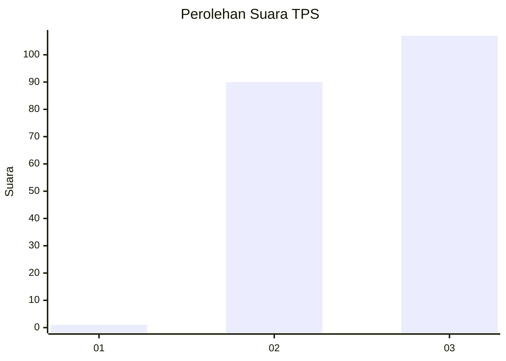
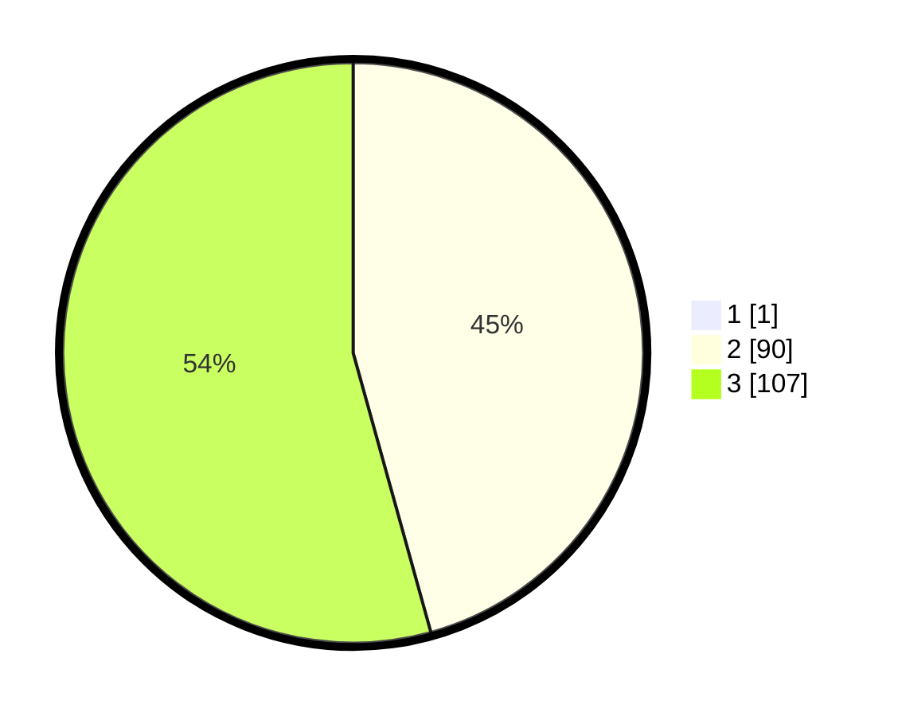

# Hasil

## Grafik

## Tabel

| No. | Nama Paslon    | Suara | Suara (raw) | Persentase |
|:--- |:-------------- | -----:| -----------:| ----------:|
| 1   | ANIES MUHAIMIN | 1     | [1][p-1]    | 0,51       |
| 2   | PRABOWO GIBRAN | 90    | [90][p-2]   | 45,45      |
| 3   | GANJAR MAHFUD  | 107   | [107][p-3]  | 54,04      |

[p-1]: https://github.com/gigit-pemilu/pemilu-2024-51-bali/blob/main/pilpres/hitung-suara/sub/51-bali/sub/04-gianyar/sub/06-tegallalang/sub/2003-kenderan/sub/004-tps/sub/paslon-1.txt
[p-2]: https://github.com/gigit-pemilu/pemilu-2024-51-bali/blob/main/pilpres/hitung-suara/sub/51-bali/sub/04-gianyar/sub/06-tegallalang/sub/2003-kenderan/sub/004-tps/sub/paslon-2.txt
[p-3]: https://github.com/gigit-pemilu/pemilu-2024-51-bali/blob/main/pilpres/hitung-suara/sub/51-bali/sub/04-gianyar/sub/06-tegallalang/sub/2003-kenderan/sub/004-tps/sub/paslon-3.txt

## Foto C Plano

https://sirekap-obj-formc.kpu.go.id/639c/pemilu/ppwp/51/04/06/20/03/5104062003004-20240214-220033--b575f42e-8b9b-4ad7-b5d3-4510c135d589.jpg

https://sirekap-obj-formc.kpu.go.id/639c/pemilu/ppwp/51/04/06/20/03/5104062003004-20240214-220259--49c9b1d4-bc58-48e5-81a6-40bd44c68560.jpg

https://sirekap-obj-formc.kpu.go.id/639c/pemilu/ppwp/51/04/06/20/03/5104062003004-20240214-220624--1e71731a-3989-4b01-baa0-7ad4655285a8.jpg

## Metadata

| Key        | Value               |
| ---------- | ------------------- |
| Time Stamp | 2024-02-24 22:31:28 |

