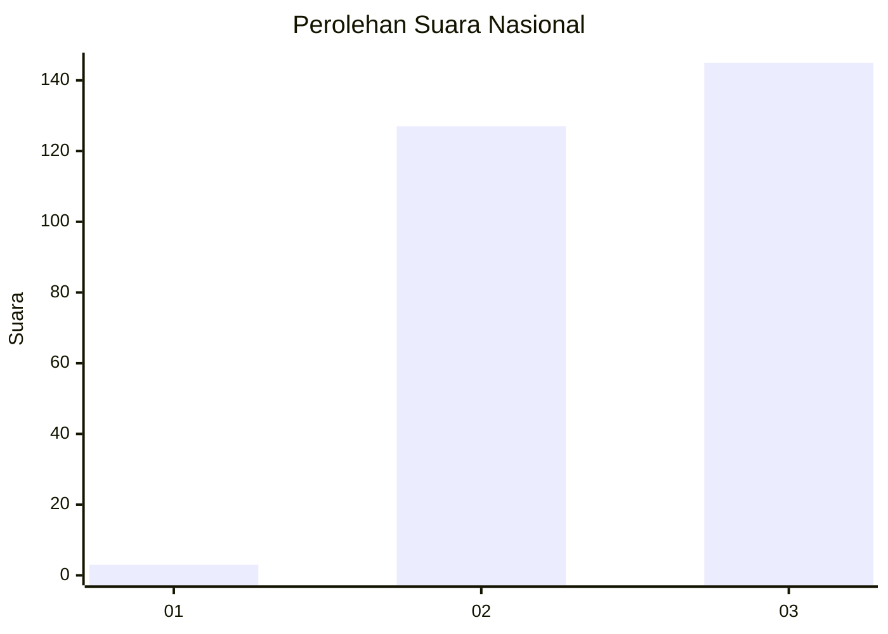
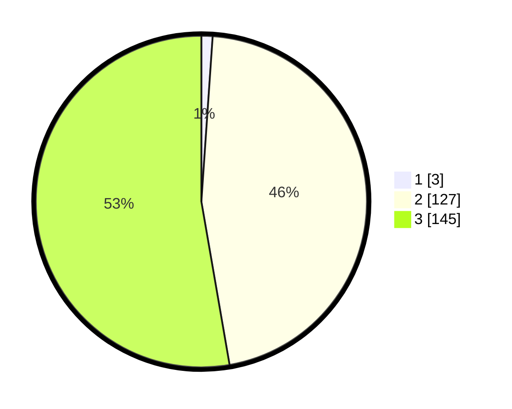

# Hasil

## Grafik

## Tabel

| No. | Nama Paslon    | Suara | Suara (raw) | Persentase |
|:--- |:-------------- | -----:| -----------:| ----------:|
| 1   | ANIES MUHAIMIN | 3     | [3][p-1]    | 1,09       |
| 2   | PRABOWO GIBRAN | 127   | [127][p-2]  | 46,18      |
| 3   | GANJAR MAHFUD  | 145   | [145][p-3]  | 52,73      |

[p-1]: https://github.com/gigit-pemilu/pemilu-2024/blob/main/pilpres/hitung-suara/sub/51-bali/sub/04-gianyar/sub/06-tegallalang/sub/2004-kedisan/sub/016-tps/sub/paslon-1.txt
[p-2]: https://github.com/gigit-pemilu/pemilu-2024/blob/main/pilpres/hitung-suara/sub/51-bali/sub/04-gianyar/sub/06-tegallalang/sub/2004-kedisan/sub/016-tps/sub/paslon-2.txt
[p-3]: https://github.com/gigit-pemilu/pemilu-2024/blob/main/pilpres/hitung-suara/sub/51-bali/sub/04-gianyar/sub/06-tegallalang/sub/2004-kedisan/sub/016-tps/sub/paslon-3.txt

## Foto C Plano

https://sirekap-obj-formc.kpu.go.id/67bb/pemilu/ppwp/51/04/06/20/04/5104062004016-20240214-155641--e33a9d9a-8793-440a-97a1-21d90fa74be9.jpg

https://sirekap-obj-formc.kpu.go.id/67bb/pemilu/ppwp/51/04/06/20/04/5104062004016-20240214-160102--cae1eba4-faa4-436c-957d-e82422a4c940.jpg

https://sirekap-obj-formc.kpu.go.id/67bb/pemilu/ppwp/51/04/06/20/04/5104062004016-20240214-160130--c6ec0633-9fe7-4d66-ba74-15cbfba5a405.jpg

## Metadata

| Key        | Value               |
| ---------- | ------------------- |
| Time Stamp | 2024-02-15 12:00:28 |

