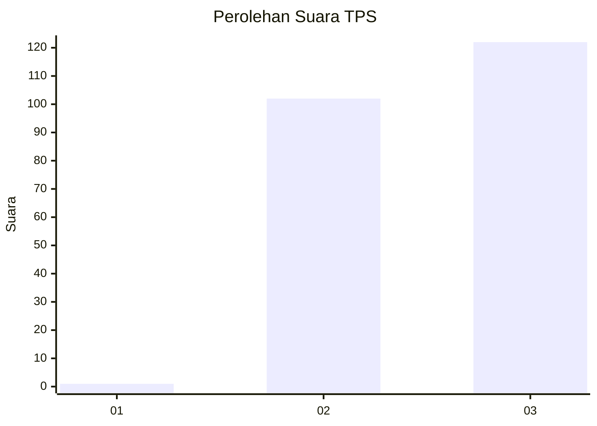
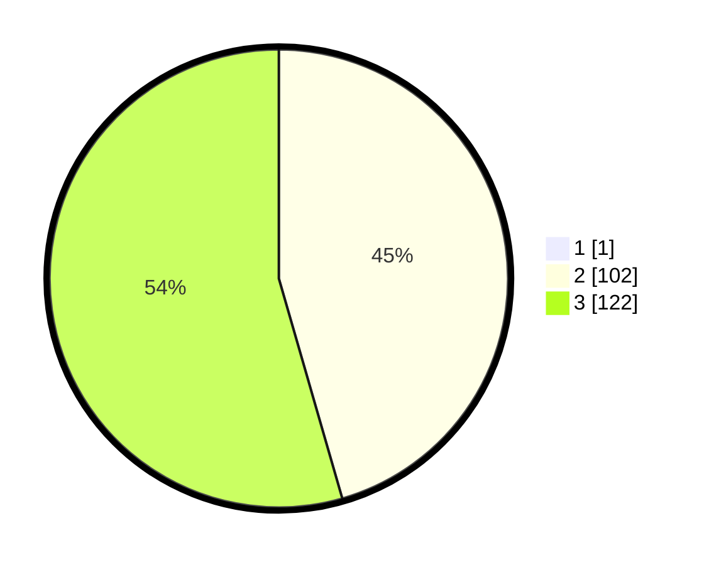

# Hasil

## Grafik

## Tabel

| No. | Nama Paslon    | Suara | Suara (raw) | Persentase |
|:--- |:-------------- | -----:| -----------:| ----------:|
| 1   | ANIES MUHAIMIN | 1     | [1][p-1]    | 0,44       |
| 2   | PRABOWO GIBRAN | 102   | [102][p-2]  | 45,33      |
| 3   | GANJAR MAHFUD  | 122   | [122][p-3]  | 54,22      |

[p-1]: https://github.com/gigit-pemilu/pemilu-2024-51-bali/blob/main/pilpres/hitung-suara/sub/51-bali/sub/04-gianyar/sub/06-tegallalang/sub/2005-pupuan/sub/001-tps/sub/paslon-1.txt
[p-2]: https://github.com/gigit-pemilu/pemilu-2024-51-bali/blob/main/pilpres/hitung-suara/sub/51-bali/sub/04-gianyar/sub/06-tegallalang/sub/2005-pupuan/sub/001-tps/sub/paslon-2.txt
[p-3]: https://github.com/gigit-pemilu/pemilu-2024-51-bali/blob/main/pilpres/hitung-suara/sub/51-bali/sub/04-gianyar/sub/06-tegallalang/sub/2005-pupuan/sub/001-tps/sub/paslon-3.txt

## Foto C Plano

https://sirekap-obj-formc.kpu.go.id/58c0/pemilu/ppwp/51/04/06/20/05/5104062005001-20240214-202514--2e8fcd49-6579-49e0-930a-e94fddd1122f.jpg

https://sirekap-obj-formc.kpu.go.id/58c0/pemilu/ppwp/51/04/06/20/05/5104062005001-20240214-202611--98868b09-a29e-4ea2-abda-bd4d8888c5bc.jpg

https://sirekap-obj-formc.kpu.go.id/58c0/pemilu/ppwp/51/04/06/20/05/5104062005001-20240214-202711--b52418db-f2fd-4442-b14e-5a1047cd572f.jpg

## Metadata

| Key        | Value               |
| ---------- | ------------------- |
| Time Stamp | 2024-02-15 15:00:29 |

