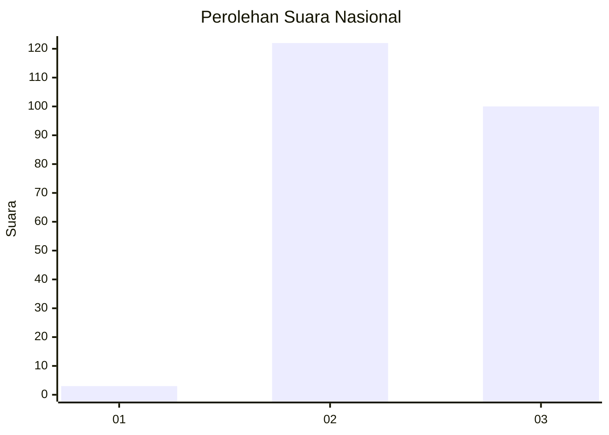
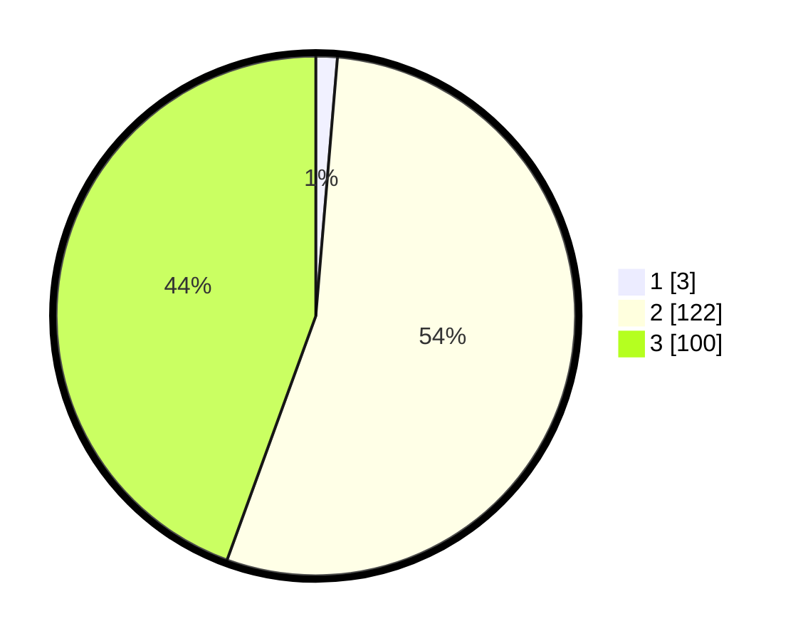

# Hasil

## Grafik

## Tabel

| No. | Nama Paslon    | Suara | Suara (raw) | Persentase |
|:--- |:-------------- | -----:| -----------:| ----------:|
| 1   | ANIES MUHAIMIN | 3     | [3][p-1]    | 1,33       |
| 2   | PRABOWO GIBRAN | 122   | [122][p-2]  | 54,22      |
| 3   | GANJAR MAHFUD  | 100   | [100][p-3]  | 44,44      |

[p-1]: https://github.com/gigit-pemilu/pemilu-2024/blob/main/pilpres/hitung-suara/sub/51-bali/sub/04-gianyar/sub/06-tegallalang/sub/2005-pupuan/sub/004-tps/sub/paslon-1.txt
[p-2]: https://github.com/gigit-pemilu/pemilu-2024/blob/main/pilpres/hitung-suara/sub/51-bali/sub/04-gianyar/sub/06-tegallalang/sub/2005-pupuan/sub/004-tps/sub/paslon-2.txt
[p-3]: https://github.com/gigit-pemilu/pemilu-2024/blob/main/pilpres/hitung-suara/sub/51-bali/sub/04-gianyar/sub/06-tegallalang/sub/2005-pupuan/sub/004-tps/sub/paslon-3.txt

## Foto C Plano

https://sirekap-obj-formc.kpu.go.id/1fc4/pemilu/ppwp/51/04/06/20/05/5104062005004-20240214-204221--e702cf49-c82f-4f8a-be81-5d054811667c.jpg

https://sirekap-obj-formc.kpu.go.id/1fc4/pemilu/ppwp/51/04/06/20/05/5104062005004-20240214-223120--1698292d-07dd-4d34-a692-4eff2643c437.jpg

https://sirekap-obj-formc.kpu.go.id/1fc4/pemilu/ppwp/51/04/06/20/05/5104062005004-20240214-204552--f9b432a2-a3ba-4f38-b074-b475e3c1fa26.jpg

## Metadata

| Key        | Value               |
| ---------- | ------------------- |
| Time Stamp | 2024-02-15 15:00:29 |

