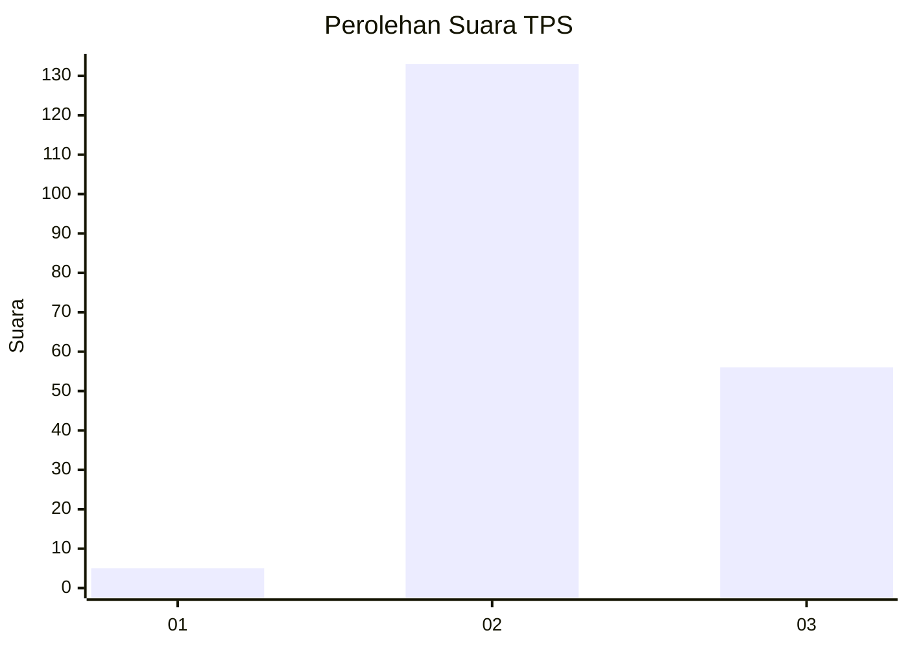

# Hasil

## Grafik

## Tabel

| No. | Nama Paslon    | Suara | Suara (raw) | Persentase |
|:--- |:-------------- | -----:| -----------:| ----------:|
| 1   | ANIES MUHAIMIN | 5     | [5][p-1]    | 2,58       |
| 2   | PRABOWO GIBRAN | 133   | [133][p-2]  | 68,56      |
| 3   | GANJAR MAHFUD  | 56    | [56][p-3]   | 28,87      |

[p-1]: https://github.com/gigit-pemilu/pemilu-2024-51-bali/blob/main/pilpres/hitung-suara/sub/51-bali/sub/04-gianyar/sub/06-tegallalang/sub/2005-pupuan/sub/007-tps/sub/paslon-1.txt
[p-2]: https://github.com/gigit-pemilu/pemilu-2024-51-bali/blob/main/pilpres/hitung-suara/sub/51-bali/sub/04-gianyar/sub/06-tegallalang/sub/2005-pupuan/sub/007-tps/sub/paslon-2.txt
[p-3]: https://github.com/gigit-pemilu/pemilu-2024-51-bali/blob/main/pilpres/hitung-suara/sub/51-bali/sub/04-gianyar/sub/06-tegallalang/sub/2005-pupuan/sub/007-tps/sub/paslon-3.txt

## Foto C Plano

https://sirekap-obj-formc.kpu.go.id/d1e5/pemilu/ppwp/51/04/06/20/05/5104062005007-20240214-132100--879546b1-6452-490c-9eea-164a86353dfd.jpg

https://sirekap-obj-formc.kpu.go.id/d1e5/pemilu/ppwp/51/04/06/20/05/5104062005007-20240214-133036--5d1c6336-89e6-4558-b898-482f9aa62778.jpg

https://sirekap-obj-formc.kpu.go.id/d1e5/pemilu/ppwp/51/04/06/20/05/5104062005007-20240214-131425--7d321258-98cf-42d6-a068-eb3c3d2f1c36.jpg

## Metadata

| Key        | Value               |
| ---------- | ------------------- |
| Time Stamp | 2024-02-15 12:00:28 |

