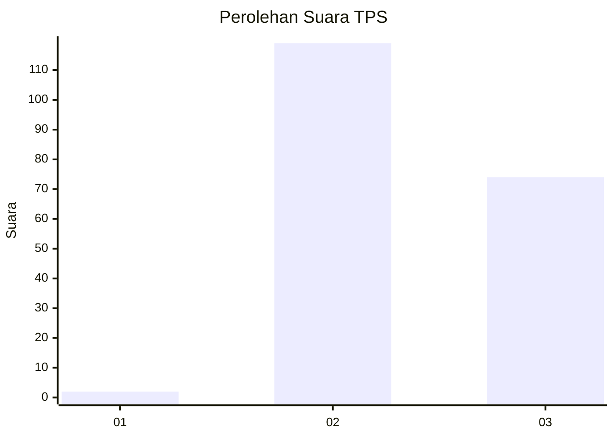
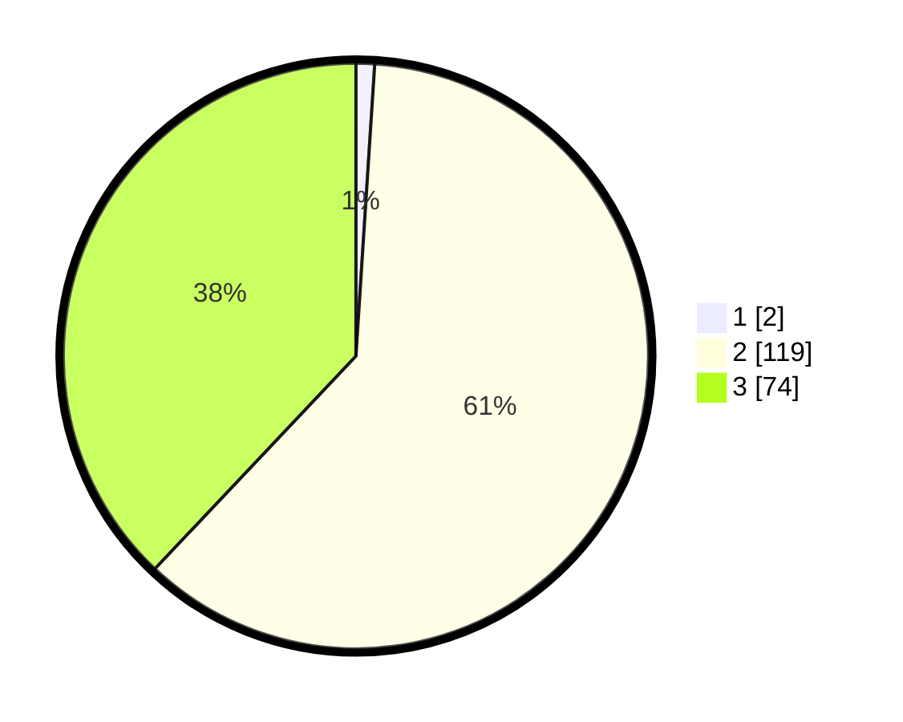

# Hasil

## Grafik

## Tabel

| No. | Nama Paslon    | Suara | Suara (raw) | Persentase |
|:--- |:-------------- | -----:| -----------:| ----------:|
| 1   | ANIES MUHAIMIN | 2     | [2][p-1]    | 1,03       |
| 2   | PRABOWO GIBRAN | 119   | [119][p-2]  | 61,03      |
| 3   | GANJAR MAHFUD  | 74    | [74][p-3]   | 37,95      |

[p-1]: https://github.com/gigit-pemilu/pemilu-2024-51-bali/blob/main/pilpres/hitung-suara/sub/51-bali/sub/04-gianyar/sub/06-tegallalang/sub/2005-pupuan/sub/010-tps/sub/paslon-1.txt
[p-2]: https://github.com/gigit-pemilu/pemilu-2024-51-bali/blob/main/pilpres/hitung-suara/sub/51-bali/sub/04-gianyar/sub/06-tegallalang/sub/2005-pupuan/sub/010-tps/sub/paslon-2.txt
[p-3]: https://github.com/gigit-pemilu/pemilu-2024-51-bali/blob/main/pilpres/hitung-suara/sub/51-bali/sub/04-gianyar/sub/06-tegallalang/sub/2005-pupuan/sub/010-tps/sub/paslon-3.txt

## Foto C Plano

https://sirekap-obj-formc.kpu.go.id/f04e/pemilu/ppwp/51/04/06/20/05/5104062005010-20240215-054350--c95cec57-56aa-4917-a923-2ce82fe1d08a.jpg

https://sirekap-obj-formc.kpu.go.id/f04e/pemilu/ppwp/51/04/06/20/05/5104062005010-20240215-054400--8534caff-29d2-4f59-bfad-9fa182bff473.jpg

https://sirekap-obj-formc.kpu.go.id/f04e/pemilu/ppwp/51/04/06/20/05/5104062005010-20240215-054410--dcd1148b-ec3c-48ad-8311-7e84d6461187.jpg

## Metadata

| Key        | Value               |
| ---------- | ------------------- |
| Time Stamp | 2024-02-15 15:00:29 |

